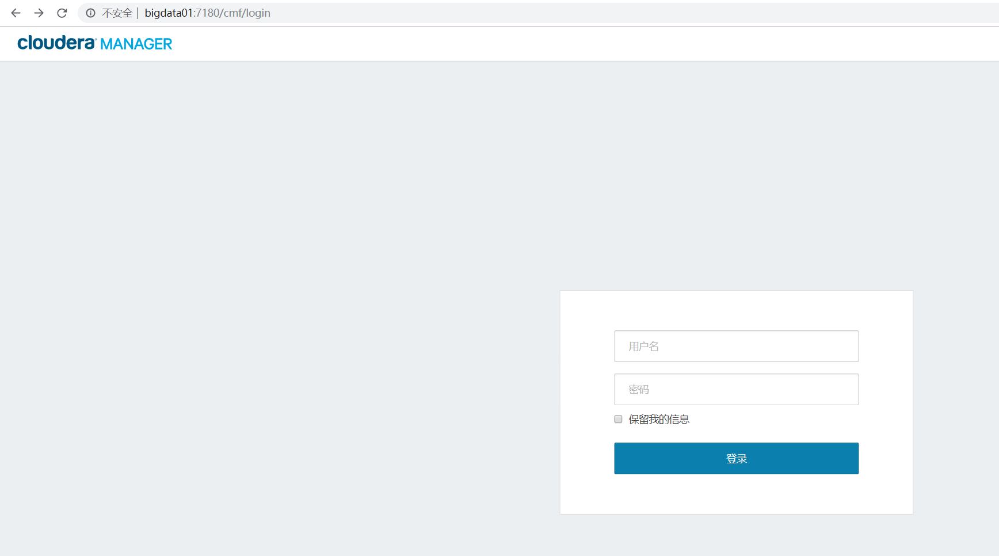

## 安装Cloudera Manager

> 前提各个服务器进行ssh免密登录,关闭SELINUX,安装JDK,配置ntp时间同步软件

### 安装前准备

* 关闭SELINUX
  * 修改`/etc/selinux/config`文件
    > 将SELINUX=enforcing改为SELINUX=disabled
  * 重新启动
  * 查看SELINUX状态
    ```sh
    [yetao_yang@bigdata01 ~]$ getenforce
    Disabled
    ```

* 配置ntp
  * 安装
    * `yum install ntp`
  * 配置开机启动
    * `chkconfig ntpd on`
  * 如果不是阿里云的服务器则进行如下配置
    * 主节点配置修改`/etc/ntp.conf`,改为
      ```
      server s1a.time.edu.cn prefer

      server 0.centos.pool.ntp.org iburst
      server 1.centos.pool.ntp.org iburst
      server 2.centos.pool.ntp.org iburst
      server 3.centos.pool.ntp.org iburst
      ```
    * 主节点进行时间同步
      ```sh
      [root@bigdata01 ~]# /usr/sbin/ntpdate s1a.time.edu.cn
      26 Aug 02:36:35 ntpdate[4808]: adjust time server 202.112.10.60 offset -0.000118 sec
      ```
    * 从节点上修改`/etc/ntp.conf`,改为
      ```
      server bigdata01

      server 0.centos.pool.ntp.org iburst
      server 1.centos.pool.ntp.org iburst
      server 2.centos.pool.ntp.org iburst
      server 3.centos.pool.ntp.org iburst
      ```
    * 从节点同步时间
      * `ntpdate server01`
    * 从节点需要定期同步主节点的时间,设置定时任务
      * 启动定时任务
        * `service crond start`
      * 在`/etc/cron.d`文件夹下创建ntp.corn文件并添加如下内容
        ```
        00 */3 * * * /usr/sbin/ntpdate  bigdata01 >> /root/ntpdate.log 2>&1
        ```
      * 每隔3小时同步一次
      * 添加定时任务
        * `crontab ./ntp.cron`
      * 查看是否把脚本添加进定时任务
        ```sh
        [root@bigdata02 cron.d]# crontab -l
        00 */3 * * * /usr/sbin/ntpdate  bigdata01 >> /root/ntpdate.log 2>&1
        ```
      * 所有从节点ntp开机启动
        * `chkconfig ntpd on`

### 下载相关资源
* 下载CM软件包
  * 把该[地址](http://archive.cloudera.com/cm5/redhat/7/x86_64/cm/5.16/RPMS/x86_64/)下的rpm包全部下载下来(java和oracle除外),一共5个
* 下载cloudera-manager安装文件
  * 把该[地址](http://archive.cloudera.com/cm5/installer/5.1.6/)下的cloudera-manager-installer.bin下载下来
* 下载rpm仓库文件
  * 下载该[地址](http://archive.cloudera.com/cm5/redhat/7/x86_64/cm/)下的cloudera-manager.repo文件
* 下载parcel(较大，1.9GB)
  * 下载该[地址](http://archive.cloudera.com/cdh5/parcels/5.16/)下的`CDH-5.16.2-1.cdh5.16.2.p0.8-el7.parcel`与`CDH-5.16.2-1.cdh5.16.2.p0.8-el7.parcel.sha1`两个文件
* 一共9个文件

### 资源分配(放在`/home/yetao_yang/CHD` 下面)
hostname | 用途 | 文件
-- | -- | --
bigdata01 | 主，安装CM | CDH-5.16.2-1.cdh5.16.2.p0.8-el7.parcel<br/>CDH-5.16.2-1.cdh5.16.2.p0.8-el7.parcel.sha1<br/>cloudera-manager-agent-5.16.2-1.cm5162.p0.7.el7.x86_64.rpm<br/>cloudera-manager-daemons-5.16.2-1.cm5162.p0.7.el7.x86_64.rpm<br/>cloudera-manager-installer.bin<br/>cloudera-manager.repo<br/>cloudera-manager-server-5.16.2-1.cm5162.p0.7.el7.x86_64.rpm<br/>cloudera-manager-server-db-2-5.16.2-1.cm5162.p0.7.el7.x86_64.rpm<br/>enterprise-debuginfo-5.16.2-1.cm5162.p0.7.el7.x86_64.rpm
bigdata02 | 从，slaver | cloudera-manager-agent-5.16.2-1.cm5162.p0.7.el7.x86_64.rpm<br/>cloudera-manager-daemons-5.16.2-1.cm5162.p0.7.el7.x86_64.rpm<br/>cloudera-manager.repo
bigdata03 | 从，slaver | cloudera-manager-agent-5.16.2-1.cm5162.p0.7.el7.x86_64.rpm<br/>cloudera-manager-daemons-5.16.2-1.cm5162.p0.7.el7.x86_64.rpm<br/>cloudera-manager.repo

> 下面操作都是在`/home/yetao_yang/CHD`路径下

### 所有节点执行
* 修改`cloudera-manager.repo`文件,在`baseurl`配置后面加上具体版本号
  ```
  [cloudera-manager]
  # Packages for Cloudera Manager, Version 5, on RedHat or CentOS 7 x86_64
  name=Cloudera Manager
  baseurl=https://archive.cloudera.com/cm5/redhat/7/x86_64/cm/5/5.16
  gpgkey =https://archive.cloudera.com/cm5/redhat/7/x86_64/cm/RPM-GPG-KEY-cloudera
  gpgcheck = 1
  ```
* 开始安装
  * `yum localinstall --nogpgcheck *.rpm`
* 检查各节点安装包
  * `yum list | grep cloudera`


### 主节点执行
* 在主节点上给安装脚本赋权
  * `chmod u+x cloudera-manager-installer.bin`
* 主节点执行安装脚本
  * `./cloudera-manager-installer.bin`
* 如提示需要删除文件则删除`/etc/cloudera-scm-server/db.properties`文件
* 一路next安装
  * 最后等待约1分钟,浏览器输入`http://bigdata01:7180`
    <br/>

#### CDH服务安装
* 制作本地parcel
  > 前面完成cloudera manager安装之后bigdata01会在/opt目录下生成cloudera文件夹，将之前下载好的CDH-*文件移动到parcel-repo文件夹中
* 执行拷贝(注意把后缀sha1重命名为sha)
  ```
  [root@bigdata01 CDH]# cp CDH-5.16.2-1.cdh5.16.2.p0.8-el7.parcel /opt/cloudera/parcel-repo/
  [root@bigdata01 CDH]# cp CDH-5.16.2-1.cdh5.16.2.p0.8-el7.parcel.sha1 /opt/cloudera/parcel-repo/CDH-5.16.2-1.cdh5.16.2.p0.8-el7.parcel.sha
  ```
* 将cloudera manager的用户授权给/opt和日志目录
  ```
  chown cloudera-scm.cloudera-scm  /opt  -R
  chown cloudera-scm.cloudera-scm  /var/log/cloudera-scm-agent -R
  ```

* 重启cloudera-scm-server
  ```sh
  /etc/init.d/cloudera-scm-server restart
  ```


groupadd supergroup
usermod -a -G supergroup hdfs
su - hdfs -s /bin/bash -c "hdfs dfsadmin -refreshUserToGroupsMappings"

/opt/cloudera/cm/lib
  cm-jar包依赖的位置,添加mysql依赖

/etc/cloudera-scm-server
  com.cloudera.cmf.db.type=mysql
  com.cloudera.cmf.db.host=bigdata03
  com.cloudera.cmf.db.name=scm
  com.cloudera.cmf.db.user=root
  com.cloudera.cmf.db.setupType=EXTERNAL
  com.cloudera.cmf.db.password=123456

/opt/cloudera/parcels/CDH/lib/hive/scripts/metastore/upgrade/mysql
  hive-schema-2.1.1.mysql.sql


https://www.cnblogs.com/fastzhe/p/7444439.html
