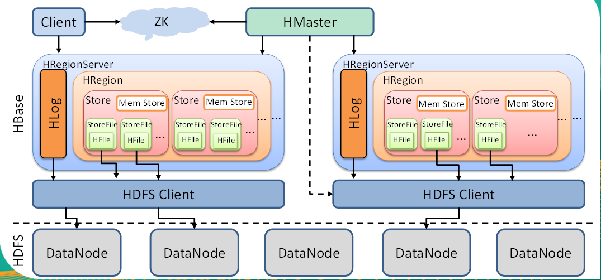
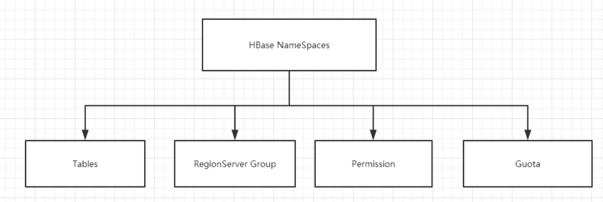
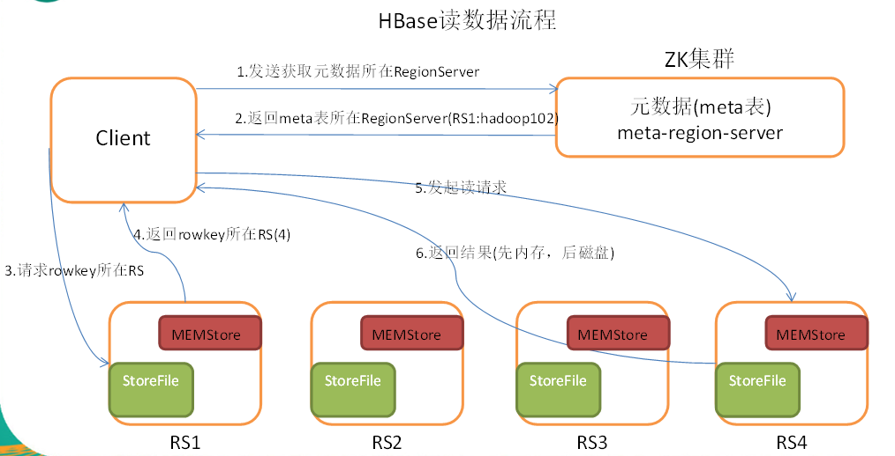
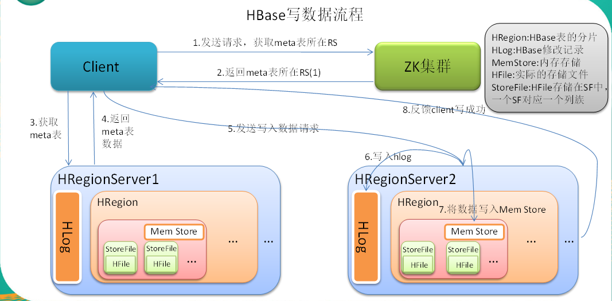
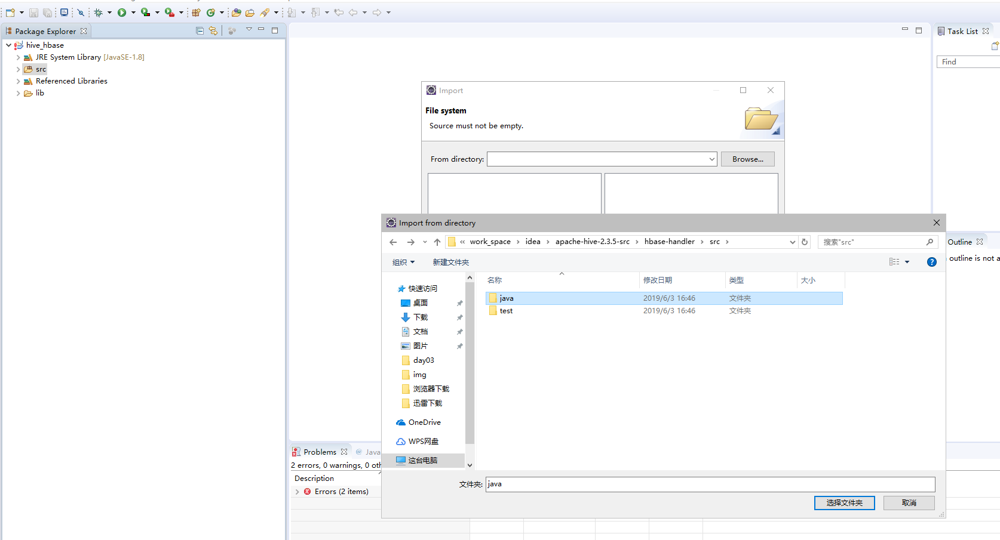
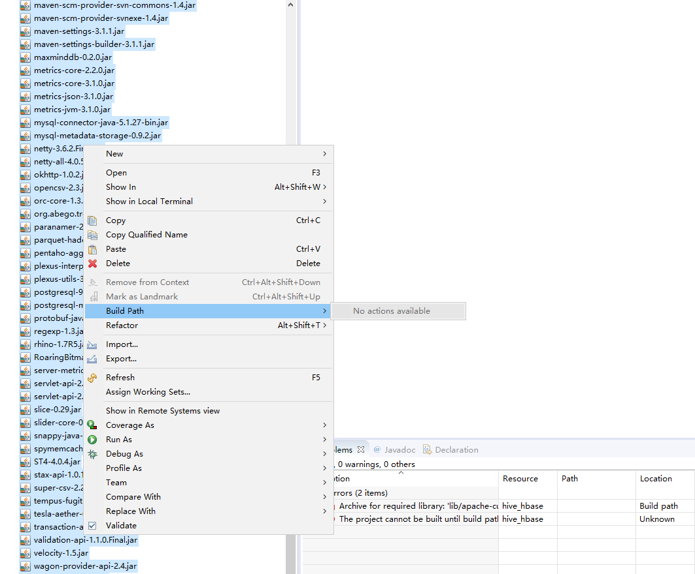
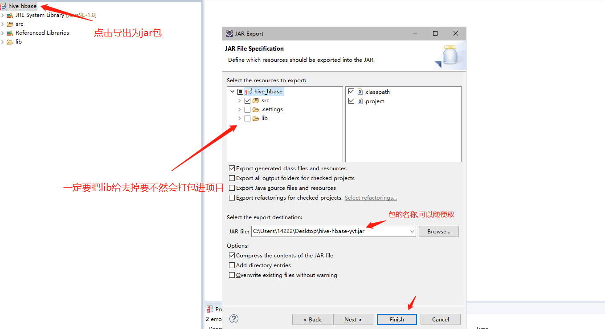
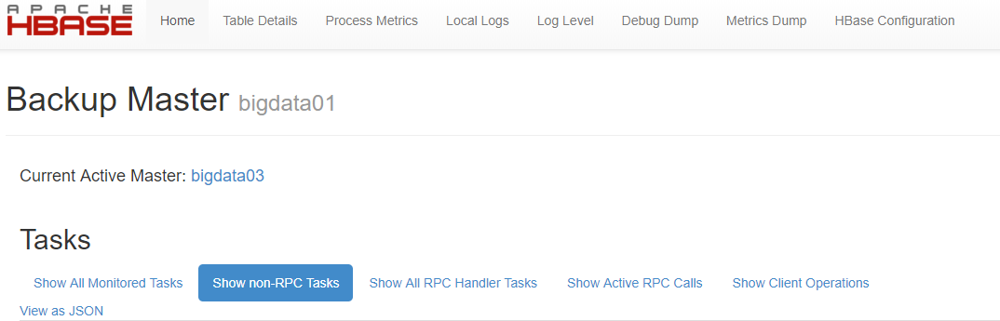
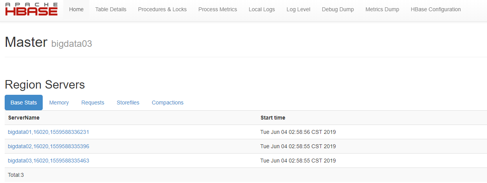

### HBase介绍

> HBase的原型是Google的BigTable论文，受到了该论文思想的启发，目前作为Hadoop的子项目来开发维护，用于支持结构化的数据存储</br>
> * 2006年Google发表BigTable白皮书
* 2006年开始开发HBase
* 2008程序员默默地将HBase弄成了Hadoop的子项目
* 2010年HBase成为Apache顶级项目

```
-- HBase是一个高可靠性、高性能、面向列、可伸缩的分布式存储系统，利用HBASE技术可在廉价PC Server上搭建起大规模结构化存储集群。
-- HBase的目标是存储并处理大型的数据，更具体来说是仅需使用普通的硬件配置，就能够处理由成千上万的行和列所组成的大型数据。
-- HBase是Google Bigtable的开源实现，但是也有很多不同之处。比如：Google Bigtable利用GFS作为其文件存储系统，HBase利用Hadoop HDFS作为其文件存储系统；Google运行MAPREDUCE来处理Bigtable中的海量数据，HBase同样利用Hadoop MapReduce来处理HBase中的海量数据；Google Bigtable利用Chubby作为协同服务，HBase利用Zookeeper作为对应。
```
* 特点
  * 海量存储
    ```
    Hbase适合存储PB级别的海量数据，在PB级别的数据以及采用廉价PC存储的情况下，能在几十到百毫秒内返回数据。
    这与Hbase的极易扩展性息息相关。正式因为Hbase良好的扩展性，才为海量数据的存储提供了便利。
    ```
  * 列式存储
    ```
    这里的列式存储其实说的是列族存储，Hbase是根据列族来存储数据的。
    列族下面可以有非常多的列，列族在创建表的时候就必须指定。
    ```
  * 极易扩展
    ```
    Hbase的扩展性主要体现在两个方面，一个是基于上层处理能力（RegionServer）的扩展，一个是基于存储的扩展（HDFS）。
    通过横向添加RegionSever的机器，进行水平扩展，提升Hbase上层的处理能力，提升Hbsae服务更多Region的能力。
    ```
  * 高并发
    ```
    由于目前大部分使用Hbase的架构，都是采用的廉价PC，因此单个IO的延迟其实并不小，一般在几十到上百ms之间。
    这里说的高并发，主要是在并发的情况下，Hbase的单个IO延迟下降并不多。能获得高并发、低延迟的服务。
    ```
  * 稀疏
    ```
    稀疏主要是针对Hbase列的灵活性，在列族中，你可以指定任意多的列，在列数据为空的情况下，是不会占用存储空间的。
    ```

### HBase架构
</br>
* Client
  * Client包含了访问Hbase的接口，另外Client还维护了对应的cache来加速Hbase的访问，比如cache的.META.元数据的信息
* Zookeeper
  * HBase通过Zookeeper来做master的高可用、RegionServer的监控、元数据的入口以及集群配置的维护等工作。具体工作如下：
    * 通过Zoopkeeper来保证集群中只有1个master在运行，如果master异常，会通过竞争机制产生新的master提供服务
    * 通过Zoopkeeper来监控RegionServer的状态，当RegionSevrer有异常的时候，通过回调的形式通知Master RegionServer上下线的信息
    * 通过Zoopkeeper存储元数据的统一入口地址
* Hmaster
  * 功能
    * 监控RegionServer
    * 处理RegionServer故障转移
    * 处理元数据的变更
    * 处理region的分配或转移
    * 在空闲时间进行数据的负载均衡
    * 通过Zookeeper发布自己的位置给客户端
  * 职责
    * 为RegionServer分配Region
    * 维护整个集群的负载均衡
    * 维护集群的元数据信息
    * 发现失效的Region，并将失效的Region分配到正常的RegionServer上
    * 当RegionSever失效的时候，协调对应Hlog的拆分
* HregionServer
  * 功能
    * 负责存储HBase的实际数据
    * 处理分配给它的Region
    * 刷新缓存到HDFS
    * 维护Hlog
    * 执行压缩
    * 负责处理Region分片
  * 职责
    * 管理master为其分配的Region
    * 处理来自客户端的读写请求
    * 负责和底层HDFS的交互，存储数据到HDFS
    * 负责Region变大以后的拆分
    * 负责Storefile的合并工作
* HDFS
  * 提供元数据和表数据的底层分布式存储服务
  * 数据多副本，保证的高可靠和高可用性
* HRegion
  * Hbase表的分片，HBase表会根据RowKey值被切分成不同的region存储在RegionServer中，在一个RegionServer中可以有多个不同的region。
  * 一个HRegionServer对应多个HRegion,一个HRegion对应一个表 但一个表可以对应多个HRegion
* store
  * 一个store对应一个列族,但一个列族是可以对应多个store的,因为HRegion会切分,HRegion切分时也会把store也切分过去
* MemStore
  * 内存存储，位于内存中，用来保存当前的数据操作，所以当数据保存在WAL中之后，RegsionServer会在内存中存储键值对
* HFile
  * 这是在磁盘上保存原始数据的实际的物理文件，是实际的存储文件。StoreFile是以Hfile的形式存储在HDFS的。
* HLog
  > HBase的修改记录，当对HBase读写数据的时候，数据不是直接写进磁盘，它会在内存中保留一段时间（时间以及数据量阈值可以设定）。但把数据保存在内存中可能有更高的概率引起数据丢失，为了解决这个问题，数据会先写在一个叫做Write-Ahead logfile的文件中，然后再写入内存中。所以在系统出现故障的时候，数据可以通过这个日志文件重建。

### 安装HBase

> **前提**</br>正确部署zookeeper集群并启用</br>正确部署Hadoop集群(HA)并启用

* 前往官网[下载](https://hbase.apache.org/downloads.html)
  * 下载前确认hadoop与hbse是否兼容
  * **本人下载版本为2.0.5**
* 修改配置文件`hbase-env.sh`
  ```sh
  export JAVA_HOME=/usr/local/java/jdk1.8.0_211
  export HBASE_MANAGES_ZK=false
  export HBASE_LOG_DIR=/home/yetao_yang/hbase/logs
  ```
* 修改配置文件`log4j.properties`
  ```conf
  hbase.log.dir=/home/yetao_yang/hbase/logs
  ```
* 创建相应的logs文件夹
  * `mkdir /home/yetao_yang/hbase/logs`
* 修改配置文件`hbase-site.xml`
  ```xml
  <property>  
          <name>hbase.rootdir</name>  
          <value>hdfs://mycluster/hbase</value>  
  </property>

  <property>  
          <name>hbase.cluster.distributed</name>
          <value>true</value>
  </property>

  <!-- 0.98后的新变动，之前版本没有.port,默认端口为60000 -->
  <property>
          <name>hbase.master.port</name>
          <value>16000</value>
  </property>

  <property>  
          <name>hbase.zookeeper.quorum</name>
       <value>bigdata01:2181,bigdata02:2181,bigdata03:2181</value>
  </property>

  <property>  
          <name>hbase.zookeeper.property.dataDir</name>
       <value>/home/yetao_yang/zookeeper/data</value>
  </property>
  ```
* 修改`regionservers`
  ```
  bigdata01
  bigdata02
  bigdata03
  ```
* 向服务器分发`HBase`
  * `scp -r hbase-2.0.5 yetao_yang@bigdata02:/home/yetao_yang/hbase`
  * `scp -r hbase-2.0.5 yetao_yang@bigdata03:/home/yetao_yang/hbase`
* 软连接hadoop配置文件下的`core-site.xml`与`hdfs-site.xml`到`hbase`的配置文件下
  * `ln -s ~/hadoop/hadoop-2.8.5/etc/hadoop/core-site.xml ~/hbase/hbase-2.0.5/conf/core-site.xml`
  * `ln -s ~/hadoop/hadoop-2.8.5/etc/hadoop/hdfs-site.xml ~/hbase/hbase-2.0.5/conf/hdfs-site.xml`

### 启动`HBase`
* 在单一节点运行命令
  * `./start-hbase.sh`
* 查看三台机器进程**已搭建Zookeeper集群,Hadoop(HA),KAFKA集群,HIVE单机,Yarn历史服务器**
  * `bigdata01`
    ```sh
    [yetao_yang@bigdata01 bin]$ jps
    11089 DataNode
    27523 Jps
    11300 JournalNode
    11526 DFSZKFailoverController
    11654 JobHistoryServer
    26807 HMaster
    5513 Kafka
    6635 ResourceManager
    10972 NameNode
    4734 QuorumPeerMain
    26942 HRegionServer
    ```
  * `bigdata02`
    ```sh
    [yetao_yang@bigdata02 conf]$ jps
    6256 ResourceManager
    12849 HRegionServer
    13169 Jps
    4706 QuorumPeerMain
    6978 DataNode
    5462 Kafka
    7193 JobHistoryServer
    6092 NodeManager
    7084 JournalNode
    ```
  * `bigdata03`
    ```sh
    [yetao_yang@bigdata03 conf]$ jps
    4755 QuorumPeerMain
    7603 Kafka
    6309 NodeManager
    8646 JournalNode
    8457 NameNode
    6762 RunJar
    10394 HRegionServer
    8540 DataNode
    8780 DFSZKFailoverController
    10861 Jps
    ```

### `HBase`的shell操作

```sh
[yetao_yang@bigdata01 bin]$ ./hbase shell
# 查看数据库中有哪些表
hbase(main):001:0> list
TABLE
0 row(s)
Took 0.3725 seconds
=> []


# 创建表
# creat 表,列族
hbase(main):002:0> create 'student','info'
Created table student
Took 4.8768 seconds                                                                                                                   => Hbase::Table - student
# 查看库中的表
hbase(main):003:0> list
TABLE                                                                                                                     student                                                                                                                   1 row(s)
Took 0.0161 seconds                                                                                                                   => ["student"]

# 向表中添加数据
# put 表名,rowkey,列族里面的列,对应列的值
hbase(main):004:0> put 'student','1001','info:sex','male'
Took 0.2173 seconds                                                                                                                   # put 表名,rowkey,列族里面的列,对应列的值
hbase(main):005:0> put 'student','1001','info:age','18'
Took 0.0111 seconds
# put 表名,rowkey,列族里面的列,对应列的值
hbase(main):006:0> put 'student','1002','info:name','Janna'
Took 0.0100 seconds
# put 表名,rowkey,列族里面的列,对应列的值
hbase(main):007:0> put 'student','1002','info:sex','female'
Took 0.0139 seconds
# put 表名,rowkey,列族里面的列,对应列的值
hbase(main):008:0> put 'student','1002','info:age','20'
Took 0.0081 seconds


# 根据表名扫描表
# scan 表名
hbase(main):009:0> scan 'student'
ROW                                                             COLUMN+CELL
 1001                                                           column=info:age, timestamp=1559205527479, value=18
 1001                                                           column=info:sex, timestamp=1559205516221, value=male
 1002                                                           column=info:age, timestamp=1559205564689, value=20
 1002                                                           column=info:name, timestamp=1559205538072, value=Janna
 1002                                                           column=info:sex, timestamp=1559205553174, value=female
2 row(s)
Took 0.0363 seconds

# 根据rowkey扫描表
# scan 表名,{STARTROW => 开始的rowkey, STOPROW  => 结束的rowkey}
hbase(main):010:0> scan 'student',{STARTROW => '1001', STOPROW  => '1001'}
ROW                                                             COLUMN+CELL
 1001                                                           column=info:age, timestamp=1559205527479, value=18
 1001                                                           column=info:sex, timestamp=1559205516221, value=male
1 row(s)
Took 0.0104 seconds

# 根据rowkey扫描表
# scan 表名,{STARTROW => 开始的rowkey}
hbase(main):011:0> scan 'student',{STARTROW => '1001'}
ROW                                                             COLUMN+CELL
 1001                                                           column=info:age, timestamp=1559205527479, value=18
 1001                                                           column=info:sex, timestamp=1559205516221, value=male
 1002                                                           column=info:age, timestamp=1559205564689, value=20
 1002                                                           column=info:name, timestamp=1559205538072, value=Janna
 1002                                                           column=info:sex, timestamp=1559205553174, value=female
2 row(s)
Took 0.0132 seconds

# 查看表结构
# describe 表名
hbase(main):012:0> describe 'student'
Table student is ENABLED
student
COLUMN FAMILIES DESCRIPTION
{NAME => 'info', VERSIONS => '1', EVICT_BLOCKS_ON_CLOSE => 'false', NEW_VERSION_BEHAVIOR => 'false', KEEP_DELETED_CELLS => 'FALSE', CACHE_DATA_ON_WRITE => 'false', DATA_BLOCK_ENCODING => 'NONE', TTL => 'FOREVER', MIN_VERSIONS => '0', REPLICATION_SC
OPE => '0', BLOOMFILTER => 'ROW', CACHE_INDEX_ON_WRITE => 'false', IN_MEMORY => 'false', CACHE_BLOOMS_ON_WRITE => 'false', PREFETCH_BLOCKS_ON_OPEN => 'false', COMPRESSION => 'NONE', BLOCKCACHE => 'true', BLOCKSIZE => '65536'}
1 row(s)
Took 0.0610 seconds

# 更新指定字段
# put 表名,rowkey,列族里面的列,对应列的值
hbase(main):013:0> put 'student','1001','info:name','Nick'
Took 0.0074 seconds
# 更新指定字段
# put 表名,rowkey,列族里面的列,对应列的值
hbase(main):014:0> put 'student','1001','info:age','100'
Took 0.0065 seconds

# 查看是否生效
hbase(main):015:0> scan 'student'
ROW                                                             COLUMN+CELL
 1001                                                           column=info:age, timestamp=1559205694929, value=100
 1001                                                           column=info:name, timestamp=1559205682302, value=Nick
 1001                                                           column=info:sex, timestamp=1559205516221, value=male
 1002                                                           column=info:age, timestamp=1559205564689, value=20
 1002                                                           column=info:name, timestamp=1559205538072, value=Janna
 1002                                                           column=info:sex, timestamp=1559205553174, value=female
2 row(s)
Took 0.0141 seconds

# 查看指定rowkey的数据
# get 表名,rowkey
hbase(main):016:0> get 'student','1001'
COLUMN                                                          CELL
 info:age                                                       timestamp=1559205694929, value=100
 info:name                                                      timestamp=1559205682302, value=Nick
 info:sex                                                       timestamp=1559205516221, value=male
1 row(s)
Took 0.0238 seconds

# 查看指定列族:列的数据
# get 表名,rowkey,列族里面的列
hbase(main):017:0> get 'student','1001','info:name'
COLUMN                                                          CELL
 info:name                                                      timestamp=1559205682302, value=Nick
1 row(s)
Took 0.0097 seconds

# 统计表数据行数
# count 表名
hbase(main):018:0> count 'student'
2 row(s)
Took 0.0356 seconds
=> 2

# 变更表信息 将info列族中的数据存放3个版本
# alter 表名,{NAME=>列族,VERSIONS=>版本}
hbase(main):019:0> alter 'student',{NAME=>'info',VERSIONS=>3}
Updating all regions with the new schema...
1/1 regions updated.
Done.
Took 9.6723 seconds

# 查看表结构验证
hbase(main):020:0> describe 'student'
Table student is ENABLED
student
COLUMN FAMILIES DESCRIPTION
{NAME => 'info', VERSIONS => '3', EVICT_BLOCKS_ON_CLOSE => 'false', NEW_VERSION_BEHAVIOR => 'false', KEEP_DELETED_CELLS => 'FALSE', CACHE_DATA_ON_WRITE => 'false', DATA_BLOCK_ENCODING => 'NONE', TTL => 'FOREVER', MIN_VERSIONS => '0', REPLICATION_SC
OPE => '0', BLOOMFILTER => 'ROW', CACHE_INDEX_ON_WRITE => 'false', IN_MEMORY => 'false', CACHE_BLOOMS_ON_WRITE => 'false', PREFETCH_BLOCKS_ON_OPEN => 'false', COMPRESSION => 'NONE', BLOCKCACHE => 'true', BLOCKSIZE => '65536'}
1 row(s)
Took 0.0289 seconds

# 获取指定列族下列的对应版本
# get 表名,rowkey,{COLUMN=>列族下指定列,VERSIONS=>版本}
hbase(main):021:0> get 'student','1001',{COLUMN=>'info:name',VERSIONS=>3}
COLUMN                                                          CELL
 info:name                                                      timestamp=1559205682302, value=Nick
1 row(s)
Took 0.0481 seconds

# 删除指定rowkey的全部数据
# deleteall 表名,rowkey
hbase(main):022:0> deleteall 'student','1001'
Took 0.0119 seconds
# 查看是否生效
hbase(main):023:0> scan 'student'
ROW                                                             COLUMN+CELL
 1002                                                           column=info:age, timestamp=1559205564689, value=20
 1002                                                           column=info:name, timestamp=1559205538072, value=Janna
 1002                                                           column=info:sex, timestamp=1559205553174, value=female
1 row(s)
Took 0.0128 seconds

# 删除rowkey的某一列数据
# delete 表名,rowkey,列族下指定的列
hbase(main):024:0> delete 'student','1002','info:sex'
Took 0.0061 seconds
# 查看是否生效
hbase(main):025:0> scan 'student'
ROW                                                             COLUMN+CELL
 1002                                                           column=info:age, timestamp=1559205564689, value=20
 1002                                                           column=info:name, timestamp=1559205538072, value=Janna
1 row(s)
Took 0.0088 seconds

# 清空表数据
# truncate 表名
hbase(main):026:0> truncate 'student'
Truncating 'student' table (it may take a while):
Disabling table...
Truncating table...
Took 13.0485 seconds
# 查看是否生效
hbase(main):027:0> scan 'student'
ROW                                                             COLUMN+CELL
0 row(s)
Took 0.6595 seconds

# 删除表
# 首先应把表设为disable状态
hbase(main):028:0> disable 'student'
Took 4.5993 seconds
# 最后执行删除
hbase(main):030:0> drop 'student'
Took 2.6041 seconds
# 查看是否生效
hbase(main):031:0> list
TABLE
0 row(s)
Took 0.0101 seconds
=> []

```

### HBase的数据结构

* RowKey
  * 与nosql数据库一样,RowKey是用来检索记录的主键。访问HBASE table中的行，只有三种方式
    * 通过单个RowKey访问
    * 通过RowKey的range（正则）
    * 全表扫描
    > RowKey行键 (RowKey)可以是任意字符串(最大长度是64KB，实际应用中长度一般为 10-100bytes)，在HBASE内部，RowKey保存为字节数组。存储时，数据按照RowKey的字典序(byte order)排序存储。设计RowKey时，要充分排序存储这个特性，将经常一起读取的行存储放到一起。(位置相关性)
* Column Family
  > **列族**：HBASE表中的每个列，都归属于某个列族。列族是表的schema的一部 分(而列不是)，必须在使用表之前定义。列名都以列族作为前缀。例如 courses:history，courses:math都属于courses 这个列族。
* Cell
  > 由{rowkey, column Family:columu, version} 唯一确定的单元。cell中的数据是没有类型的，全部是字节码形式存贮。
  > 关键字：无类型、字节码
* Time Stamp
  > HBASE 中通过rowkey和columns确定的为一个存贮单元称为cell。每个cell都保存着同一份数据的多个版本。版本通过时间戳来索引。时间戳的类型是64位整型。时间戳可以由HBASE(在数据写入时自动 )赋值，此时时间戳是精确到毫秒的当前系统时间。时间戳也可以由客户显式赋值。如果应用程序要避免数据版 本冲突，就必须自己生成具有唯一性的时间戳。每个 cell中，不同版本的数据按照时间倒序排序，即最新的数据排在最前面。
  > 为了避免数据存在过多版本造成的的管理 (包括存贮和索引)负担，HBASE提供 了两种数据版本回收方式。一是保存数据的最后n个版本，二是保存最近一段 时间内的版本（比如最近七天）。用户可以针对每个列族进行设置。
* 命名空间
  > </br>
  * Table：表，所有的表都是命名空间的成员，即表必属于某个命名空间，如果没有指定，则在default默认的命名空间中。
  * RegionServer group：一个命名空间包含了默认的RegionServer Group。
  * Permission：权限，命名空间能够让我们来定义访问控制列表ACL（Access Control List）。
    * 例如，创建表，读取表，删除，更新等等操作。
  * Quota：限额，可以强制一个命名空间可包含的region的数量。

### HBase读流程

</br>
* Client先访问zookeeper，从meta表读取region的位置，然后读取meta表中的数据。meta中又存储了用户表的region信息；
* 根据namespace、表名和rowkey在meta表中找到对应的region信息；
* 找到这个region对应的regionserver；
* 查找对应的region；
* 先从MemStore找数据，如果没有，再到BlockCache里面读；
* BlockCache还没有，再到StoreFile上读(为了读取的效率)；
* **如果是从StoreFile里面读取的数据，不是直接返回给客户端，而是先写入BlockCache，再返回给客户端。**

### HBase写流程

</br>
* Client向HregionServer发送写请求；
* HregionServer将数据写到HLog（write ahead log）。为了数据的持久化和恢复；
* HregionServer将数据写到内存（MemStore）；
* 反馈Client写成功。

### 数据flush过程
> 当MemStore数据达到阈值（默认是128M，老版本是64M），将数据刷到硬盘，将内存中的数据删除，同时删除HLog中的历史数据 并将数据存储到HDFS中

### 数据合并过程
> * 当数据块达到4块，Hmaster将数据块加载到本地，进行合并
* 当合并的数据超过256M，进行拆分，将拆分后的Region分配给不同的HregionServer管理
* 当HregionServer宕机后，将HregionServer上的hlog拆分，然后分配给不同的HregionServer加载，修改.META.
* 注意：HLog会同步到HDFS。

### `HBase API`操作

* 在pm文件里加入如下依赖
  ```xml
  <!-- https://mvnrepository.com/artifact/org.apache.hbase/hbase -->
  <dependency>
      <groupId>org.apache.hbase</groupId>
      <artifactId>hbase</artifactId>
      <version>2.0.5</version>
      <type>pom</type>
  </dependency>
  <!-- https://mvnrepository.com/artifact/org.apache.hbase/hbase-client -->
  <dependency>
      <groupId>org.apache.hbase</groupId>
      <artifactId>hbase-client</artifactId>
      <version>2.0.5</version>
  </dependency>
  <!-- https://mvnrepository.com/artifact/com.alibaba/fastjson -->
  <dependency>
      <groupId>com.alibaba</groupId>
      <artifactId>fastjson</artifactId>
      <version>1.2.58</version>
  </dependency>
  ```
* 基础代码
  ```java
  // 声明静态配置
  static Configuration conf = null;
  static Connection conn = null;
  static {
      conf = HBaseConfiguration.create();
      conf.set("hbase.zookeeper.quorum", "bigdata01,bigdata02,bigdata03");
      conf.set("hbase.zookeeper.property.clientPort", "2181");
      try {
          conn = ConnectionFactory.createConnection(conf);
      } catch (IOException e) {
          e.printStackTrace();
      }
  }

  // ...  具体方法

  /**
   * 格式化查询或过滤后的对象
   * @param scanner
   *          查询的结果集
   * @return
   */
  private static List<Map<String,Object>> formatScanner(ResultScanner scanner){
      List<Map<String,Object>> result = Lists.newArrayList();
      for(Result rs:scanner) {
          Map<String,Object> lineMap = Maps.newHashMap();
          String rowkey = Bytes.toString(rs.getRow());
          lineMap.put("RowKey",rowkey);
          Cell[] cells  = rs.rawCells();
          for(Cell cell : cells) {
              String columFamily = Bytes.toString(CellUtil.cloneFamily(cell));
              String qualiFiler = Bytes.toString(CellUtil.cloneQualifier(cell));
              String value = Bytes.toString(CellUtil.cloneValue(cell));
              Map<String,String> kv = null;
              if (lineMap.containsKey(columFamily)){
                  kv = (Map<String,String>)lineMap.get(columFamily);
                  kv.put(qualiFiler,value);
                  lineMap.put(columFamily,kv);
              } else {
                  kv = Maps.newHashMap();
                  kv.put(qualiFiler,value);
                  lineMap.put(columFamily,kv);
              }
          }
          result.add(lineMap);
      }
      scanner.close();
      return result;
  }

  private static Map<String, String> formatCells(Cell[] cells) {
      Map<String,String> result = Maps.newHashMap();
      for(Cell cell : cells) {
          result.put(
                  Bytes.toString(CellUtil.cloneQualifier(cell)),
                  Bytes.toString(CellUtil.cloneValue(cell))
                  );
      }
      return result;
  }
  ```

* 创建表
  ```java
  public static void main(String[] args) throws Exception {
    TableName tableName = TableName.valueOf("test");
    String[] columnFamilys = { "article", "author" };
    createTable(tableName, columnFamilys);
  }

  /**
   * 创建表（包含多个列簇）
   *
   * @tableName 表名
   *
   * @family 列族列表
   */
  public static void createTable(TableName tableName, String[] columnFamilys) throws IOException {
      Admin admin = conn.getAdmin();
      if(!admin.tableExists(tableName)) {
          //表描述器构造器
          TableDescriptorBuilder  tdb  =TableDescriptorBuilder.newBuilder(tableName)  ;
          //列族描述器构造器
          ColumnFamilyDescriptorBuilder cdb ;
          //获得列描述器
          ColumnFamilyDescriptor  cfd ;
          for (String columnFamily:columnFamilys) {
              cdb =  ColumnFamilyDescriptorBuilder.newBuilder(Bytes.toBytes(columnFamily));
              cfd = cdb.build();
              //添加列族
              tdb.setColumnFamily(cfd);
          }
          //获得表描述器
          TableDescriptor td = tdb.build();
          //创建表
          admin.createTable(td);
      }else {
          System.out.println("表已存在！");
      }
      //关闭链接
  }
  ```

* 添加数据
  ```java

  public static void main(String[] args) throws Exception {
    // region添加数据
    List<Map<String,Object>> listMap=new ArrayList<Map<String, Object>>();
    Map<String,Object> map1=new HashMap<String,Object>();
    map1.put("rowKey","ce_shi3");     // 指定的rowkey
    map1.put("columnFamily","info"); // 指定列族
    map1.put("columnName","name");   // 指定列族里面的列明
    map1.put("columnValue","yf");    // 对应列明的值
    listMap.add(map1);

    Map<String,Object> map2=new HashMap<String,Object>();
    map2.put("rowKey","ce_shi3");   // 指定的rowkey
    map2.put("columnFamily","info");  // 指定列族
    map2.put("columnName","sex");   // 指定列族里面的列明
    map2.put("columnValue","女");  // 对应列明的值
    listMap.add(map2);

    Map<String,Object> map3=new HashMap<String,Object>();
    map3.put("rowKey","ce_shi3");
    map3.put("columnFamily","info");
    map3.put("columnName","age");
    map3.put("columnValue","24");
    listMap.add(map3);

    Map<String,Object> map4=new HashMap<String,Object>();
    map4.put("rowKey","ce_shi3");
    map4.put("columnFamily","info");
    map4.put("columnName","phoneNum");
    map4.put("columnValue","1553687894");
    listMap.add(map4);
    insertMany(TableName.valueOf("student"),listMap);
    // endregion
  }

  /**
   * 添加数据（多个rowKey，多个列簇，适合由固定结构的数据）
   * @param tableName
   * @param list
   * @throws IOException
   */
  public static void insertMany(TableName tableName,List<Map<String,Object>> list)
          throws IOException {
      List<Put> puts = new ArrayList<Put>();
      Table table = conn.getTable(tableName);// Tabel负责跟记录相关的操作如增删改查等//
      if(list!=null&&list.size()>0){
          for(Map<String,Object> map:list){
              Put put=new Put(Bytes.toBytes(map.get("rowKey").toString()));
              put.addColumn(Bytes.toBytes(map.get("columnFamily").toString()),
                      Bytes.toBytes(map.get("columnName").toString()),
                      Bytes.toBytes(map.get("columnValue").toString()));
              puts.add(put);
          }
      }
      table.put(puts);
      table.close();
      System.out.println("add data Success!");
  }
  ```

* 根据rowkey,列族,列名修改值
  ```java
  public static void main(String[] args) throws Exception {
    String rowKey="ce_shi2";
    String columnFamily="info";
    String columnName="name";
    String columnValue="yyyytt";
    updateData(TableName.valueOf("student"),rowKey,columnFamily,columnName,columnValue);
  }

  public static void updateData(TableName tableName,
                                String rowKey,
                                String columnFamily,
                                String columnName,
                                String columnValue) throws IOException {
      Table table = conn.getTable(tableName);
      Put put1 = new Put(Bytes.toBytes(rowKey));
      put1.addColumn(Bytes.toBytes(columnFamily),Bytes.toBytes(columnName) , Bytes.toBytes(columnValue));
      table.put(put1);
      table.close();
  }
  ```

* 全表扫描
  ```java
  public static void main(String[] args) throws Exception {
    ResultScanner searchResult = scanTable(TableName.valueOf("student"));
    List<Map<String, Object>> formatResult = formatScanner(searchResult);
    System.out.println(JSON.toJSONString(formatResult,true));
  }

  public static  ResultScanner scanTable(TableName tableName) throws IOException {
      Table table = conn.getTable(tableName);
      Scan scan = new Scan();
      ResultScanner scanner = table.getScanner(scan);
      return scanner;
  }
  ```

* 根据某行查找值
  ```java
  public static void main(String[] args) throws Exception {
    String rowKey1="ce_shi1";
    Map<String, String> searchResult = getResult(TableName.valueOf("student"), rowKey1);
    System.out.println(JSON.toJSONString(searchResult, true));
  }

  public static Map<String,String> getResult(TableName tableName, String rowKey) throws IOException {
      Table table = conn.getTable(tableName);
      //获得一行
      Get get = new Get(Bytes.toBytes(rowKey));
      Result set = table.get(get);
      Cell[] cells  = set.rawCells();
      Map<String,String> formatData = formatCells(cells);
      table.close();
      return formatData;
  }
  ```

* 删除某行某个列族的某个列
  ```java
  public static void main(String[] args) throws Exception {
    String rowKey1="ce_shi1";
    String columnFamily1="info";
    String columnName1="name";
    deleteData(TableName.valueOf("student"),rowKey1,columnFamily1,columnName1);
  }

  public static void deleteData(TableName tableName,
                                String rowKey,
                                String columnFamily,
                                String columnName) throws IOException {
      Table table = conn.getTable(tableName);
      Delete delete = new Delete(Bytes.toBytes(rowKey));
      delete.addColumn(Bytes.toBytes(columnFamily), Bytes.toBytes(columnName));
      table.delete(delete);
      table.close();
  }
  ```

* 删除某个列族
  ```java
  public static void main(String[] args) throws Exception {
    String rowKey1="ce_shi1";
    String columnFamily1="info";
    deleteData(TableName.valueOf("student"),rowKey1,columnFamily1);
  }

  public static void deleteData(TableName tableName,
                                String rowKey,
                                String columnFamily) throws IOException {
      Table table = conn.getTable(tableName);
      Delete delete = new Delete(Bytes.toBytes(rowKey));
      delete.addFamily(Bytes.toBytes(columnFamily));
      table.delete(delete);
      table.close();
  }
  ```

* 删除某行某个列族的多个列
  ```java
  public static void main(String[] args) throws Exception {
    String rowKey1="ce_shi1";
    String columnFamily1="info";
    List<String> columnNames=new ArrayList<String>();
    columnNames.add("content");
    columnNames.add("title");
    deleteData(TableName.valueOf("student"),rowKey1,columnFamily1,columnNames);
  }

  public static void deleteData(TableName tableName,
                                String rowKey,
                                String columnFamily,
                                List<String> columnNames) throws IOException {
      Table table = conn.getTable(tableName);
      Delete delete = new Delete(Bytes.toBytes(rowKey));
      for(String columnName:columnNames){
          delete.addColumns(Bytes.toBytes(columnFamily), Bytes.toBytes(columnName));
      }
      table.delete(delete);
      table.close();
  }
  ```

* 删除某行
  ```java
  public static void main(String[] args) throws Exception {
    String rowKey1="ce_shi1";
    deleteData(TableName.valueOf("student"),rowKey1);
  }

  public static void deleteData(TableName tableName,String rowKey) throws IOException {
      Table table = conn.getTable(tableName);
      Delete delete = new Delete(Bytes.toBytes(rowKey));
      table.delete(delete);
      table.close();
  }
  ```

* rowKey过滤器
  ```java
  public static void main(String[] args) throws Exception {
    ResultScanner scan = rowkeyFilter(TableName.valueOf("student"),
                                      CompareOperator.EQUAL,
                                      "ce_shi*");
    System.out.println(JSON.toJSONString(formatScanner(scan), true));
  }

  public static  ResultScanner rowkeyFilter(TableName tableName,
                                            CompareOperator compareOperator,
                                            String expr) throws IOException {
      Table table = conn.getTable(tableName);
      Scan scan = new Scan();
      RowFilter filter = new RowFilter(compareOperator,new RegexStringComparator(expr));
      scan.setFilter(filter);
      ResultScanner scanner  = table.getScanner(scan);
      return scanner;
  }
  ```

* 列值过滤器
  ```java
  public static void main(String[] args) throws Exception {
    ResultScanner scan = singColumnFilter(TableName.valueOf("student"),
            "info",
            "name",
            CompareOperator.EQUAL,
            "cxsm");
    System.out.println(JSON.toJSONString(formatScanner(scan), true));
  }

  public static ResultScanner singColumnFilter(TableName tableName,
                                      String columFamily,
                                      String columName,
                                      CompareOperator compareOperator,
                                      String value) throws IOException {
      Table table = conn.getTable(tableName);
      Scan scan = new Scan();
      //下列参数分别为，列族，列名，比较符号，值
      SingleColumnValueFilter filter =  new SingleColumnValueFilter(
              Bytes.toBytes(columFamily),
              Bytes.toBytes(columName),
              compareOperator,
              Bytes.toBytes(value)) ;
      scan.setFilter(filter);
      ResultScanner scanner = table.getScanner(scan);
      return scanner;
  }
  ```

* 列名前缀过滤器
  ```java
  public static void main(String[] args) throws Exception {
    ResultScanner scan = columnPrefixFilter(TableName.valueOf("student"),
                                                              "name");
    System.out.println(JSON.toJSONString(formatScanner(scan), true));
  }

  public static ResultScanner columnPrefixFilter(TableName tableName,String columName) throws IOException {
      Table table = conn.getTable(tableName);
      Scan scan = new Scan();
      ColumnPrefixFilter filter = new ColumnPrefixFilter(Bytes.toBytes(columName));
      scan.setFilter(filter);
      ResultScanner scanner  = table.getScanner(scan);
      return scanner;
  }
  ```

* 多个过滤器
  ```java
  public static void main(String[] args) throws Exception {
    SingleColumnValueFilter filter1 =  new SingleColumnValueFilter( Bytes.toBytes("info"),
                                                Bytes.toBytes("age"),
                                                CompareOperator.EQUAL,  Bytes.toBytes("16")) ;
    ColumnPrefixFilter filter2 = new ColumnPrefixFilter(Bytes.toBytes("name"));
    ResultScanner scan = filterSet(TableName.valueOf("student"),filter1,filter2);
    System.out.println(JSON.toJSONString(formatScanner(scan), true));
  }

  public static ResultScanner filterSet(TableName tableName, Filter... filters) throws IOException {
      Table table = conn.getTable(tableName);
      Scan scan = new Scan();
      FilterList list = new FilterList(FilterList.Operator.MUST_PASS_ALL);
      for (Filter filter : filters) {
          list.addFilter(filter);
      }
      scan.setFilter(list);
      ResultScanner scanner  = table.getScanner(scan);
      return scanner;
  }
  ```

### HBase与Hive集成

* 修改`hive-site.xml`文件并添加如下配置
  ```xml
  <property>
      <name>hive.zookeeper.quorum</name>
      <value>bigdata01,bigdata02,bigdata03</value>
      <description>The list of ZooKeeper servers to talk to. This is only needed for read/write locks.</description>
  </property>
  <property>
      <name>hive.zookeeper.client.port</name>
      <value>2181</value>
      <description>The port of ZooKeeper servers to talk to. This is only needed for read/write locks.</description>
  </property>
  ```

* 把HBase下的部分jar包软连接到hive/lib目录下
  ```sh
  ln -s ~/hbase/hbase-2.0.5/lib/hbase-annotations-2.0.5.jar ~/hive/hive-2.3.5/lib/hbase-annotations-2.0.5.jar
  ln -s ~/hbase/hbase-2.0.5/lib/hbase-client-2.0.5.jar ~/hive/hive-2.3.5/lib/hbase-client-2.0.5.jar
  ln -s ~/hbase/hbase-2.0.5/lib/hbase-common-2.0.5-tests.jar ~/hive/hive-2.3.5/lib/hbase-common-2.0.5-tests.jar
  ln -s ~/hbase/hbase-2.0.5/lib/hbase-common-2.0.5.jar ~/hive/hive-2.3.5/lib/hbase-common-2.0.5.jar
  ln -s ~/hbase/hbase-2.0.5/lib/hbase-hadoop-compat-2.0.5.jar ~/hive/hive-2.3.5/lib/hbase-hadoop-compat-2.0.5.jar
  ln -s ~/hbase/hbase-2.0.5/lib/hbase-hadoop2-compat-2.0.5-tests.jar ~/hive/hive-2.3.5/lib/hbase-hadoop2-compat-2.0.5-tests.jar
  ln -s ~/hbase/hbase-2.0.5/lib/hbase-hadoop2-compat-2.0.5.jar ~/hive/hive-2.3.5/lib/hbase-hadoop2-compat-2.0.5.jar
  ln -s ~/hbase/hbase-2.0.5/lib/hbase-procedure-2.0.5.jar ~/hive/hive-2.3.5/lib/hbase-procedure-2.0.5.jar
  ln -s ~/hbase/hbase-2.0.5/lib/hbase-protocol-2.0.5.jar ~/hive/hive-2.3.5/lib/hbase-protocol-2.0.5.jar
  ln -s ~/hbase/hbase-2.0.5/lib/hbase-server-2.0.5.jar ~/hive/hive-2.3.5/lib/hbase-server-2.0.5.jar
  ln -s ~/hbase/hbase-2.0.5/lib/hbase-it-2.0.5.jar ~/hive/hive-2.3.5/lib/hbase-it-2.0.5.jar
  ```

* 如果hive与hbase版本jar包不对应,要重新编译`hive`的`hive-hbase-handler-2.3.5.jar`
  * 下载Eclipse,新建java项目,并把`hbase-handler`模块导入src中
    </br>
  * 把`hive/lib`目录下的jar包全部拷贝到项目下的lib文件夹下,并`build path`
    </br>
  * 编译项目
    </br>
  * 把编译好的jar包拷入hive的lib目录下
* 案例一
  > 建立Hive表，关联HBase表，插入数据到Hive表的同时能够影响HBase表

  * 在Hive中创建表同时关联HBase
    ```sh
    CREATE TABLE hive_hbase_emp_table(
    empno int,
    ename string,
    job string,
    mgr int,
    hiredate string,
    sal double,
    comm double,
    deptno int)
    STORED BY 'org.apache.hadoop.hive.hbase.HBaseStorageHandler'
    WITH SERDEPROPERTIES ("hbase.columns.mapping" = ":key,info:ename,info:job,info:mgr,info:hiredate,info:sal,info:comm,info:deptno")
    TBLPROPERTIES ("hbase.table.name" = "hbase_emp_table");
    ```
  * 分别进入hive表与hbase表进行查看
    ```sh
    hive> show tables;
    OK
    emp
    hive_hbase_emp_table
    Time taken: 0.024 seconds, Fetched: 2 row(s)
    ```
    ```sh
    hbase(main):003:0> list
    TABLE
    hbase_emp_table
    student
    2 row(s)
    Took 0.1387 seconds
    => ["hbase_emp_table", "student"]
    ```
  * 在hive表中创建中间表
    ```sh
    CREATE TABLE emp(
    empno int,
    ename string,
    job string,
    mgr int,
    hiredate string,
    sal double,
    comm double,
    deptno int)
    row format delimited fields terminated by '\t';
    ```
  * 向中间表导入数据
    ```sh
    hive> load data local inpath '/home/yetao_yang/hive/loadData/emp' into table emp;
    ```

  * 通过insert命令将中间表中的数据导入到Hive关联HBase的那张表中
    ```sh
    hive> insert into table hive_hbase_emp_table select * from emp;
    ```
  * 查看hive表以及关联的hbase表是否已经插入数据
    ```sh
    hive> select * from hive_hbase_emp_table;
    OK
    10	yyt	上班	20	20180903	20.5	10.0	8
    39	cxsm	运维	21	20190403	19.5	3.8	4
    Time taken: 0.335 seconds, Fetched: 2 row(s)
    ```
    ```sh
    hbase(main):004:0> scan 'hbase_emp_table'
    ROW                                                   COLUMN+CELL
     10                                                   column=info:comm, timestamp=1559554933266, value=10.0
     10                                                   column=info:deptno, timestamp=1559554933266, value=8
     10                                                   column=info:ename, timestamp=1559554933266, value=yyt
     10                                                   column=info:hiredate, timestamp=1559554933266, value=20180903
     10                                                   column=info:job, timestamp=1559554933266, value=上班
     10                                                   column=info:mgr, timestamp=1559554933266, value=20
     10                                                   column=info:sal, timestamp=1559554933266, value=20.5
     39                                                   column=info:comm, timestamp=1559554933266, value=3.8
     39                                                   column=info:deptno, timestamp=1559554933266, value=4
     39                                                   column=info:ename, timestamp=1559554933266, value=cxsm
     39                                                   column=info:hiredate, timestamp=1559554933266, value=20190403
     39                                                   column=info:job, timestamp=1559554933266, value=运维
     39                                                   column=info:mgr, timestamp=1559554933266, value=21
     39                                                   column=info:sal, timestamp=1559554933266, value=19.5
    ```
* 案例二
  > 在HBase中已经存储了某一张表hbase_emp_table，然后在Hive中创建一个外部表来关联HBase中的hbase_emp_table这张表，使之可以借助Hive来分析HBase这张表中的数据

  * 在hive中创建外部表
    ```sh
    CREATE EXTERNAL TABLE relevance_hbase_emp(
    empno int,
    ename string,
    job string,
    mgr int,
    hiredate string,
    sal double,
    comm double,
    deptno int)
    STORED BY
    'org.apache.hadoop.hive.hbase.HBaseStorageHandler'
    WITH SERDEPROPERTIES ("hbase.columns.mapping" =
    ":key,info:ename,info:job,info:mgr,info:hiredate,info:sal,info:comm,info:deptno")
    TBLPROPERTIES ("hbase.table.name" = "hbase_emp_table");
    ```
  * 建立关联后就可以直接进行查询了
    ```sh
    hive> select * from relevance_hbase_emp;
    OK
    10	yyt	上班	20	20180903	20.5	10.0	8
    39	cxsm	运维	21	20190403	19.5	3.8	4
    Time taken: 0.416 seconds, Fetched: 2 row(s)
    ```

### HBase的高可用

> 在HBase中Hmaster负责监控RegionServer的生命周期，均衡RegionServer的负载，如果Hmaster挂掉了，那么整个HBase集群将陷入不健康的状态，并且此时的工作状态并不会维持太久。所以HBase支持对Hmaster的高可用配置。

* 关闭HBase集群
  * `./bin/stop-hbase.sh`
* 在conf目录下新建`backup-masters`文件并添加高可用的机器
  ```
  bigdata03
  ```
* 启动HBase
* 查看`bigdata01`与`bigdata03`的`16010`的`web`端口
  </br>
  </br>

### Hbase预分区

> 每一个region维护着startRow与endRowKey，如果加入的数据符合某个region维护的rowKey范围，则该数据交给这个region维护。那么依照这个原则，我们可以将数据所要投放的分区提前大致的规划好，以提高HBase性能。</br>
> **Habse默认的分区机制会有数据倾斜的问题**

* **散列**
  > 数据如果没有进行散列的处理,会使数据的`region`之间出现数据倾斜,所以尽量要使数据均匀的分配到各个region中去
* **聚合**
  > 如果数据过于散列会导致`同用户`或`同基数`的数据存到不同的`regoin`,如 相同手机号码,相同年份,相同月份的数据存到不同的region,如果后期要统计相同手机号码每个月通话的总时长,会消耗很多资源并且取数据也会变得繁琐

* **通过设计rowkey的方式来解决矛盾**
  > 设计`rowkey`具体还是要根据具体的业务场景来进行设计
  ```
  比如每个月统计一次相同手机号的通话时长,里面有手机号码,日期,通话时长等字段
  rowkey的设计就要尽可能的把当月相同手机号的数据存放到同一个region
  给出的解决方案是 取手机号的后四位与日期格式拼接到一起比如: 3344_1903 ,再把这个数进行hash,最后取region数量的模 hash%5 的值
  加在前面 如 hash%5|3344_1903_18684063344_timestamp
  ```
* **手动设置预分区**
  ```sh
  hbase> create 'staff1','info','partition1',SPLITS => ['1000','2000','3000','4000']
  ```
* 生成16进制序列预分区
  ```sh
  hbase> create 'staff2','info','partition2',{NUMREGIONS => 15, SPLITALGO => 'HexStringSplit'}
  ```
* **使用javaAPI创建预分区**
  ```java
  //自定义算法，产生一系列Hash散列值存储在二维数组中
  byte[][] splitKeys = 某个散列值函数
  //创建HBaseAdmin实例
  HBaseAdmin hAdmin = new HBaseAdmin(HBaseConfiguration.create());
  //创建HTableDescriptor实例
  HTableDescriptor tableDesc = new HTableDescriptor(tableName);
  //通过HTableDescriptor实例和散列值二维数组创建带有预分区的HBase表
  hAdmin.createTable(tableDesc, splitKeys);
  ```

### 内存优化


> HBase操作过程中需要大量的内存开销，毕竟Table是可以缓存在内存中的，一般会分配整个可用内存的70%给HBase的Java堆。但是不建议分配非常大的堆内存，因为GC过程持续太久会导致RegionServer处于长期不可用状态，一般16~48G内存就可以了，如果因为框架占用内存过高导致系统内存不足，框架一样会被系统服务拖死。

* 允许在HDFS的文件中追加内容
  * `hdfs-site.xml`、`hbase-site.xml`
  * 属性`dfs.support.append`
  * 解释`开启HDFS追加同步，可以优秀的配合HBase的数据同步和持久化。默认值为true。`
* 优化DataNode允许的最大文件打开数
  * `hdfs-site.xml`
  * 属性`dfs.datanode.max.transfer.threads`
  * 解释`HBase一般都会同一时间操作大量的文件，根据集群的数量和规模以及数据动作，设置为4096或者更高。默认值：4096`
* 优化延迟高的数据操作的等待时间
  * `hdfs-site.xml`
  * 属性`dfs.image.transfer.timeout`
  * 解释`如果对于某一次数据操作来讲，延迟非常高，socket需要等待更长的时间，建议把该值设置为更大的值（默认60000毫秒），以确保socket不会被timeout掉。`
* 优化数据的写入效率
  * `mapred-site.xml`
  * 属性`mapreduce.map.output.compress`,`mapreduce.map.output.compress.codec`
  * 解释`开启这两个数据可以大大提高文件的写入效率，减少写入时间。第一个属性值修改为true，第二个属性值修改为：org.apache.hadoop.io.compress.GzipCodec或者其他压缩方式。`
* 优化DataNode存储
  * `hdfs-site.xml`
  * 属性`dfs.datanode.failed.volumes.tolerated`
  * 解释`默认为0，意思是当DataNode中有一个磁盘出现故障，则会认为该DataNode shutdown了。如果修改为1，则一个磁盘出现故障时，数据会被复制到其他正常的DataNode上，当前的DataNode继续工作。`
* 设置RPC监听数量
  * `hbase-site.xml`
  * 属性`hbase.regionserver.handler.count`
  * 解释`默认值为30，用于指定RPC监听的数量，可以根据客户端的请求数进行调整，读写请求较多时，增加此值。`
* 优化HStore文件大小
  * `hbase-site.xml`
  * 属性`hbase.hregion.max.filesize`
  * 解释`默认值10737418240（10GB），如果需要运行HBase的MR任务，可以减小此值，因为一个region对应一个map任务，如果单个region过大，会导致map任务执行时间过长。该值的意思就是，如果HFile的大小达到这个数值，则这个region会被切分为两个Hfile。`
* 优化hbase客户端缓存
  * `hbase-site.xml`
  * 属性`hbase.client.write.buffer`
  * 解释`用于指定HBase客户端缓存，增大该值可以减少RPC调用次数，但是会消耗更多内存，反之则反之。一般我们需要设定一定的缓存大小，以达到减少RPC次数的目的。`
* 指定scan.next扫描HBase所获取的行数
  * `hbase-site.xml`
  * 属性`hbase.client.scanner.caching`
  * 解释`用于指定scan.next方法获取的默认行数，值越大，消耗内存越大。`
* flush、compact、split机制
  > 当MemStore达到阈值，将Memstore中的数据Flush进Storefile；compact机制则是把flush出来的小文件合并成大的Storefile文件。split则是当Region达到阈值，会把过大的Region一分为二。</br>**涉及属性**
  * `hbase.hregion.memstore.flush.size：134217728`
    * 这个参数的作用是当单个HRegion内所有的Memstore大小总和超过指定值时，flush该HRegion的所有memstore。RegionServer的flush是通过将请求添加一个队列，模拟生产消费模型来异步处理的。那这里就有一个问题，当队列来不及消费，产生大量积压请求时，可能会导致内存陡增，最坏的情况是触发OOM。
  * `hbase.regionserver.global.memstore.upperLimit：0.4`</br>`hbase.regionserver.global.memstore.lowerLimit：0.38`
    * 当MemStore使用内存总量达到hbase.regionserver.global.memstore.upperLimit指定值时，将会有多个MemStores flush到文件中，MemStore flush 顺序是按照大小降序执行的，直到刷新到MemStore使用内存略小于lowerLimit
