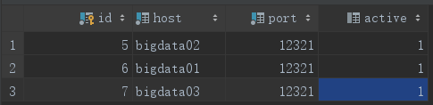

### 安装Azkaban

* 安装`git`编译过程中需要git
  * `yum -y install git`
* 安装`gradle`
  * [下载]()合适的版本</br>
    </br>
  * 解压
    * `unzip gradle-4.10-all.zip`
  * 配置环境变量
    * `vim ~/.bashrc`
      ```sh
      export GRADLE_HOME=/home/yetao_yang/gradle/gradle-4.10
      export PATH=$PATH:$GRADLE_HOME/bin
      ```
    * 刷新环境变量
      * `source ~/.bashrc`
    * 查看是否安装成功
      * `gradle -version`
        ```sh
        ------------------------------------------------------------
        Gradle 4.10
        ------------------------------------------------------------

        Build time:   2018-08-27 18:35:06 UTC
        Revision:     ee3751ed9f2034effc1f0072c2b2ee74b5dce67d

        Kotlin DSL:   1.0-rc-3
        Kotlin:       1.2.60
        Groovy:       2.4.15
        Ant:          Apache Ant(TM) version 1.9.11 compiled on March 23 2018
        JVM:          1.8.0_211 (Oracle Corporation 25.211-b12)
        OS:           Linux 3.10.0-957.el7.x86_64 amd64
        ```
* 下载azkaban的源代码
  * `在附件中有`
* 解压并运行构建命令
  * `./gradlew build -x test`
    ```sh
    BUILD SUCCESSFUL in 5m 30s
    73 actionable tasks: 73 executed
    ```
* 拷贝对应的编译后的包到指定目录
  ```sh
  [yetao_yang@bigdata02 azkaban-3.57.0]$ cp azkaban-exec-server/build/distributions/azkaban-exec-server-0.1.0-SNAPSHOT.tar.gz ~/azkaban/install/
  [yetao_yang@bigdata02 azkaban-3.57.0]$ cp azkaban-web-server/build/distributions/azkaban-web-server-0.1.0-SNAPSHOT.tar.gz ~/azkaban/install/
  [yetao_yang@bigdata02 azkaban-3.57.0]$ cp azkaban-db/build/distributions/azkaban-db-0.1.0-SNAPSHOT.tar.gz ~/azkaban/install/
  ```
* 解压后重命名</br>
  </br>

* 在`azkaban-web-server`目录下生成数字证书
  * `keytool -keystore keystore -alias jetty -genkey -keyalg RSA`
    ```sh
    [yetao_yang@bigdata02 azkaban-web-server]$ keytool -keystore keystore -alias jetty -genkey -keyalg RSA
    输入密钥库口令:
    再次输入新口令:
    您的名字与姓氏是什么?
      [Unknown]:
    您的组织单位名称是什么?
      [Unknown]:
    您的组织名称是什么?
      [Unknown]:
    您所在的城市或区域名称是什么?
      [Unknown]:
    您所在的省/市/自治区名称是什么?
      [Unknown]:
    该单位的双字母国家/地区代码是什么?
      [Unknown]:  CN
    CN=Unknown, OU=Unknown, O=Unknown, L=Unknown, ST=Unknown, C=CN是否正确?
      [否]:  Y
    输入 <jetty> 的密钥口令
    (如果和密钥库口令相同, 按回车):
    再次输入新口令:
    Warning:
    JKS 密钥库使用专用格式。建议使用 "keytool -importkeystore -srckeystore keystore -destkeystore keystore -deststoretype pkcs12" 迁移到行业标准格式 PKCS12。
    [yetao_yang@bigdata02 azkaban-web-server]$
    ```
* 准备`Azkaban`数据库
  * 在mysql下建立`database`,并执行`azkaban-db`下的`create-all-sql-0.1.0-SNAPSHOT.sql`文件
    ```sh
    mysql> use azkaban;
    Database changed
    mysql> source /home/yetao_yang/sql/create-all-sql-0.1.0-SNAPSHOT.sql;
    mysql> show tables;
    +--------------------------+
    | Tables_in_azkaban        |
    +--------------------------+
    | QRTZ_BLOB_TRIGGERS       |
    | QRTZ_CALENDARS           |
    | QRTZ_CRON_TRIGGERS       |
    | QRTZ_FIRED_TRIGGERS      |
    | QRTZ_JOB_DETAILS         |
    | QRTZ_LOCKS               |
    | QRTZ_PAUSED_TRIGGER_GRPS |
    | QRTZ_SCHEDULER_STATE     |
    | QRTZ_SIMPLE_TRIGGERS     |
    | QRTZ_SIMPROP_TRIGGERS    |
    | QRTZ_TRIGGERS            |
    | active_executing_flows   |
    | active_sla               |
    | execution_dependencies   |
    | execution_flows          |
    | execution_jobs           |
    | execution_logs           |
    | executor_events          |
    | executors                |
    | project_events           |
    | project_files            |
    | project_flow_files       |
    | project_flows            |
    | project_permissions      |
    | project_properties       |
    | project_versions         |
    | projects                 |
    | properties               |
    | triggers                 |
    +--------------------------+
    29 rows in set (0.00 sec)
    ```

* 修改配置文件
  * `/home/yetao_yang/azkaban/install/azkaban-web-server/conf/azkaban.properties`
    ```sh
    # Azkaban Personalization Settings
    # 随意改
    azkaban.name=YETAO_YANG
    # 随意改
    azkaban.label=CXSM Azkaban
    azkaban.color=#FF3601
    azkaban.default.servlet.path=/index
    web.resource.dir=/home/yetao_yang/azkaban/install/azkaban-web-server/web/
    default.timezone.id=Asia/Shanghai
    # Azkaban UserManager class
    user.manager.class=azkaban.user.XmlUserManager
    user.manager.xml.file=/home/yetao_yang/azkaban/install/azkaban-web-server/conf/azkaban-users.xml
    # Loader for projects
    # 给执行器里面的绝对路径
    executor.global.properties=/home/yetao_yang/azkaban/install/azkaban-exec-server/conf/global.properties
    azkaban.project.dir=/home/yetao_yang/azkaban/projects
    azkaban.jobtype.plugin.dir=/home/yetao_yang/azkaban/install/azkaban-web-server/plugins/jobtypes
    # Velocity dev mode
    velocity.dev.mode=false
    # Azkaban Jetty server properties.
    # jetty.use.ssl=false
    jetty.ssl.port=8443
    jetty.maxThreads=25
    jetty.port=8888
    # 添加jetty的数字证书
    jetty.keystore=/home/yetao_yang/azkaban/install/azkaban-web-server/keystore
    # 密码
    jetty.password=yetao_yang123
    # 数字证书密码
    jetty.keypassword=yetao_yang123
    # 可信任的数字证书
    jetty.truststore=/home/yetao_yang/azkaban/install/azkaban-web-server/keystore
    # 数字证书密码
    jetty.trustpassword=yetao_yang123
    # Azkaban Executor settings
    # executor 端口号
    executor.port=12321
    # mail settings
    # 发件方的地址
    mail.sender=13657211852@163.com
    # 邮件服务器
    mail.host=smtp.163.com
    # 显示的名称
    mail.user=13657211852@163.com
    # 邮箱密码
    mail.password=1996311yyt
    # User facing web server configurations used to construct the user facing server URLs. They are useful when there is a reverse proxy between Azkaban web servers and users.
    # enduser -> myazkabanhost:443 -> proxy -> localhost:8081
    # when this parameters set then these parameters are used to generate email links.
    # if these parameters are not set then jetty.hostname, and jetty.port(if ssl configured jetty.ssl.port) are used.
    # azkaban.webserver.external_hostname=myazkabanhost.com
    # azkaban.webserver.external_ssl_port=443
    # azkaban.webserver.external_port=8081
    # 失败时发送邮件
    job.failure.email=13657211852@163.com
    # 成功时发送邮件
    job.success.email=13657211852@163.com
    lockdown.create.projects=false
    cache.directory=cache
    # JMX stats
    jetty.connector.stats=true
    executor.connector.stats=true
    # Azkaban mysql settings by default. Users should configure their own username and password.
    database.type=mysql
    mysql.port=3306
    mysql.host=bigdata03
    mysql.database=azkaban
    mysql.user=root
    mysql.password=123456
    mysql.numconnections=100
    #Multiple Executor
    azkaban.use.multiple.executors=true
    azkaban.executorselector.filters=StaticRemainingFlowSize,CpuStatus
    azkaban.executorselector.comparator.NumberOfAssignedFlowComparator=1
    azkaban.executorselector.comparator.Memory=1
    azkaban.executorselector.comparator.LastDispatched=1
    azkaban.executorselector.comparator.CpuUsage=1
    ```
  * `/home/yetao_yang/azkaban/install/azkaban-web-server/conf/azkaban-users.xml`
    ```xml
    <azkaban-users>
      <user groups="azkaban" password="azkaban" roles="admin" username="azkaban"/>
      <user password="metrics" roles="metrics" username="metrics"/>
      <!-- 添加一个用户 赋予 admin和 metrics权限-->
      <user password="123456" roles="admin,metrics" username="yetao_yang"/>

      <role name="admin" permissions="ADMIN"/>
      <role name="metrics" permissions="METRICS"/>
    </azkaban-users>
    ```
  * `azkaban-exec-server/conf/azkaban.properties`
    ```sh
    # Azkaban Personalization Settings
    azkaban.name=Test
    azkaban.label=My Local Azkaban
    azkaban.color=#FF3601
    azkaban.default.servlet.path=/index
    web.resource.dir=web/
    # 修改时区为上海
    default.timezone.id=Asia/Shanghai
    # Azkaban UserManager class
    user.manager.class=azkaban.user.XmlUserManager
    user.manager.xml.file=conf/azkaban-users.xml
    # Loader for projects
    # 改为绝对路径
    executor.global.properties=/home/yetao_yang/azkaban/install/azkaban-exec-server/conf/global.properties
    # 任务存放地址
    azkaban.project.dir=/home/yetao_yang/azkaban/projects
    # Velocity dev mode
    # velocity.dev.mode=false
    # Azkaban Jetty server properties.
    # jetty.use.ssl=false
    jetty.maxThreads=25
    jetty.port=8888
    # Where the Azkaban web server is located
    # azkaban.webserver.url=http://localhost:8888
    # mail settings
    mail.sender=
    mail.host=
    # User facing web server configurations used to construct the user facing server URLs. They are useful when there is a reverse proxy between Azkaban web servers and users.
    # enduser -> myazkabanhost:443 -> proxy -> localhost:8081
    # when this parameters set then these parameters are used to generate email links.
    # if these parameters are not set then jetty.hostname, and jetty.port(if ssl configured jetty.ssl.port) are used.
    # azkaban.webserver.external_hostname=myazkabanhost.com
    # azkaban.webserver.external_ssl_port=443
    # azkaban.webserver.external_port=8081
    job.failure.email=
    job.success.email=
    lockdown.create.projects=false
    cache.directory=cache
    # JMX stats
    jetty.connector.stats=true
    executor.connector.stats=true
    # Azkaban plugin settings
    # 插件地址
    azkaban.jobtype.plugin.dir=/home/yetao_yang/azkaban/install/azkaban-exec-server/plugins/jobtypes
    # Azkaban mysql settings by default. Users should configure their own username and password.
    # mysql相关配置
    database.type=mysql
    mysql.port=3306
    mysql.host=bigdata03
    mysql.database=azkaban
    mysql.user=root
    mysql.password=123456
    # mysql链接数
    mysql.numconnections=100
    # Azkaban Executor settings
    # 线程相关
    executor.maxThreads=50
    executor.flow.threads=30
    # executor 端口号
    executor.port=12321
    ```
  * `azkaban-exec`端可以配置多个,在多个服务器上面运行
    * 把`azkaban-exec-server`文件复制到对应服务器
    * 新建对应`azkaban.project.dir`的文件夹
    * 在数据库里面修改`executors`表,把active状态改为1</br>
      </br>

* 启动`azkaban`
  * 在多个执行服务器上面启动`exec`服务
    * `/home/yetao_yang/azkaban/install/azkaban-exec-server/bin/start-exec.sh`
  * 启动`web`服务
    * `/home/yetao_yang/azkaban/install/azkaban-web-server/bin/start-web.sh`
* 在浏览器上面进行查看
  * `https://bigdata02:8443/index`</br>
    </br>
* 基本的工作流格式
  * 要有一个以`.project`结尾的文件声明工作流版本如`flow20.project`内容如下
    ```
    azkaban-flow-version: 2.0
    ```
  * 要有一个以`.flow`结尾的文件,用于说明工作流的具体细节如`basic.flow`内容如下
    ```
    nodes:
      - name: jobA
        type: command
        config:
          command: echo "This is an echoed text."
    ```
* 创建Command类型多Job工作流
  * `.project`内容与上相同
  * `basic.flow`
    ```
    nodes:
      - name: jobC
        type: noop
        # jobC depends on jobA and jobB
        dependsOn:
          - jobA
          - jobB

      - name: jobA
        type: command
        config:
          command: echo "This is an echoed text."

      - name: jobB
        type: command
        config:
          command: pwd
    ```
* 创建`spark`工作流
  * scala代码如下
    ```scala
    object SparkSql2Hive extends App{
      System.setProperty("HADOOP_USER_NAME", "yetao_yang")
      val sparkConf = new SparkConf().setAppName("spark2hive")//.setMaster("spark://bigdata01:7077")
      val spark = SparkSession
        .builder()
        .config(sparkConf).enableHiveSupport()
        .getOrCreate()
      spark.sql("select * from emp").show
      spark.stop
    }
    ```
  * 把项目进行打包
  * `.project`内容与上相同
  * `basic.flow`
    ```
    nodes:
      - name: spark2hive
        type: command
        config:
          command: /home/yetao_yang/spark/spark-2.4.3/bin/spark-submit --class com.yyt.sparkSQL.SparkSql2Hive --master yarn --deploy-mode cluster helloWord-1.0-SNAPSHOT-jar-with-dependencies.jar
    ```
  * 把三个文件进行压缩,并上传到`Azkaban`
  * Azkaban任务简览</br>
    </br>
    </br>
    </br>
  * 查看`YARN`日志</br>
    </br>
