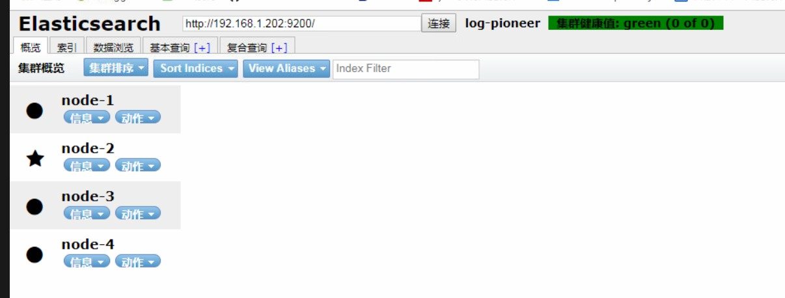

### ElasticSearch集群搭建

<h5 style="color:red">主机名</h5> | hadoop01 | hadoop02 | hadoop03 | hadoop04
:-- | :--: | :--: | :--: | :--:
<h5 style="color:red">ES版本</h5> | elasticsearch-7.0.0 | elasticsearch-7.0.0 | elasticsearch-7.0.0 | elasticsearch-7.0.0
<h5 style="color:red">主从关系</h5> |主节点1 | 从节点 | 从节点 | 主节点2

> 下载[ElasticSearch](https://www.elastic.co/cn/downloads/past-releases)

> 解压

> 修改`config/elasticsearch.yml`文件,添加以下内容


### ElasticSearch 7.x 版本
```
# 集群名称
cluster.name: log-pioneer
# 节点名称
node.name: node-4
# 数据存放目录
path.data: /home/dp_elk/elasticsearch/data
# 日志存放目录
path.logs: /home/dp_elk/elasticsearch/logs
# ip地址
network.host: elk04
# 端口号
http.port: 9200
# 主节点地址
discovery.seed_hosts: ["elk01", "elk02"]
# 集群初始化的主节点名称
cluster.initial_master_nodes: ["node-1", "node-2"]
# 检测到多少个节点后开始备份数据
gateway.recover_after_nodes: 5
http.cors.enabled: true
http.cors.allow-origin: "*"
network.bind_host: 0.0.0.0
```

### Elasticsearch 6.x 版本

```
# 集群名称
cluster.name: log-pioneer
# 节点名称
node.name: node-1
# 数据存放目录
path.data: /home/dp_elk/elasticsearch/data
# 日志存放目录
path.logs: /home/dp_elk/elasticsearch/logs
# ip地址
network.host: elk01
# 端口号
http.port: 9200
# 集群地址
discovery.zen.ping.unicast.hosts: [elk01", "elk02", "elk03", "elk04", "elk05"]
# 集群初始化的主节点名称
discovery.zen.minimum_master_nodes: 1
# 检测到多少个节点后开始备份数据
gateway.recover_after_nodes: 5
http.cors.enabled: true
http.cors.allow-origin: "*"
network.bind_host: 0.0.0.0
```

> 分别启动四台节点<br>
  `nohup ./bin/elasticsearch &`

> 浏览器下载`Elasticsearch Head`插件,查看集群状态<br>
  

> 错误解析

* `max file descriptors [4096] for elasticsearch process is too low, increase to at least [65535]`
  * 切换到`root`用户并修改`/etc/security/limits.conf`文件,添加该配置
    ```
    *               soft    nofile          65536
    *               hard    nofile          65536
    ```
  * 刷新系统配置
    * `sysctl -p`
* `max virtual memory areas vm.max_map_count [65530] is too low, increase to at least [262144]`
  * 切换到`root`用户并修改`/etc/sysctl.conf`文件,添加该配置
    ```
    vm.max_map_count=262144
    ```
  * `sysctl -p`

### [安装](https://www.elastic.co/cn/downloads/kibana)`kibana`

* 修改`kibana.yml`文件配置
  * `server.port: 5602`
  * `server.host: "0.0.0.0"`
  * `elasticsearch.hosts: ["http://elk03:9200"]`
  * `i18n.locale: "zh-CN"`
* 启动`kibana`
  * `./kibana.sh`

### 配置`filebeat`

* 修改`filebeat.yml`文件

  ```yml
  #=========================== Filebeat inputs =============================
  filebeat.inputs:
  - type: log
    enabled: true
    paths:
      - /var/log/messages
  #============================= Filebeat modules ===============================
  filebeat.config.modules:
    # Glob pattern for configuration loading
    path: ${path.config}/modules.d/*.yml

    # Set to true to enable config reloading
    reload.enabled: false

    # Period on which files under path should be checked for changes
    #reload.period: 10s

  #==================== Elasticsearch template setting ==========================

  setup.template.settings:
    index.number_of_shards: 1
    #index.codec: best_compression
    #_source.enabled: false
  #-------------------------- KAFKA output ------------------------------
  output.kafka:
    enabled: true
    hosts: ["elk01:9092","elk02:9092","elk03:9092","elk04:9092","elk05:9092"]
    topic: syslog_filebeat

  #================================ Processors =====================================

  # Configure processors to enhance or manipulate events generated by the beat.

  processors:
    - add_host_metadata: ~
    - add_cloud_metadata: ~
  ```

* 启动`filebeat`
  * `nohup ./filebeat -e -c ./filebeat.yml &`

### logstash

> 关于filebeat配置

```config
input {
  kafka {
    # kafka的地址
    bootstrap_servers => ["elk01:9092,elk02:9092,elk03:9092,elk04:9092,elk05:9092"]
    # 组id避免消息重复消费
    group_id => "filebeatSyslog"
    auto_offset_reset => "earliest"
    consumer_threads => "5"
    decorate_events => "false"
    topics => ["syslog_filebeat"]
    type => "log"
    codec => json {
        charset => "UTF-8"
    }
  }
}
# 命令台输入 用于测试
#input {
#    stdin{codec=>line}
#}


filter{
  grok{
    # 这是自定义patterns的地址
    patterns_dir => ["/home/dp_elk/logstash/patterns"]
    # 进行正则匹配
    match => {
        "message" => "%{SYSLOG_FIRST_EN_DATE:log_time1} %{GREEDYDATA:hostname} %{GREEDYDATA:log_tag}\[%{NUMBER:process_code:int}\]: %{SYSLOG_DATE:log_time2}.*%{LOG_LEVEL:log_level}.*clzzName : %{GREEDYDATA:class_name},methodName : %{GREEDYDATA:method_name},statuCode : %{NUMBER:statu_code:int}"
    }
  }
 mutate{
    # 删除message字段
    remove_field => "message"
  }
}

# 输出到控制台,用于测试
#output {
#    stdout{codec=>rubydebug}
#}

# 输出到ElasticSearch集群
output {
  elasticsearch {
    hosts => ["http://elk01:9200","http://elk02:9200","http://elk03:9200","http://elk04:9200","http://elk05:9200"]
    index => "syslog_filebeat"
  }
}
```

### logstash接收syslog消息并输出到KAFKA

* 配置config文件

  ```conf
  # 指定syslog的端口号
  input {
      syslog{
          # syslog发送消息到本机的9990端口
          port => 9990
      }
  }
  # 输出消息到kafka
  output{
      kafka{
          codec => json
          topic_id => "syslog_test"
          bootstrap_servers => "elk01:9092,elk02:9092,elk03:9092,elk04:9092,elk05:9092"
      }
  }
  ```

### logstash接收KAFKA消息并输出到ElasticSearch

* 配置config文件

  ```conf
  # 从KAFKA接收消息
  input {
      kafka {
          bootstrap_servers => ["elk01:9092,elk02:9092,elk03:9092,elk04:9092,elk05:9092"]
          group_id => "syslogTest"
          auto_offset_reset => "earliest"
          consumer_threads => "5"
          decorate_events => "false"
          topics => ["syslog_test"]
          type => "log"
          codec => json {
              charset => "UTF-8"
          }
     }
  }
  # 过滤器配置
  filter{
    grok{
      # 自定义patterns的文件夹地址
      patterns_dir => ["/home/dp_elk/logstash/patterns"]
      # 正则解析, 里面有用到自定义patterns
      match => {
          "message" => "%{SYSLOG_FIRST_EN_DATE:log_time1} %{GREEDYDATA:log_tag}\[%{NUMBER:process_code:int}\]: %{SYSLOG_DATE:log_time2}.*%{LOG_LEVEL:log_level}.*clzzName : %{GREEDYDATA:class_name},methodName : %{GREEDYDATA:method_name},statuCode : %{NUMBER:statu_code:int}"
      }
    }
    # 时间转换
    date{
      # 把log_time1字段按`MMM dd HH:mm:ss`格式转换为UNIX格式的时间戳
      match =>["log_time1","MMM dd HH:mm:ss","UNIX"]
      # 时区加8小时
      timezone => "+08:00"
      target => "log_time1"
    }
    # 时间转换
    date{
      # 把log_time2字段按`yyyy-MM-dd HH:mm:ss.SSS`格式转换为UNIX格式的时间戳
      match => ["log_time2","yyyy-MM-dd HH:mm:ss.SSS","UNIX"]
      # 时区加8小时
      timezone => "+08:00"
      target => "log_time2"
    }
    ruby{
       # ruby代码的文件路径,这里面对已经转换为时间格式的log_time1,log_time2字段,以及已经为时间字段的@timestamp,转换成毫秒值
       path => "/home/dp_elk/logstash/ruby/syslog_out_es.rb"
    }
  }
  # 输出到ES里面
  output {
    elasticsearch {
      hosts => ["http://elk01:9200","http://elk02:9200","http://elk03:9200","http://elk04:9200","http://elk05:9200"]
      index => "syslog_tcp_es"
    }
  }
  ```

### logstash输出数据到http
* logstash端配置
  ```conf
  output {
      #stdout{codec=>rubydebug}
      http{
          id => "syslog_http01"
          url => "http://192.168.1.223:9800/yyt/logstash/test01"
          http_method => "get"
          format => "json"
      }
  }
  ```
* java端配置
  ```java
  @RestController
  @RequestMapping("/yyt/logstash/")
  public class LogstashController {
      @GetMapping("test01")
      public void test01(@RequestBody Map<String,Object> params){
          params.forEach((k,v) -> {
              System.out.println(k+"----"+v);
          });
      }
  }
  ```
* 控制台打印为
  ```
  facility----0
  method_name----821
  log_time1----1556438592000
  timestamp----1556438591996
  priority----0
  process_code----9661
  class_name----aaaaaa4481
  tags----[_grokparsefailure_sysloginput]
  host----192.168.1.208
  facility_label----kernel
  log_time2----1556438594000
  log_tag----**********test********
  @version----1
  statu_code----3561
  severity----0
  log_level----INFO
  severity_label----Emergency
  @timestamp----2019-04-28T08:03:13.996Z
  message----<30>Apr 28 16:03:14 **********test********[9661]: 2019-04-28 16:03:14.000  INFO 1 --- [pool-1-thread-1] toTimer$$EnhancerBySpringCGLIB$$f0c78222 : clzzName : aaaaaa4271,methodName : 2581,statuCode : 3561
  ```

### logstash输出数据到RabbitMQ
  ```
  output {
      rabbitmq{
          id => "rabbitmq_test"
          # Exchange
          exchange => "logstash_rabbitmq"
          exchange_type => "topic"
          arguments => {"x-ha-policy" => "all"}
          # rabbitMQ的ip
          host => ["39.97.100.190"]
          # 端口号
          port => 5672
          # 用户名
          user => "guest"
          # 密码
          password => "guest!2019"
      }
  }
  ```

### 自定义patterns
* `vi /home/dp_elk/logstash/patterns/dateformat`
  ```
  # 2019-04-25 10:20:06.001
  #SYSLOG_DATE %{YEAR}-%{MONTH}-%{MONTHDAY} %{HOUR}:%{MINUTE}:%{SECOND}.[0-9]{1,3}
  SYSLOG_DATE \d+\-\d+\-\d+\s\d+\:\d+\:\d+.\d+
  # Apr 25 10:20:06
  SYSLOG_FIRST_EN_DATE %{MONTH} %{MONTHDAY} %{HOUR}:%{MINUTE}:%{SECOND}
  ```
* `vi /home/dp_elk/logstash/patterns/logformat`
  ```
  LOG_LEVEL WARN|DEBUG|INFO|ERROR|warn|debug|info|error
  ```

### ruby代码

```ruby
def register(params)
    # 这里通过params获取的参数是在logstash文件中通过script_params传入的
    @message = params["message"]
end

# 这里通过参数event可以获取到所有input中的属性
def filter(event)
    # log_time1;@timestamp;log_time2已经在conf文件中转换为了时间格式所以 (event.get('XXXX').to_f * 1000).to_i 为时间戳
    # event.set(aaa, bbb) 添加一个aaa字段,值为bbb,如果字段已存在则覆盖
    event.set('log_time1', (event.get('log_time1').to_f * 1000).to_i)
    event.set('timestamp', (event.get('@timestamp').to_f * 1000).to_i)
    event.set('log_time2', (event.get('log_time2').to_f * 1000).to_i)
    # 返回event对象
    return [event]

end
```

### 常用命令

* 查看指定机器上kafka的相关topics
  * `./bin/kafka-topics.sh --list --zookeeper hadoop02:2181`
* docker编译jar应用(基本)
  * `docker build -t front:1.0-SNAPSHOT .`
* 启动docker应用, 并把日志文件以tcp的方式发送到指定的地址
  * `docker run --name=ss3 --log-driver syslog  --log-opt syslog-address=tcp://elk01:9990 --log-opt tag="**********test********" -d -p 8888:8888 648`

### 设置防火墙规则
* `firewall-cmd --zone=public --add-port=9200/tcp --permanent`
  * 打开9200端口
* `firewall-cmd --zone=public --add-port=9300/tcp --permanent`
  * 打开9300端口
* `firewall-cmd   --reload`
  * 更新防火墙规则
* `firewall-cmd --zone=public --list-ports`
  * 查看打开的端口列表
