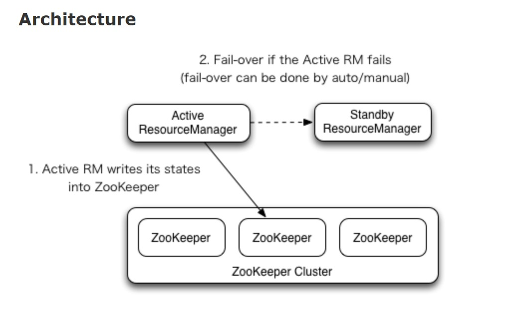

## 根据完全分布式模型进行修改

### HDFS的高可用

> <h4 style="color: red">Centos 里面一定要安装fuser这个插件 命令 : `yum install psmisc` PS: 切记一定要安装,要不然namenode不能自动切换到active</h4>

> 本地测试hadoop版本为2.9.2版本 [官方HDFS HA教程地址](https://hadoop.apache.org/docs/r2.9.2/hadoop-project-dist/hadoop-hdfs/HDFSHighAvailabilityWithQJM.html)

> **先配置好zookeeper**

* 在`yarn-site.xml`里面配置日志聚集功能
  ```xml
  <!-- reducer获取数据的方式 -->
  <property>
   <name>yarn.nodemanager.aux-services</name>
   <value>mapreduce_shuffle</value>
  </property>
  <!-- 指定YARN的ResourceManager的地址 -->
  <property>
  <name>yarn.resourcemanager.hostname</name>
  <value>hadoop02</value>
  </property>
  <!-- 日志聚集功能 -->
  <property>
  <name>yarn.log-aggregation-enable</name>
  <value>true</value>
  </property>
  <property>
  <!-- 日志保留时间设置为7天  -->
  <name>yarn.log-aggregation.retain-seconds</name>
  <value>604800</value>
  </property>
  ```
* 在`mapred-site.xml`里面配置历史服务器
  ```xml
  <property>
  <name>mapreduce.jobhistory.address</name>
  <value>hadoop01:10020</value>
  </property>
  <property>
      <name>mapreduce.jobhistory.webapp.address</name>
      <value>hadoop01:19888</value>
  </property>
  ```

* 配置`hdfs-site.xml`

  ```xml
  <!-- 指定HDFS副本的数量 -->
  <property>
    <name>dfs.replication</name>
    <value>3</value>
  </property>

  <!-- namenode对外暴露的集群名称 -->
  <property>
    <name>dfs.nameservices</name>
    <value>mycluster</value>
  </property>

  <!-- 两个namenode叫什么名称 -->
  <property>
    <name>dfs.ha.namenodes.mycluster</name>
    <value>nn1,nn2</value>
  </property>

  <!-- namenode的通信地址 -->
  <property>
    <name>dfs.namenode.rpc-address.mycluster.nn1</name>
    <value>hadoop01:8020</value>
  </property>
  <!-- namenode的通信地址 -->
  <property>
    <name>dfs.namenode.rpc-address.mycluster.nn2</name>
    <value>hadoop03:8020</value>
  </property>

  <!-- namenode的外部端口 -->
  <property>
    <name>dfs.namenode.http-address.mycluster.nn1</name>
    <value>hadoop01:50070</value>
  </property>
  <!-- namenode的外部端口 -->
  <property>
    <name>dfs.namenode.http-address.mycluster.nn2</name>
    <value>hadoop03:50070</value>
  </property>

  <!-- qjournal 共享数据的配置地址 至少要三台 -->
  <property>
    <name>dfs.namenode.shared.edits.dir</name>
    <value>qjournal://hadoop01:8485;hadoop02:8485;hadoop03:8485/mycluster</value>
  </property>

  <!-- 代理类 -->
  <property>
    <name>dfs.client.failover.proxy.provider.mycluster</name>
    <value>org.apache.hadoop.hdfs.server.namenode.ha.ConfiguredFailoverProxyProvider</value>
  </property>

  <!-- 隔离机制 -->
  <property>
    <name>dfs.ha.fencing.methods</name>
    <value>sshfence</value>
  </property>
  <!-- 采用哪个用户的ssh -->
  <property>
    <name>dfs.ha.fencing.ssh.private-key-files</name>
    <value>/home/yetao_yang/.ssh/id_rsa</value>
  </property>
  <!-- 开启故障自动转移 -->
  <property>
    <name>dfs.ha.automatic-failover.enabled</name>
    <value>true</value>
  </property>
  ```

* 配置`core-site.xml`

  ```xml
  <!-- namenode的通信地址 -->
  <property>
    <name>fs.defaultFS</name>
    <value>hdfs://mycluster</value>
  </property>
  <!-- 指定hadoop运行时产生文件的存储目录 -->
  <property>
    <name>hadoop.tmp.dir</name>
    <value>/home/yetao_yang/hadoop_HA/data/hadoop/tmp</value>
  </property>
  <!-- journalnode共享数据的存放路径 -->
  <property>
    <name>dfs.journalnode.edits.dir</name>
    <value>/home/yetao_yang/hadoop_HA/data/jn</value>
  </property>
  <!-- zk的服务器地址 -->
  <property>
    <name>ha.zookeeper.quorum</name>
    <value>hadoop01:2181,hadoop02:2181,hadoop03:2181</value>
  </property>

  ```

> **启动流程**
* 在各个JournalNode节点上，输入以下命令启动journalnode服务
  * `sbin/hadoop-daemon.sh start journalnode`
* 在[nn1]上，对其进行格式化，并启动
  * `bin/hdfs namenode -format`
  * `sbin/hadoop-daemon.sh start namenode`
* 在[nn2]上，同步nn1的元数据信息
  * `bin/hdfs namenode -bootstrapStandby`
* 关闭所有HDFS服务
  * `sbin/stop-dfs.sh`
* 启动Zookeeper集群
  * `bin/zkServer.sh start`
* 初始化HA在Zookeeper中状态
  * `bin/hdfs zkfc -formatZK`
* 启动HDFS服务
  * `sbin/start-dfs.sh`
* 如果没启动zkfc就要启动zkfc
  * `sbin/hadoop-daemon.sh start zkfc`

### YARN高可用
本地测试hadoop版本为2.9.2版本 [官方YARN HA教程地址](https://hadoop.apache.org/docs/r2.9.2/hadoop-yarn/hadoop-yarn-site/ResourceManagerHA.html)<br>


* 配置`yarn-site.xml`
  ```xml
  <!-- reducer获取数据的方式 -->
  <property>
      <name>yarn.nodemanager.aux-services</name>
      <value>mapreduce_shuffle</value>
  </property>
  <!--启用resourcemanager ha-->
  <property>
    <name>yarn.resourcemanager.ha.enabled</name>
    <value>true</value>
  </property>
  <!--声明两台resourcemanager的地址-->
  <property>
    <name>yarn.resourcemanager.cluster-id</name>
    <value>cluster-yarn</value>
  </property>
  <property>
    <name>yarn.resourcemanager.ha.rm-ids</name>
    <value>rm1,rm2</value>
  </property>
  <property>
    <name>yarn.resourcemanager.hostname.rm1</name>
    <value>hadoop01</value>
  </property>
  <property>
    <name>yarn.resourcemanager.hostname.rm2</name>
    <value>hadoop02</value>
  </property>
  <!-- 指定rm1客户端的地址 -->
  <property>
    <name>yarn.resourcemanager.webapp.address.rm1</name>
    <value>hadoop01:8088</value>
  </property>
  <!-- 指定rm2客户端的地址 -->
  <property>
    <name>yarn.resourcemanager.webapp.address.rm2</name>
    <value>hadoop02:8088</value>
  </property>
  <!--启用自动恢复-->
  <property>
    <name>yarn.resourcemanager.recovery.enabled</name>
    <value>true</value>
  </property>
  <!--指定zookeeper集群的地址-->
  <property>
    <name>yarn.resourcemanager.zk-address</name>
    <value>hadoop01:2181,hadoop02:2181,hadoop03:2181</value>
  </property>
  <!--指定resourcemanager的状态信息存储在zookeeper集群-->
  <property>
    <name>yarn.resourcemanager.store.class</name>
    <value>org.apache.hadoop.yarn.server.resourcemanager.recovery.ZKRMStateStore</value>
  </property>
  <!-- 日志聚集功能 -->
  <property>
    <name>yarn.log-aggregation-enable</name>
    <value>true</value>
  </property>
  <property>
    <name>yarn.log-aggregation.retain-seconds</name>
    <value>604800</value>
  </property>
  ```
* 在rm1上启动yarn
  * `sbin/start-yarn.sh`
* 在rm2上启动yarn
  * `sbin/yarn-daemon.sh start resourcemanager`
* 查看服务状态
  * `bin/yarn rmadmin -getServiceState rm1`
