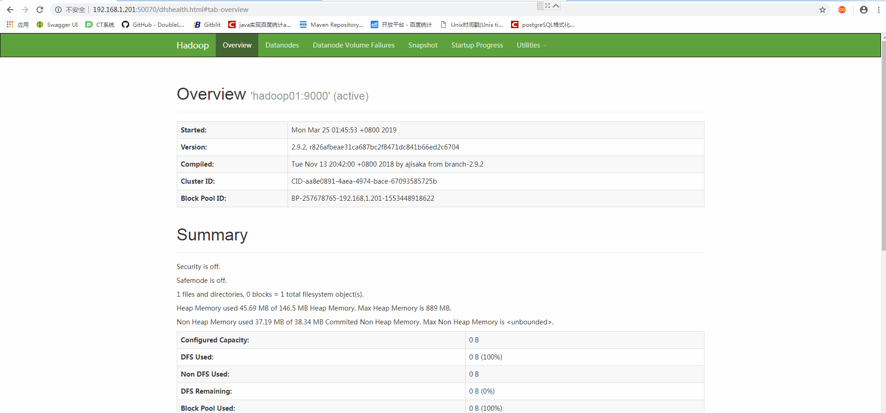
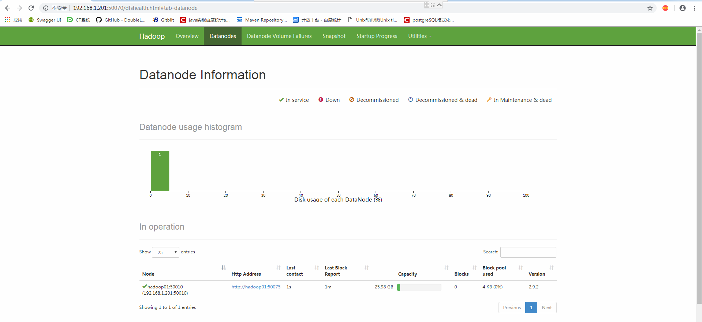
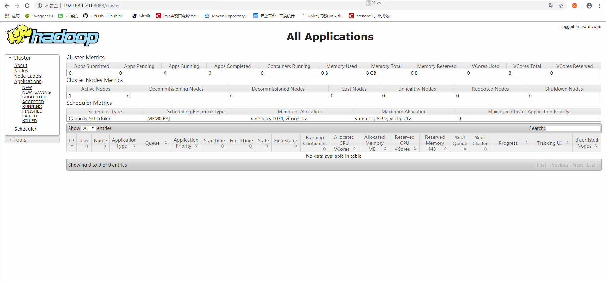
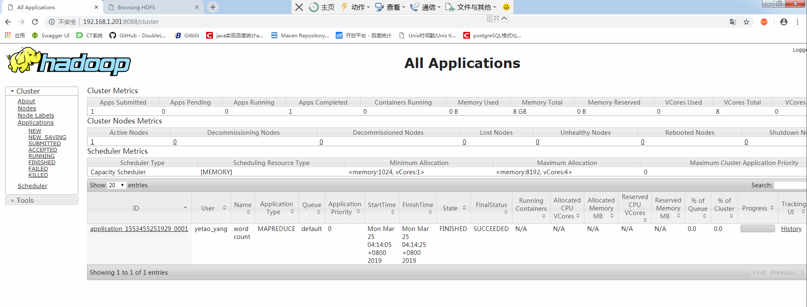

# 单节点

### 从[官网](https://hadoop.apache.org/)下载对应版本的hadoop


* 解压到对应的目录

* 配置环境变量
  * 在当前用户下的`.bashrc`文件中配置
    * `/home/yetao_yang/hadoop/hadoop-2.9.2`目录是下载hadoop对应的解压文件夹路径

  ```shell
  export HADOOP_HOME=/home/yetao_yang/hadoop/hadoop-2.9.2
  export CLASSPATH=.:${JAVA_HOME}/lib:${JRE_HOME}/lib
  export PATH=${HADOOP_HOME}/bin:${HADOOP_HOME}/sbin:$PATH
  ```
* 刷新环境变量文件配置
  * `source ~/.bashrc`
* 查看hadoop版本
  * `hadoop version`

* 测试[官网](https://hadoop.apache.org/docs/r2.9.2/hadoop-project-dist/hadoop-common/SingleCluster.html)grep示例
  * 创建input文件夹
    * `mkdir input`
  * 把配置文件里面.xml结尾的文件拷贝到input下面
    * `cp etc/hadoop/*.xml input`
  * 运行haoop的测试案例
    * `hadoop jar share/hadoop/mapreduce/hadoop-mapreduce-examples-2.9.2.jar grep input output 'dfs[a-z.]+'`
    * `share/hadoop/mapreduce/hadoop-mapreduce-examples-2.9.2.jar`里面存放的是hadoop的所有测试案例
    * `grep`指定案例
    * `input`为数据来源
    * `output`为解析数据的存放地址
    * `dfs[a-z.]+`为解析规则
      * dfs开头 + a到z的任意多个字符
    * 查看output文件夹的`part-r-00000`
      ```shell
      [yetao_yang@localhost output]$ cat part-r-00000
      1	dfsadmin
      ```

* 测试wordcount案例
  * `vi wcinput/wc.input`

    ```
    a a a b b
    c d d d d e
    e f f f f f f f f
    ```
  * 运行命令
    * `hadoop jar share/hadoop/mapreduce/hadoop-mapreduce-examples-2.9.2.jar wordcount wcinput/ wcoutput/`
  * 查看结果
    ```shell
    [yetao_yang@localhost hadoop-2.9.2]$ cat wcoutput/part-r-00000
    a	3
    b	2
    c	1
    d	4
    e	2
    f	8
    ```

* hdfs的wordcount案例
  * 修改`hadoop-env.sh`文件里面的JAVA_HOME路径为绝对路径
    * 使用`echo $JAVA_HOME`查看路径
  * 修改`core-site.xml`文件,修改hadoop`namenode`地址与hadoop文件存储目录

    ```xml
    <!-- 指定HDFS中NameNode的地址 -->
    <property>
            <name>fs.defaultFS</name>
        <value>hdfs://hadoop01:9000</value>
    </property>

    <!-- 指定hadoop运行时产生文件的存储目录 -->
    <property>
            <name>hadoop.tmp.dir</name>
            <value>/home/yetao_yang/hadoop/data/tmp</value>
    </property>
    ```

  * 更改`hdfs-site.xml`文件,修改HDFS的副本数量

    ```xml
    <!-- 指定HDFS副本的数量 -->
  	<property>
  		<name>dfs.replication</name>
  		<value>1</value>
  	</property>
    ```

  * 格式化namenode(**第一次启动时格式化，以后就不要总格式化**)生成一个namenode文件夹
    * `hdfs namenode -format`
    * 日志如下

      ```shell
      ************************************************************/
      19/03/25 01:35:17 INFO namenode.NameNode: registered UNIX signal handlers for [TERM, HUP, INT]
      19/03/25 01:35:17 INFO namenode.NameNode: createNameNode [-format]
      Formatting using clusterid: CID-aa8e0891-4aea-4974-bace-67093585725b
      19/03/25 01:35:18 INFO namenode.FSEditLog: Edit logging is async:true
      19/03/25 01:35:18 INFO namenode.FSNamesystem: KeyProvider: null
      19/03/25 01:35:18 INFO namenode.FSNamesystem: fsLock is fair: true
      19/03/25 01:35:18 INFO namenode.FSNamesystem: Detailed lock hold time metrics enabled: false
      19/03/25 01:35:18 INFO namenode.FSNamesystem: fsOwner             = yetao_yang (auth:SIMPLE)
      19/03/25 01:35:18 INFO namenode.FSNamesystem: supergroup          = supergroup
      19/03/25 01:35:18 INFO namenode.FSNamesystem: isPermissionEnabled = true
      19/03/25 01:35:18 INFO namenode.FSNamesystem: HA Enabled: false
      19/03/25 01:35:18 INFO common.Util: dfs.datanode.fileio.profiling.sampling.percentage set to 0. Disabling file IO profiling
      19/03/25 01:35:18 INFO blockmanagement.DatanodeManager: dfs.block.invalidate.limit: configured=1000, counted=60, effected=1000
      19/03/25 01:35:18 INFO blockmanagement.DatanodeManager: dfs.namenode.datanode.registration.ip-hostname-check=true
      19/03/25 01:35:18 INFO blockmanagement.BlockManager: dfs.namenode.startup.delay.block.deletion.sec is set to 000:00:00:00.000
      19/03/25 01:35:18 INFO blockmanagement.BlockManager: The block deletion will start around 2019 三月 25 01:35:18
      19/03/25 01:35:18 INFO util.GSet: Computing capacity for map BlocksMap
      19/03/25 01:35:18 INFO util.GSet: VM type       = 64-bit
      19/03/25 01:35:18 INFO util.GSet: 2.0% max memory 889 MB = 17.8 MB
      19/03/25 01:35:18 INFO util.GSet: capacity      = 2^21 = 2097152 entries
      19/03/25 01:35:18 INFO blockmanagement.BlockManager: dfs.block.access.token.enable=false
      19/03/25 01:35:18 WARN conf.Configuration: No unit for dfs.heartbeat.interval(3) assuming SECONDS
      19/03/25 01:35:18 WARN conf.Configuration: No unit for dfs.namenode.safemode.extension(30000) assuming MILLISECONDS
      19/03/25 01:35:18 INFO blockmanagement.BlockManagerSafeMode: dfs.namenode.safemode.threshold-pct = 0.9990000128746033
      19/03/25 01:35:18 INFO blockmanagement.BlockManagerSafeMode: dfs.namenode.safemode.min.datanodes = 0
      19/03/25 01:35:18 INFO blockmanagement.BlockManagerSafeMode: dfs.namenode.safemode.extension = 30000
      19/03/25 01:35:18 INFO blockmanagement.BlockManager: defaultReplication         = 1
      19/03/25 01:35:18 INFO blockmanagement.BlockManager: maxReplication             = 512
      19/03/25 01:35:18 INFO blockmanagement.BlockManager: minReplication             = 1
      19/03/25 01:35:18 INFO blockmanagement.BlockManager: maxReplicationStreams      = 2
      19/03/25 01:35:18 INFO blockmanagement.BlockManager: replicationRecheckInterval = 3000
      19/03/25 01:35:18 INFO blockmanagement.BlockManager: encryptDataTransfer        = false
      19/03/25 01:35:18 INFO blockmanagement.BlockManager: maxNumBlocksToLog          = 1000
      19/03/25 01:35:18 INFO namenode.FSNamesystem: Append Enabled: true
      19/03/25 01:35:18 INFO namenode.FSDirectory: GLOBAL serial map: bits=24 maxEntries=16777215
      19/03/25 01:35:18 INFO util.GSet: Computing capacity for map INodeMap
      19/03/25 01:35:18 INFO util.GSet: VM type       = 64-bit
      19/03/25 01:35:18 INFO util.GSet: 1.0% max memory 889 MB = 8.9 MB
      19/03/25 01:35:18 INFO util.GSet: capacity      = 2^20 = 1048576 entries
      19/03/25 01:35:18 INFO namenode.FSDirectory: ACLs enabled? false
      19/03/25 01:35:18 INFO namenode.FSDirectory: XAttrs enabled? true
      19/03/25 01:35:18 INFO namenode.NameNode: Caching file names occurring more than 10 times
      19/03/25 01:35:18 INFO snapshot.SnapshotManager: Loaded config captureOpenFiles: falseskipCaptureAccessTimeOnlyChange: false
      19/03/25 01:35:18 INFO util.GSet: Computing capacity for map cachedBlocks
      19/03/25 01:35:18 INFO util.GSet: VM type       = 64-bit
      19/03/25 01:35:18 INFO util.GSet: 0.25% max memory 889 MB = 2.2 MB
      19/03/25 01:35:18 INFO util.GSet: capacity      = 2^18 = 262144 entries
      19/03/25 01:35:18 INFO metrics.TopMetrics: NNTop conf: dfs.namenode.top.window.num.buckets = 10
      19/03/25 01:35:18 INFO metrics.TopMetrics: NNTop conf: dfs.namenode.top.num.users = 10
      19/03/25 01:35:18 INFO metrics.TopMetrics: NNTop conf: dfs.namenode.top.windows.minutes = 1,5,25
      19/03/25 01:35:18 INFO namenode.FSNamesystem: Retry cache on namenode is enabled
      19/03/25 01:35:18 INFO namenode.FSNamesystem: Retry cache will use 0.03 of total heap and retry cache entry expiry time is 600000 millis
      19/03/25 01:35:18 INFO util.GSet: Computing capacity for map NameNodeRetryCache
      19/03/25 01:35:18 INFO util.GSet: VM type       = 64-bit
      19/03/25 01:35:18 INFO util.GSet: 0.029999999329447746% max memory 889 MB = 273.1 KB
      19/03/25 01:35:18 INFO util.GSet: capacity      = 2^15 = 32768 entries
      19/03/25 01:35:18 INFO namenode.FSImage: Allocated new BlockPoolId: BP-257678765-192.168.1.201-1553448918622
      19/03/25 01:35:18 INFO common.Storage: Storage directory /home/yetao_yang/hadoop/data/tmp/dfs/name has been successfully formatted.
      19/03/25 01:35:18 INFO namenode.FSImageFormatProtobuf: Saving image file /home/yetao_yang/hadoop/data/tmp/dfs/name/current/fsimage.ckpt_0000000000000000000 using no compression
      19/03/25 01:35:18 INFO namenode.FSImageFormatProtobuf: Image file /home/yetao_yang/hadoop/data/tmp/dfs/name/current/fsimage.ckpt_0000000000000000000 of size 329 bytes saved in 0 seconds .
      19/03/25 01:35:18 INFO namenode.NNStorageRetentionManager: Going to retain 1 images with txid >= 0
      19/03/25 01:35:18 INFO namenode.NameNode: SHUTDOWN_MSG:
      /************************************************************
      SHUTDOWN_MSG: Shutting down NameNode at hadoop01/192.168.1.201
      ************************************************************/

      ```

      * 根据日志查看`/home/yetao_yang/hadoop/data/tmp/dfs/name/current`下的`VERSION`文件
        ```shell
        [yetao_yang@hadoop01 current]$ cat VERSION
        #Mon Mar 25 01:35:18 CST 2019
        namespaceID=1347588471
        clusterID=CID-aa8e0891-4aea-4974-bace-67093585725b
        cTime=1553448918622
        storageType=NAME_NODE
        blockpoolID=BP-257678765-192.168.1.201-1553448918622
        layoutVersion=-63
        ```
        * `namespaceID` : namenode节点的识别码
        * `clusterID` : 集群的识别码
        * `cTime` : 集群的创建时间
        * `storageType` : 该节点类型
  * 启动`namenode`
    * 进入`sbin`目录运行命令
      * `hadoop-daemon.sh start namenode`
    * 查看是否启动成功
      ```shell
      [yetao_yang@hadoop01 ~]$ jps
      10865 NameNode
      10968 Jps
      ```
    * 在浏览器上查看是否启动成功
      * `http://192.168.1.201:50070`

        
  * 启动`datanode`
    * `hadoop-daemon.sh start datanode`
    * 查看是否启动成功
      ```shell
      [yetao_yang@hadoop01 sbin]$ jps
      10865 NameNode
      11089 Jps
      11006 DataNode
      ```
    * 在浏览器查看状态

      

  * 进入`/home/yetao_yang/hadoop/data/tmp/dfs/data/current`目录查看`VERSION`文件

    ```shell
    [yetao_yang@hadoop01 current]$ cat VERSION
    #Mon Mar 25 01:53:29 CST 2019
    storageID=DS-4c4beebd-cba5-4290-8276-8f994b104e75
    clusterID=CID-aa8e0891-4aea-4974-bace-67093585725b
    cTime=0
    datanodeUuid=d65baa69-7393-41b6-92b5-1b89bd1dcbae
    storageType=DATA_NODE
    layoutVersion=-57
    ```
    * `namenode`的VERSION文件要与`datanode`的VERSION文件里面的`clusterID`一致
    * <font style="color:red">如果重新格式化namenode节点,namenode节点又会重新生成`clusterID`会与`datanode`里面的clusterID不一致</font>
      * 所以要删除hadoop下的`data`文件夹与logs文件夹

  * 在hdfs上创建文件夹 [查看更多hdfs文件命令](http://hadoop.apache.org/docs/r1.2.1/file_system_shell.html)
    * `hdfs dfs -mkdir -p /user/test01/input`
      
  * 上传之前案例的wc.input文件到hdfs
    * `hdfs dfs -put wcinput/wc.input /user/test01/input`

  * 运行`wordcount`案例
    * `hadoop jar share/hadoop/mapreduce/hadoop-mapreduce-examples-2.9.2.jar wordcount`
  * 查看运行结果
    ```shell
    [yetao_yang@hadoop01 hadoop-2.9.2]$ hdfs dfs -cat /user/test01/output/part-r-00000
    a	3
    b	2
    c	1
    d	4
    e	2
    f	8
    ```

* 在`yarn`上运行`MapReduce程序`
  * 修改`yarn-env.sh`文件夹
    * 修改`JAVA_HOME`
      * `export JAVA_HOME=/home/yetao_yang/jdk/jdk1.8.0_201`
  * 修改`yarn-site.xml`文件
    ```xml
    <!-- reducer获取数据的方式 -->
    <property>
     <name>yarn.nodemanager.aux-services</name>
     <value>mapreduce_shuffle</value>
    </property>

    <!-- 指定YARN的ResourceManager的地址 -->
    <property>
    <name>yarn.resourcemanager.hostname</name>
    <value>hadoop01</value>
    </property>
    ```
  * 配置`mapred-env.sh`文件
    * 修改`JAVA_HOME`
      * `export JAVA_HOME=/home/yetao_yang/jdk/jdk1.8.0_201`
  * 重命名`mapred-site.xml.template`文件为`mapred-site.xml`并添加配置

    ```xml
    <!-- 指定mr运行在yarn上 -->
    <property>
    	<name>mapreduce.framework.name</name>
    	<value>yarn</value>
    </property>
    ```
  * 启动resourcemanager
    * `yarn-daemon.sh start resourcemanager`
      ```shell
      [yetao_yang@hadoop01 ~]$ yarn-daemon.sh start resourcemanager
      starting resourcemanager, logging to /home/yetao_yang/hadoop/hadoop-2.9.2/logs/yarn-yetao_yang-resourcemanager-hadoop01.out
      ```
  * 启动nodemanager
    * `yarn-daemon.sh start nodemanager`
      ```shell
      [yetao_yang@hadoop01 ~]$ yarn-daemon.sh start nodemanager
      starting nodemanager, logging to /home/yetao_yang/hadoop/hadoop-2.9.2/logs/yarn-yetao_yang-nodemanager-hadoop01.out
      ```
  * 查看进程
    ```shell
    [yetao_yang@hadoop01 ~]$ jps
    10865 NameNode
    12178 NodeManager
    11863 ResourceManager
    12301 Jps
    11006 DataNode
    ```
  * 查看`yarn` WEB页面
    * `http://192.168.1.201:8088/cluster`

      
  * 删除之前创建的`output`文件目录
    * `hdfs dfs -rm -r /user/test01/output`
  * 运行`MapReduce`程序
    * `hadoop jar ./hadoop/hadoop-2.9.2/share/hadoop/mapreduce/hadoop-mapreduce-examples-2.9.2.jar wordcount /user/test01/input /user/test01/output`
  * 查看`yarn`WEB端

    
  * 查看hdfs的output文件
    ```shell
    [yetao_yang@hadoop01 ~]$ clear
    [yetao_yang@hadoop01 ~]$ hdfs dfs -cat /user/test01/output/part-r-00000
    a	3
    b	2
    c	1
    d	4
    e	2
    f	8
    ```
* 配置历史服务器
  * 修改`yarn-site.xml`文件,添加如下配置
    ```xml
    <property>
    <name>mapreduce.jobhistory.address</name>
    <value>hadoop01:10020</value>
    </property>
    <property>
        <name>mapreduce.jobhistory.webapp.address</name>
        <value>hadoop01:19888</value>
    </property>
    ```
  * 启动历史服务器
    * `mr-jobhistory-daemon.sh start historyserver`
  * 配置日志聚集功能

    ```xml
    <!-- 日志聚集功能使能 -->
    <property>
    <name>yarn.log-aggregation-enable</name>
    <value>true</value>
    </property>
    <!-- 日志保留时间设置7天 -->
    <property>
    <name>yarn.log-aggregation.retain-seconds</name>
    <value>604800</value>
    </property>
    ```
  * 关闭`nodemanager` 、`resourcemanager`和`historymanager`

    ```shell
    [yetao_yang@hadoop01 hadoop]$ yarn-daemon.sh stop resourcemanager
    stopping resourcemanager
    [yetao_yang@hadoop01 hadoop]$ jps
    10865 NameNode
    13274 Jps
    11006 DataNode
    [yetao_yang@hadoop01 hadoop]$ yarn-daemon.sh stop nodemanager
    stopping nodemanager
    nodemanager did not stop gracefully after 5 seconds: killing with kill -9
    [yetao_yang@hadoop01 hadoop]$ mr-jobhistory-daemon.sh stop historyserver
    stopping historyserver
    [yetao_yang@hadoop01 hadoop]$ jps
    10865 NameNode
    13341 Jps
    11006 DataNode
    ```
  * 开启`nodemanager` 、`resourcemanager`和`historymanager`

    ```shell
    [yetao_yang@hadoop01 hadoop]$ yarn-daemon.sh start resourcemanager
    starting resourcemanager, logging to /home/yetao_yang/hadoop/hadoop-2.9.2/logs/yarn-yetao_yang-resourcemanager-hadoop01.out
    [yetao_yang@hadoop01 hadoop]$ yarn-daemon.sh start nodemanager
    starting nodemanager, logging to /home/yetao_yang/hadoop/hadoop-2.9.2/logs/yarn-yetao_yang-nodemanager-hadoop01.out
    [yetao_yang@hadoop01 hadoop]$ mr-jobhistory-daemon.sh start historyserver
    starting historyserver, logging to /home/yetao_yang/hadoop/hadoop-2.9.2/logs/mapred-yetao_yang-historyserver-hadoop01.out
    ```
  * 运行`MapReduce程序`
    * `hadoop jar share/hadoop/mapreduce/hadoop-mapreduce-examples-2.9.2.jar wordcount /user/test01/input /user/test01/output01`
  * 查看日志信息

    

# 完全分布模式

> 集群说明

系统 | hostname | ip | hadoop版本 | java版本
--|--|--|--|--
CentOS Linux release 7.6.1810 (Core)|hadoop01|192.168.1.201|Hadoop 2.9.2|1.8.0_201
CentOS Linux release 7.6.1810 (Core)|hadoop02|192.168.1.202|Hadoop 2.9.2|1.8.0_201
CentOS Linux release 7.6.1810 (Core)|hadoop03|192.168.1.203|Hadoop 2.9.2|1.8.0_201

> 集群规划

|hadoop01|hadooop02|hadoop03
---|---|---|---
HDFS|NameNode</br></br>DataNode|DataNode|SecondaryNameNode</br></br>DataNode
YARN|NodeManager|ResourceManager</br></br>NodeManager|NodeManager

> **ps: 三台机器的java均已配置好环境变量,Hadoop也配置好环境变量**

* 配置免密登录ssh
  * 查看用户目录下是否有.ssh文件
    ```shell
    [yetao_yang@hadoop01 ~]$ ls -al
    总用量 32
    drwx------. 5 yetao_yang yetao_yang   139 3月  25 15:03 .
    drwxr-xr-x. 3 root       root          24 3月  18 23:55 ..
    -rw-------. 1 yetao_yang yetao_yang  5220 3月  25 06:36 .bash_history
    -rw-r--r--. 1 yetao_yang yetao_yang    18 10月 31 01:07 .bash_logout
    -rw-r--r--. 1 yetao_yang yetao_yang   193 10月 31 01:07 .bash_profile
    -rw-r--r--. 1 yetao_yang yetao_yang   515 3月  23 15:31 .bashrc
    -rw-r--r--. 1 yetao_yang yetao_yang 12288 3月  25 15:03 .bashrc.swp
    drwxrwxr-x. 3 yetao_yang yetao_yang    53 3月  25 15:07 hadoop
    drwxrwxr-x. 3 yetao_yang yetao_yang    60 3月  22 01:46 jdk
    drwx------. 2 yetao_yang yetao_yang    25 3月  25 06:32 .ssh
    ```

  * 生成秘钥与公钥

    ```shell
    [yetao_yang@hadoop01 .ssh]$ ssh-keygen -t rsa
    Generating public/private rsa key pair.
    Enter file in which to save the key (/home/yetao_yang/.ssh/id_rsa):
    Enter passphrase (empty for no passphrase):
    Enter same passphrase again:
    Your identification has been saved in /home/yetao_yang/.ssh/id_rsa.
    Your public key has been saved in /home/yetao_yang/.ssh/id_rsa.pub.
    The key fingerprint is:
    SHA256:BuEoOqgGoL7c1O1r33O98T4iC8RNViAyxXH8FZfkFLU yetao_yang@hadoop01
    The key's randomart image is:
    +---[RSA 2048]----+
    |      .oo+oo...=B|
    |     o .o.o.. ooo|
    |. . . o    o. .E |
    |+. .   .. +  .   |
    |*       So .     |
    |+.  . ...        |
    |.o . . . .    .. |
    |o +   ..  oo o oo|
    | o .  .oo. o= .o=|
    +----[SHA256]-----+

    ```

  * 将sshID拷贝到另外三台(本机也要配置)机器上去

    ```shell
    [yetao_yang@hadoop01 .ssh]$ ssh-copy-id hadoop02
    /usr/bin/ssh-copy-id: INFO: Source of key(s) to be installed: "/home/yetao_yang/.ssh/id_rsa.pub"
    /usr/bin/ssh-copy-id: INFO: attempting to log in with the new key(s), to filter out any that are already installed
    /usr/bin/ssh-copy-id: INFO: 1 key(s) remain to be installed -- if you are prompted now it is to install the new keys
    yetao_yang@hadoop02's password:

    Number of key(s) added: 1

    Now try logging into the machine, with:   "ssh 'hadoop02'"
    and check to make sure that only the key(s) you wanted were added.

    [yetao_yang@hadoop01 .ssh]$ ssh-copy-id hadoop03
    /usr/bin/ssh-copy-id: INFO: Source of key(s) to be installed: "/home/yetao_yang/.ssh/id_rsa.pub"
    /usr/bin/ssh-copy-id: INFO: attempting to log in with the new key(s), to filter out any that are already installed
    /usr/bin/ssh-copy-id: INFO: 1 key(s) remain to be installed -- if you are prompted now it is to install the new keys
    yetao_yang@hadoop03's password:

    Number of key(s) added: 1

    Now try logging into the machine, with:   "ssh 'hadoop03'"
    and check to make sure that only the key(s) you wanted were added.

    [yetao_yang@hadoop01 .ssh]$ ssh-copy-id hadoop01
    /usr/bin/ssh-copy-id: INFO: Source of key(s) to be installed: "/home/yetao_yang/.ssh/id_rsa.pub"
    /usr/bin/ssh-copy-id: INFO: attempting to log in with the new key(s), to filter out any that are already installed
    /usr/bin/ssh-copy-id: INFO: 1 key(s) remain to be installed -- if you are prompted now it is to install the new keys
    yetao_yang@hadoop03's password:

    Number of key(s) added: 1

    Now try logging into the machine, with:   "ssh 'hadoop01'"
    and check to make sure that only the key(s) you wanted were added.
    ```

  * 这是配置了201免密登录202和203,同理也要在202和203上进行相同的操作
    * `至此免密登录配置完毕`
