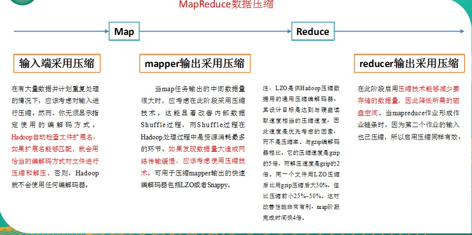
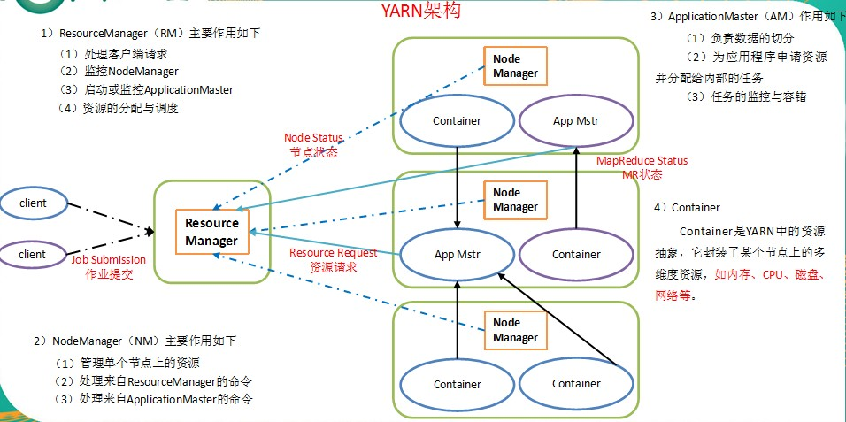
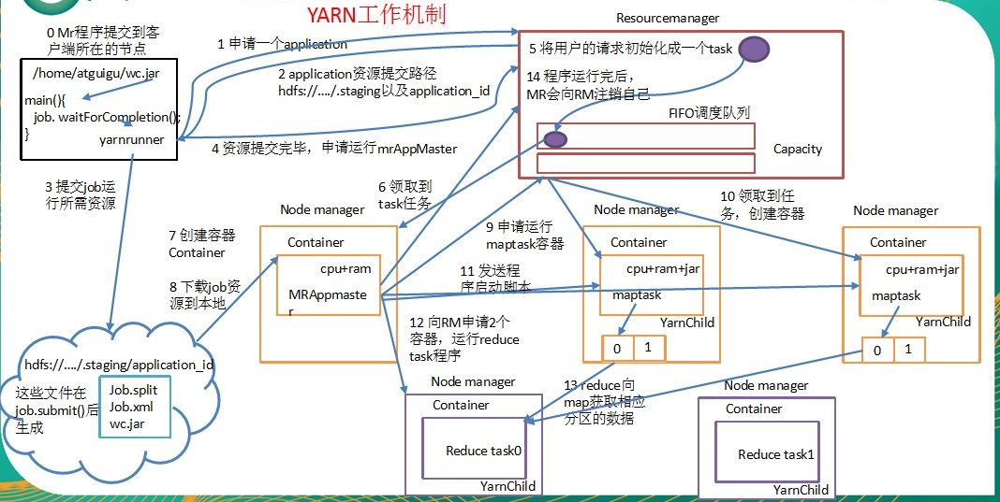

### hadoop数据压缩

> 压缩技术能够有效减少底层存储系统（HDFS）读写字节数。压缩提高了网络带宽和磁盘空间的效率。在Hadoop下，尤其是数据规模很大和工作负载密集的情况下，使用数据压缩显得非常重要。在这种情况下，I/O操作和网络数据传输要花大量的时间。还有，Shuffle与Merge过程同样也面临着巨大的I/O压力。
	鉴于磁盘I/O和网络带宽是Hadoop的宝贵资源，数据压缩对于节省资源、最小化磁盘I/O和网络传输非常有帮助。不过，尽管压缩与解压操作的CPU开销不高，其性能的提升和资源的节省并非没有代价。
	如果磁盘I/O和网络带宽影响了MapReduce作业性能，在任意MapReduce阶段启用压缩都可以改善端到端处理时间并减少I/O和网络流量。
压缩Mapreduce的一种优化策略：通过压缩编码对Mapper或者Reducer的输出进行压缩，以减少磁盘IO，提高MR程序运行速度（但相应增加了cpu运算负担）。<br><font style = "color : red">注意：压缩特性运用得当能提高性能，但运用不当也可能降低性能。</font>

* hadoop支持的压缩编码

压缩格式 |	hadoop自带？ |	算法 |	文件扩展名 |	是否可切分 |	换成压缩格式后，原来的程序是否需要修改
-- | -- | -- | -- | -- |--
Deflate |	是，直接使用 |	Defalate |	.deflate |	否 |	和文本处理一样，不需要修改
Gzip |	是，直接使用 |	Defalate |	.gz |	否 |	和文本处理一样，不需要修改
bzip2 |	是，直接使用 |	bzip2 |	.bz2 |	是 |	和文本处理一样，不需要修改
LZO |	否，需要安装 |	LZO |	.lzo |	是 |	需要建索引，还需要指定输入格式
Snappy |	否，需要安装 |	Snappy |	.snappy |	否 |	和文本处理一样，不需要修改

* hadoop编码/解码器

压缩格式 |	对应的编码/解码器
-- |
DEFLATE |	org.apache.hadoop.io.compress.DefaultCodec
gzip |	org.apache.hadoop.io.compress.GzipCodec
bzip2 |	org.apache.hadoop.io.compress.BZip2Codec
LZO |	com.hadoop.compression.lzo.LzopCodec
Snappy |	org.apache.hadoop.io.compress.SnappyCodec

* 压缩性能比较

压缩算法 |	原始文件大小 |	压缩文件大小 |	压缩速度 |	解压速度
-- | -- | -- | -- | --
gzip |	8.3GB |	1.8GB |	17.5MB/s |	58MB/s
bzip2 |	8.3GB |	1.1GB |	2.4MB/s |	9.5MB/s
LZO |	8.3GB |	2.9GB |	49.3MB/s |	74.6MB/s
Snappy | 8.3GB | 3.2GB | 250MB/s | 500MB/s

* 应用场景选择
  * Gzip
    * 当每个文件压缩之后在130M以内的（1个块大小内），都可以考虑用gzip压缩格式。
  * Bzip2
    * 适合对速度要求不高，但需要较高的压缩率的时候，可以作为mapreduce作业的输出格式；或者输出之后的数据比较大，处理之后的数据需要压缩存档减少磁盘空间并且以后数据用得比较少的情况；或者对单个很大的文本文件想压缩减少存储空间，同时又需要支持split，而且兼容之前的应用程序（即应用程序不需要修改）的情况。
  * Lzo
    * 一个很大的文本文件，压缩之后还大于200M以上的可以考虑，而且单个文件越大，lzo优点越越明显。
  * Snappy
    * 当Mapreduce作业的Map输出的数据比较大的时候，作为Map到Reduce的中间数据的压缩格式；或者作为一个Mapreduce作业的输出和另外一个Mapreduce作业的输入。

* 压缩位置选择
  * 压缩可以在MapReduce作用的任意阶段启用<br>
    

> 压缩参数的配置

参数 |	默认值 |	阶段 |	建议 |
-- | -- | -- | --
io.compression.codecs<br>在core-site.xml中配置 | org.apache.hadoop.io.compress.DefaultCodec,<br>org.apache.hadoop.io.compress.GzipCodec,<br>org.apache.hadoop.io.compress.BZip2Codec | 输入压缩 | Hadoop使用文件扩展名判断是否支持某种编解码器
mapreduce.map.output.compress<br>（在mapred-site.xml中配置）| false | mapper输出 | 这个参数设为true启用压缩
mapreduce.map.output.compress.codec<br>（在mapred-site.xml中配置）| org.apache.hadoop.io.compress.DefaultCodec | mapper输出 | 使用LZO或snappy编解码器在此阶段压缩数据
mapreduce.output.fileoutputformat.compress <br>（在mapred-site.xml中配置）| false | reducer输出 |　这个参数设为true启用压缩
mapreduce.output.fileoutputformat.compress.codec<br>（在mapred-site.xml中配置）| org.apache.hadoop.io.compress. DefaultCodec | reducer输出 | 使用标准工具或者编解码器，如gzip和bzip2
mapreduce.output.fileoutputformat.compress.type<br>（在mapred-site.xml中配置）| RECORD | reducer输出 | SequenceFile输出使用的压缩类型：NONE和BLOCK

* 压缩代码书写
  ```java
  public class TestCompress {
      public static void main(String[] args) throws IOException, ClassNotFoundException {
          testCompress("G:/proxmox-ve_5.3-2.iso","org.apache.hadoop.io.compress.DefaultCodec");
      }

      /**
       * 压缩文件
       * @param file
       *          文件名
       * @param method
       *          压缩方式
       */
      private static void testCompress(String file, String method) throws IOException, ClassNotFoundException {
          // 获取输入流
          FileInputStream fis = new FileInputStream(file);
          // 获取编解码器
          Class<?> clazz = Class.forName(method);
          Configuration conf = new Configuration();
          CompressionCodec codec = (CompressionCodec)ReflectionUtils.newInstance(clazz, conf);
          // 获取普通输出流
          FileOutputStream fos = new FileOutputStream(file + codec.getDefaultExtension());
          // 获取压缩流
          CompressionOutputStream cos = codec.createOutputStream(fos);
          //流的拷贝
          IOUtils.copyBytes(fis, cos, conf);
          IOUtils.closeStream(fos);
          IOUtils.closeStream(cos);
          IOUtils.closeStream(fis);
      }
  }
  ```
* 解压代码书写
  ```java
  public class TestUnCompress {
      public static void main(String[] args) throws IOException {
          UnCompress("G:/proxmox-ve_5.3-2.iso.deflate");
      }

      private static void UnCompress(String name) throws IOException {
          // 获取输入流
          FileInputStream fis = new FileInputStream(name);
          //  获取编码器
          Configuration conf = new Configuration();
          CompressionCodecFactory codecFactory = new CompressionCodecFactory(conf);
          CompressionCodec compressionCodec = codecFactory.getCodec(new Path(name));
          if(compressionCodec == null) {
              return;
          }
          // 获取压缩流
          CompressionInputStream cis = compressionCodec.createInputStream(fis);
          // 获取输出流
          FileOutputStream fos = new FileOutputStream(name + ".test");
          // 流的拷贝
          IOUtils.copyBytes(cis, fos, conf);
          // 关闭流
          IOUtils.closeStream(fos);
          IOUtils.closeStream(fis);
          IOUtils.closeStream(cis);
      }

  }
  ```

### Yarn
> Yarn是一个资源调度平台，负责为运算程序提供服务器运算资源，相当于一个分布式的操作系统平台，而MapReduce等运算程序则相当于运行于操作系统之上的应用程序。

* YARN主要由`ResourceManager`、`NodeManager`、`ApplicationMaster`和`Container`等组件<br>


* YARN的工作机制<br>

