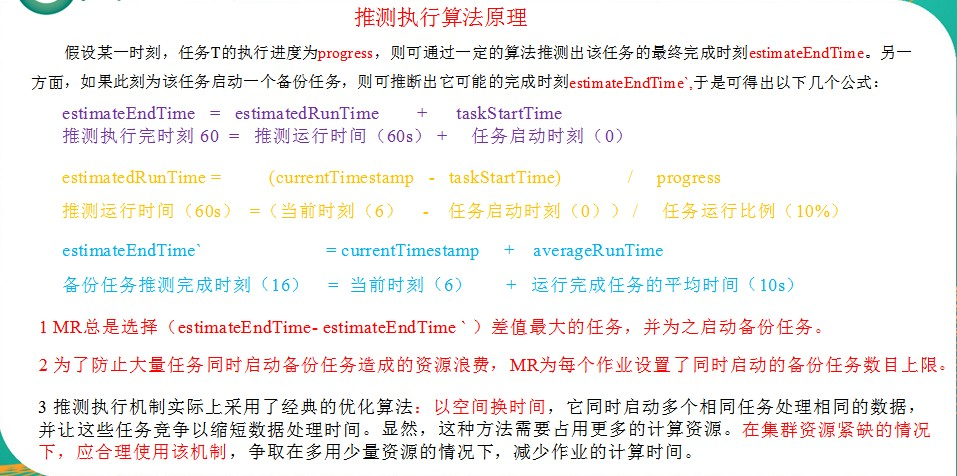

### hadoop数据压缩

> 压缩技术能够有效减少底层存储系统（HDFS）读写字节数。压缩提高了网络带宽和磁盘空间的效率。在Hadoop下，尤其是数据规模很大和工作负载密集的情况下，使用数据压缩显得非常重要。在这种情况下，I/O操作和网络数据传输要花大量的时间。还有，Shuffle与Merge过程同样也面临着巨大的I/O压力。
	鉴于磁盘I/O和网络带宽是Hadoop的宝贵资源，数据压缩对于节省资源、最小化磁盘I/O和网络传输非常有帮助。不过，尽管压缩与解压操作的CPU开销不高，其性能的提升和资源的节省并非没有代价。
	如果磁盘I/O和网络带宽影响了MapReduce作业性能，在任意MapReduce阶段启用压缩都可以改善端到端处理时间并减少I/O和网络流量。
压缩Mapreduce的一种优化策略：通过压缩编码对Mapper或者Reducer的输出进行压缩，以减少磁盘IO，提高MR程序运行速度（但相应增加了cpu运算负担）。<br><font style = "color : red">注意：压缩特性运用得当能提高性能，但运用不当也可能降低性能。</font>

* hadoop支持的压缩编码

压缩格式 |	hadoop自带？ |	算法 |	文件扩展名 |	是否可切分 |	换成压缩格式后，原来的程序是否需要修改
-- | -- | -- | -- | -- |--
Deflate |	是，直接使用 |	Defalate |	.deflate |	否 |	和文本处理一样，不需要修改
Gzip |	是，直接使用 |	Defalate |	.gz |	否 |	和文本处理一样，不需要修改
bzip2 |	是，直接使用 |	bzip2 |	.bz2 |	是 |	和文本处理一样，不需要修改
LZO |	否，需要安装 |	LZO |	.lzo |	是 |	需要建索引，还需要指定输入格式
Snappy |	否，需要安装 |	Snappy |	.snappy |	否 |	和文本处理一样，不需要修改

* hadoop编码/解码器

压缩格式 |	对应的编码/解码器
-- |
DEFLATE |	org.apache.hadoop.io.compress.DefaultCodec
gzip |	org.apache.hadoop.io.compress.GzipCodec
bzip2 |	org.apache.hadoop.io.compress.BZip2Codec
LZO |	com.hadoop.compression.lzo.LzopCodec
Snappy |	org.apache.hadoop.io.compress.SnappyCodec

* 压缩性能比较

压缩算法 |	原始文件大小 |	压缩文件大小 |	压缩速度 |	解压速度
-- | -- | -- | -- | --
gzip |	8.3GB |	1.8GB |	17.5MB/s |	58MB/s
bzip2 |	8.3GB |	1.1GB |	2.4MB/s |	9.5MB/s
LZO |	8.3GB |	2.9GB |	49.3MB/s |	74.6MB/s
Snappy | 8.3GB | 3.2GB | 250MB/s | 500MB/s

* 应用场景选择
  * Gzip
    * 当每个文件压缩之后在130M以内的（1个块大小内），都可以考虑用gzip压缩格式。
  * Bzip2
    * 适合对速度要求不高，但需要较高的压缩率的时候，可以作为mapreduce作业的输出格式；或者输出之后的数据比较大，处理之后的数据需要压缩存档减少磁盘空间并且以后数据用得比较少的情况；或者对单个很大的文本文件想压缩减少存储空间，同时又需要支持split，而且兼容之前的应用程序（即应用程序不需要修改）的情况。
  * Lzo
    * 一个很大的文本文件，压缩之后还大于200M以上的可以考虑，而且单个文件越大，lzo优点越越明显。
  * Snappy
    * 当Mapreduce作业的Map输出的数据比较大的时候，作为Map到Reduce的中间数据的压缩格式；或者作为一个Mapreduce作业的输出和另外一个Mapreduce作业的输入。

* 压缩位置选择
  * 压缩可以在MapReduce作用的任意阶段启用<br>
    

> 压缩参数的配置

参数 |	默认值 |	阶段 |	建议 |
-- | -- | -- | --
io.compression.codecs<br>在core-site.xml中配置 | org.apache.hadoop.io.compress.DefaultCodec,<br>org.apache.hadoop.io.compress.GzipCodec,<br>org.apache.hadoop.io.compress.BZip2Codec | 输入压缩 | Hadoop使用文件扩展名判断是否支持某种编解码器
mapreduce.map.output.compress<br>（在mapred-site.xml中配置）| false | mapper输出 | 这个参数设为true启用压缩
mapreduce.map.output.compress.codec<br>（在mapred-site.xml中配置）| org.apache.hadoop.io.compress.DefaultCodec | mapper输出 | 使用LZO或snappy编解码器在此阶段压缩数据
mapreduce.output.fileoutputformat.compress <br>（在mapred-site.xml中配置）| false | reducer输出 |　这个参数设为true启用压缩
mapreduce.output.fileoutputformat.compress.codec<br>（在mapred-site.xml中配置）| org.apache.hadoop.io.compress. DefaultCodec | reducer输出 | 使用标准工具或者编解码器，如gzip和bzip2
mapreduce.output.fileoutputformat.compress.type<br>（在mapred-site.xml中配置）| RECORD | reducer输出 | SequenceFile输出使用的压缩类型：NONE和BLOCK

* 压缩代码书写
  ```java
  public class TestCompress {
      public static void main(String[] args) throws IOException, ClassNotFoundException {
          testCompress("G:/proxmox-ve_5.3-2.iso","org.apache.hadoop.io.compress.DefaultCodec");
      }

      /**
       * 压缩文件
       * @param file
       *          文件名
       * @param method
       *          压缩方式
       */
      private static void testCompress(String file, String method) throws IOException, ClassNotFoundException {
          // 获取输入流
          FileInputStream fis = new FileInputStream(file);
          // 获取编解码器
          Class<?> clazz = Class.forName(method);
          Configuration conf = new Configuration();
          CompressionCodec codec = (CompressionCodec)ReflectionUtils.newInstance(clazz, conf);
          // 获取普通输出流
          FileOutputStream fos = new FileOutputStream(file + codec.getDefaultExtension());
          // 获取压缩流
          CompressionOutputStream cos = codec.createOutputStream(fos);
          //流的拷贝
          IOUtils.copyBytes(fis, cos, conf);
          IOUtils.closeStream(fos);
          IOUtils.closeStream(cos);
          IOUtils.closeStream(fis);
      }
  }
  ```
* 解压代码书写
  ```java
  public class TestUnCompress {
      public static void main(String[] args) throws IOException {
          UnCompress("G:/proxmox-ve_5.3-2.iso.deflate");
      }

      private static void UnCompress(String name) throws IOException {
          // 获取输入流
          FileInputStream fis = new FileInputStream(name);
          //  获取编码器
          Configuration conf = new Configuration();
          CompressionCodecFactory codecFactory = new CompressionCodecFactory(conf);
          CompressionCodec compressionCodec = codecFactory.getCodec(new Path(name));
          if(compressionCodec == null) {
              return;
          }
          // 获取压缩流
          CompressionInputStream cis = compressionCodec.createInputStream(fis);
          // 获取输出流
          FileOutputStream fos = new FileOutputStream(name + ".test");
          // 流的拷贝
          IOUtils.copyBytes(cis, fos, conf);
          // 关闭流
          IOUtils.closeStream(fos);
          IOUtils.closeStream(fis);
          IOUtils.closeStream(cis);
      }

  }
  ```

### Yarn
> Yarn是一个资源调度平台，负责为运算程序提供服务器运算资源，相当于一个分布式的操作系统平台，而MapReduce等运算程序则相当于运行于操作系统之上的应用程序。

* YARN主要由`ResourceManager`、`NodeManager`、`ApplicationMaster`和`Container`等组件<br>


* YARN的工作机制<br>

* 工作机制详解
	*	Mr程序提交到客户端所在的节点。
	*	Yarnrunner向Resourcemanager申请一个Application。
	*	rm将该应用程序的资源路径返回给yarnrunner。
	*	程序资源提交完毕后，申请运行mrAppMaster。
	*	RM将用户的请求初始化成一个task。
	*	其中一个NodeManager领取到task任务。
	*	该NodeManager创建容器Container，并产生MRAppmaster。
	*	Container从HDFS上拷贝资源到本地。
	*	MRAppmaster向RM 申请运行maptask资源。
	*	RM将运行maptask任务分配给另外两个NodeManager，另两个NodeManager分别领取任务并创建容器。
	*	MR向两个接收到任务的NodeManager发送程序启动脚本，这两个NodeManager分别启动maptask，maptask对数据分区排序。
	*	MrAppMaster等待所有maptask运行完毕后，向RM申请容器，运行reduce task。
	*	reduce task向maptask获取相应分区的数据。
	*	程序运行完毕后，MR会向RM申请注销自己。

### Mapreduce推测执行机制

* 一个作业由若干个Map任务和Reduce任务构成。因硬件老化、软件Bug等，某些任务可能运行非常慢。
* 典型案例：系统中有99%的Map任务都完成了，只有少数几个Map老是进度很慢，完不成，怎么办？
* 发现拖后腿的任务，比如某个任务运行速度远慢于任务平均速度。为拖后腿任务启动一个备份任务，同时运行。谁先运行完，则采用谁的结果。
* 执行推测任务的前提条件
	* 每个task只能有一个备份任务
	* 当前job已完成的task必须不小于0.05（5%）
	* 开启推测执行参数设置。Hadoop2.7.2 mapred-site.xml文件中默认是打开的
		```xml
		<property>
		  <name>mapreduce.map.speculative</name>
		  <value>true</value>
		  <description>If true, then multiple instances of some map tasks may be executed in parallel.</description>
		</property>

		<property>
		  <name>mapreduce.reduce.speculative</name>
		  <value>true</value>
		  <description>If true, then multiple instances of some reduce tasks may be executed in parallel.</description>
		</property>
		```
* 不能启用推测执行机制情况
	* 任务间存在严重的负载倾斜
	* 特殊任务，比如任务向数据库中写数据


### 倒序排序
> **需求-->输入**
* `a.txt`文件
	```
	yetao_yang yyt
	yetao_yang jumozhanjiang
	yyt changxiangshimian
	```
* `b.txt`文件
	```
	yyt changxiangshimian
	changxiangshimian jumozhanjiang
	jumozhanjiang yetao_yang
	```
* `c.txt`文件
	```
	jumozhanjiang yetao_yang
	changxiangshimian yyt
	yyt yyt
	```
**需求-->输出**
	```
	yetao_yang	a.txt--2	b.txt--1 c.txt--1
	yyt a.txt--2	b.txt--1	c.txt--3
	jumozhanjiang	a.txt--1	b.txt--2	c.txt--1
	changxiangshimian	a.txt--1	b.txt--2	c.txt--1
	```
* **编写第一组mapreduce**
	* `mapper`
		```java
		public class ReverseIndexOneMapper extends Mapper<LongWritable, Text, Text, IntWritable> {
		    String name;
		    Text k = new Text();
		    IntWritable v = new IntWritable(1);
		    @Override
		    protected void setup(Context context) throws IOException, InterruptedException {
		        FileSplit split = (FileSplit) context.getInputSplit();
		        name = split.getPath().getName();
		    }
		    @Override
		    protected void map(LongWritable key, Text value, Context context) throws IOException, InterruptedException {
		        // 获取一行
		        String line = value.toString();
		        String[] words = line.split("\t");
		        for (String word : words) {
		            String str = word + "--" + name;
		            k.set(str);
		            context.write(k,v);
		        }
		    }
		}
		```
	* `reduce`
		```java
		public class ReverseIndexOneReduce extends Reducer<Text, IntWritable, Text, IntWritable> {
		    @Override
		    protected void reduce(Text key, Iterable<IntWritable> values, Context context) throws IOException, InterruptedException {
		        int sum = 0;
		        for (IntWritable value : values) {
		            sum += value.get();
		        }
		        context.write(key, new IntWritable(sum));
		    }
		}
		```
	* `driver`
		```java
		public class ReverseIndexOneDriver  {
		    public static void main(String[] args) throws IOException, ClassNotFoundException, InterruptedException {
		        Configuration conf = new Configuration();
		        Job job = Job.getInstance(conf);
		        job.setJarByClass(ReverseIndexOneDriver.class);
		        job.setMapperClass(ReverseIndexOneMapper.class);
		        job.setReducerClass(ReverseIndexOneReduce.class);
		        job.setMapOutputKeyClass(Text.class);
		        job.setMapOutputValueClass(IntWritable.class);
		        job.setOutputKeyClass(Text.class);
		        job.setOutputValueClass(IntWritable.class);
		        FileInputFormat.setInputPaths(job, new Path(args[0]));
		        FileOutputFormat.setOutputPath(job, new Path(args[1]));
		        job.waitForCompletion(true);
		    }
		}
		```
* **编写第二组mapreduce**
	* `mapper`
		```java
		public class ReverseIndexTwoMapper extends Mapper<LongWritable, Text, Text, Text> {
		    Text k = new Text();
		    Text v = new Text();
		    @Override
		    protected void map(LongWritable key, Text value, Context context) throws IOException, InterruptedException {
		        String line = value.toString();
		        String[] words = line.split("--");
		        k.set(words[0]);
		        v.set(words[1].replace("\t","--"));
		        context.write(k, v);
		    }
		}
		```
	* `reduce`
		```java
		public class ReverseIndexTwoReduce extends Reducer<Text, Text, Text, Text> {
		    @Override
		    protected void reduce(Text key, Iterable<Text> values, Context context) throws IOException, InterruptedException {
		        StringBuffer sb = new StringBuffer();
		        for (Text value : values) {
		            sb.append(value).append("\t");
		        }
		        context.write(key, new Text(sb.toString()));
		    }
		}
		```
	* `driver`
		```java
		public class ReverseIndexTwoDriver {
		    public static void main(String[] args) throws InterruptedException, IOException, ClassNotFoundException {
		        Configuration config = new Configuration();
		        Job job = Job.getInstance(config);
		        job.setJarByClass(ReverseIndexTwoDriver.class);
		        job.setMapperClass(ReverseIndexTwoMapper.class);
		        job.setReducerClass(ReverseIndexTwoReduce.class);
		        job.setMapOutputKeyClass(Text.class);
		        job.setMapOutputValueClass(Text.class);
		        job.setOutputKeyClass(Text.class);
		        job.setOutputValueClass(Text.class);
		        FileInputFormat.setInputPaths(job, new Path(args[0]));
		        FileOutputFormat.setOutputPath(job, new Path(args[1]));
		        boolean result = job.waitForCompletion(true);
		        System.exit(result?0:1);
		    }
		}
		```
* **先执行第一组的mapreduce,然后把第一组的结果作为第二组的参数进行传入**

### 查找共同好友
* **需求-->输入**`冒号左边是单个用户,右边是该用户的好友`
	```
	A:B,C,D,F,E,O
	B:A,C,E,K
	C:F,A,D,I
	D:A,E,F,L
	E:B,C,D,M,L
	F:A,B,C,D,E,O,M
	G:A,C,D,E,F
	H:A,C,D,E,O
	I:A,O
	J:B,O
	K:A,C,D
	L:D,E,F
	M:E,F,G
	O:A,H,I,J
	```
* **需求-->输出**`x-x 表示两个好友相关联, 后面的字母表示它们的共同好友`
	```
	A-B	E C
	A-C	D F
	A-D	E F
	A-E	D B C
	A-F	O B C D E
	A-G	F E C D
	A-H	E C D O
	A-I	O
	A-J	O B
	A-K	D C
	A-L	F E D
	A-M	E F
	B-C	A
	B-D	A E
	B-E	C
	B-F	E A C
	B-G	C E A
	B-H	A E C
	B-I	A
	B-K	C A
	B-L	E
	B-M	E
	B-O	A
	C-D	A F
	C-E	D
	C-F	D A
	C-G	D F A
	C-H	D A
	C-I	A
	C-K	A D
	C-L	D F
	C-M	F
	C-O	I A
	D-E	L
	D-F	A E
	D-G	E A F
	D-H	A E
	D-I	A
	D-K	A
	D-L	E F
	D-M	F E
	D-O	A
	E-F	D M C B
	E-G	C D
	E-H	C D
	E-J	B
	E-K	C D
	E-L	D
	F-G	D C A E
	F-H	A D O E C
	F-I	O A
	F-J	B O
	F-K	D C A
	F-L	E D
	F-M	E
	F-O	A
	G-H	D C E A
	G-I	A
	G-K	D A C
	G-L	D F E
	G-M	E F
	G-O	A
	H-I	O A
	H-J	O
	H-K	A C D
	H-L	D E
	H-M	E
	H-O	A
	I-J	O
	I-K	A
	I-O	A
	K-L	D
	K-O	A
	L-M	E F
	```
* 编写第一组`mapreduce`
	* `mapper`
		```java
		public class SharedFriendOneMapper extends Mapper<LongWritable, Text, Text, Text> {
		    Text k = new Text();
		    Text v = new Text();

		    @Override
		    protected void map(LongWritable key, Text value, Context context) throws IOException, InterruptedException {
		        String line = value.toString();
		        String[] split = line.split(":");
		        String[] friends = split[1].split(",");
		        for (String friend : friends) {
		            k.set(friend);
		            v.set(split[0]);
		            context.write(k,v);
		        }
		    }
		}
		```
	* `reduce`
		```java
		public class SharedFriendsOneReduce extends Reducer<Text, Text, Text, Text> {
		    @Override
		    protected void reduce(Text key, Iterable<Text> values, Context context) throws IOException, InterruptedException {
		        // A D   A C   A  F
		        StringBuffer sb = new StringBuffer();
		        for (Text people : values) {
		            sb.append(people).append(",");
		        }
		        context.write(key,new Text(sb.toString()));
		    }
		}
		```
	* `driver`
		```java
		public class SharedFriendsOneDriver {
		    public static void main(String[] args) throws IOException, ClassNotFoundException, InterruptedException {
		        // 1 获取job对象
		        Configuration configuration = new Configuration();
		        Job job = Job.getInstance(configuration);

		        // 2 指定jar包运行的路径
		        job.setJarByClass(SharedFriendsOneDriver.class);

		        // 3 指定map/reduce使用的类
		        job.setMapperClass(SharedFriendOneMapper.class);
		        job.setReducerClass(SharedFriendsOneReduce.class);

		        // 4 指定map输出的数据类型
		        job.setMapOutputKeyClass(Text.class);
		        job.setMapOutputValueClass(Text.class);

		        // 5 指定最终输出的数据类型
		        job.setOutputKeyClass(Text.class);
		        job.setOutputValueClass(Text.class);

		        // 6 指定job的输入原始所在目录
		        FileInputFormat.setInputPaths(job, new Path(args[0]));
		        FileOutputFormat.setOutputPath(job, new Path(args[1]));

		        // 7 提交
		        boolean result = job.waitForCompletion(true);

		        System.exit(result?0:1);
		    }
		}
		```
	* **第一组输出的结果为**
		```
		A	I,K,C,B,G,F,H,O,D,
		B	A,F,J,E,
		C	A,E,B,H,F,G,K,
		D	G,C,K,A,L,F,E,H,
		E	G,M,L,H,A,F,B,D,
		F	L,M,D,C,G,A,
		G	M,
		H	O,
		I	O,C,
		J	O,
		K	B,
		L	D,E,
		M	E,F,
		O	A,H,I,J,F,
		```
* 编写第二组`mapreduce`
	* `mapper`
		```java
		public class SharedFriendTwoMapper extends Mapper<LongWritable, Text, Text, Text> {
		    Text k = new Text();
		    Text v = new Text();
		    @Override
		    protected void map(LongWritable key, Text value, Context context) throws IOException, InterruptedException {
		        String str = value.toString();
		        String[] friendArr = str.split("\t");
		        String[] persons = friendArr[1].split(",");
		        Arrays.sort(persons);
		        for (int i = 0; i < persons.length - 1; i++) {
		            for (int j = i + 1; j < persons.length; j++) {
		                context.write(new Text(persons[i] + "-" + persons[j]), new Text(friendArr[0]));
		            }
		        }
		    }
		}
		```
	* `reduce`
		```java
		public class SharedFriendsTwoReduce extends Reducer<Text, Text, Text, Text> {
		    @Override
		    protected void reduce(Text key, Iterable<Text> values, Context context)
		            throws IOException, InterruptedException {

		        StringBuffer sb = new StringBuffer();

		        for (Text friend : values) {
		            sb.append(friend).append(" ");
		        }

		        context.write(key, new Text(sb.toString()));
		    }
		}
		```
	* `driver`
		```java
		public class SharedFriendsTwoDriver {
		    public static void main(String[] args) throws Exception {
		        // 1 获取job对象
		        Configuration configuration = new Configuration();
		        Job job = Job.getInstance(configuration);

		        // 2 指定jar包运行的路径
		        job.setJarByClass(SharedFriendsTwoDriver.class);

		        // 3 指定map/reduce使用的类
		        job.setMapperClass(SharedFriendTwoMapper.class);
		        job.setReducerClass(SharedFriendsTwoReduce.class);

		        // 4 指定map输出的数据类型
		        job.setMapOutputKeyClass(Text.class);
		        job.setMapOutputValueClass(Text.class);

		        // 5 指定最终输出的数据类型
		        job.setOutputKeyClass(Text.class);
		        job.setOutputValueClass(Text.class);

		        // 6 指定job的输入原始所在目录
		        FileInputFormat.setInputPaths(job, new Path(args[0]));
		        FileOutputFormat.setOutputPath(job, new Path(args[1]));

		        // 7 提交
		        boolean result = job.waitForCompletion(true);
		        System.exit(result?0:1);
		    }
		}
		```
	* **第一组的输出结果是第二组的输入参数, 第二组的输出结果为所需的数据**


### **mapreduce的优化**

* **mapreduce跑的慢的原因**
	* 数据倾斜
	* map和reduce数设置不合理
	* map运行时间太长，导致reduce等待过久
	* 小文件过多
	* 大量的不可分块的超大文件
	* spill次数过多
	* merge次数过多等
* MapReduce优化方法
	* MapReduce优化方法主要从六个方面考虑：数据输入、Map阶段、Reduce阶段、IO传输、数据倾斜问题和常用的调优参数。
* 数据输入
	* 合并小文件：在执行mr任务前将小文件进行合并，大量的小文件会产生大量的map任务，增大map任务装载次数，而任务的装载比较耗时，从而导致mr运行较慢
	* 采用CombineTextInputFormat来作为输入，解决输入端大量小文件场景
* Map阶段
	* 减少溢写（spill）次数：通过调整io.sort.mb及sort.spill.percent参数值，增大触发spill的内存上限，减少spill次数，从而减少磁盘IO。
	* 减少合并（merge）次数：通过调整io.sort.factor参数，增大merge的文件数目，减少merge的次数，从而缩短mr处理时间。
	* 在map之后，不影响业务逻辑前提下，先进行combine处理，减少 I/O。
* Reduce阶段
	* 合理设置map和reduce数：两个都不能设置太少，也不能设置太多。太少，会导致task等待，延长处理时间；太多，会导致 map、reduce任务间竞争资源，造成处理超时等错误。
	* 设置map、reduce共存：调整slowstart.completedmaps参数，使map运行到一定程度后，reduce也开始运行，减少reduce的等待时间。
	* 规避使用reduce：因为reduce在用于连接数据集的时候将会产生大量的网络消耗。
	* 合理设置reduce端的buffer：默认情况下，数据达到一个阈值的时候，buffer中的数据就会写入磁盘，然后reduce会从磁盘中获得所有的数据。也就是说，buffer和reduce是没有直接关联的，中间多个一个写磁盘->读磁盘的过程，既然有这个弊端，那么就可以通过参数来配置，使得buffer中的一部分数据可以直接输送到reduce，从而减少IO开销:<font style="color: red">mapred.job.reduce.input.buffer.percent，默认为0.0。当值大于0的时候，会保留指定比例的内存读buffer中的数据直接拿给reduce使用。这样一来，设置buffer需要内存，读取数据需要内存，reduce计算也要内存，所以要根据作业的运行情况进行调整</font>
* 减少数据倾斜
	* 可以通过对原始数据进行抽样得到的结果集来预设分区边界值
	* 基于输出键的背景知识进行自定义分区
	* 使用Combine可以大量地减小数据倾斜
	* 采用Map Join，尽量避免Reduce Join

### **常用调优参数**

> 资源相关参数

* 以下参数是在用户自己的mr应用程序中配置就可以生效（mapred-default.xml）

配置参数 | 参数说明
-- | --
mapreduce.map.memory.mb | 一个Map Task可使用的资源上限（单位:MB），默认为1024。如果Map Task实际使用的资源量超过该值，则会被强制杀死。
mapreduce.reduce.memory.mb | 一个Reduce Task可使用的资源上限（单位:MB），默认为1024。如果Reduce Task实际使用的资源量超过该值，则会被强制杀死。
mapreduce.map.cpu.vcores | 每个Map task可使用的最多cpu core数目，默认值: 1
mapreduce.reduce.cpu.vcores | 每个Reduce task可使用的最多cpu core数目，默认值: 1
mapreduce.reduce.shuffle.parallelcopies | 每个reduce去map中拿数据的并行数。默认值是5
mapreduce.reduce.shuffle.merge.percent | buffer中的数据达到多少比例开始写入磁盘。默认值0.66
mapreduce.reduce.shuffle.input.buffer.percent | buffer大小占reduce可用内存的比例。默认值0.7
mapreduce.reduce.input.buffer.percent | 指定多少比例的内存用来存放buffer中的数据，默认值是0.0

* 应该在yarn启动之前就配置在服务器的配置文件中才能生效（yarn-default.xml）

配置参数 | 参数说明
-- | --
yarn.scheduler.minimum-allocation-mb | 给应用程序container分配的最小内存，默认值：1024
yarn.scheduler.maximum-allocation-mb | 给应用程序container分配的最大内存，默认值：8192
yarn.scheduler.minimum-allocation-vcores | 每个container申请的最小CPU核数，默认值：1
yarn.scheduler.maximum-allocation-vcores | 每个container申请的最大CPU核数，默认值：32
yarn.nodemanager.resource.memory-mb | 给containers分配的最大物理内存，默认值：8192

* shuffle性能优化的关键参数，应在yarn启动之前就配置好（mapred-default.xml）

配置参数 | 参数说明
-- | --
mapreduce.task.io.sort.mb | shuffle的环形缓冲区大小，默认100m
mapreduce.map.sort.spill.percent | 环形缓冲区溢出的阈值，默认80%

* 容错相关参数(mapreduce性能优化)

配置参数 | 参数说明
-- | --
mapreduce.map.maxattempts | 每个Map Task最大重试次数，一旦重试参数超过该值，则认为Map Task运行失败，默认值：4
mapreduce.reduce.maxattempts | 每个Reduce Task最大重试次数，一旦重试参数超过该值，则认为Map Task运行失败，默认值：4
mapreduce.task.timeout | Task超时时间，经常需要设置的一个参数，该参数表达的意思为：如果一个task在一定时间内没有任何进入，即不会读取新的数据，也没有输出数据，则认为该task处于block状态，可能是卡住了，也许永远会卡住，为了防止因为用户程序永远block住不退出，则强制设置了一个该超时时间（单位毫秒），默认是600000。如果你的程序对每条输入数据的处理时间过长（比如会访问数据库，通过网络拉取数据等），建议将该参数调大，该参数过小常出现的错误提示是“AttemptID:attempt_14267829456721_123456_m_000224_0 Timed out after 300 secsContainer killed by the ApplicationMaster.”

### 小文件的优化

* `Hadoop Archive`
	* 是一个高效地将小文件放入HDFS块中的文件存档工具，它能够将多个小文件打包成一个HAR文件，这样就减少了namenode的内存使用。
* `Sequence file`
	* sequence file由一系列的二进制key/value组成，如果key为文件名，value为文件内容，则可以将大批小文件合并成一个大文件
* `CombineFileInputFormat`
	* CombineFileInputFormat是一种新的inputformat，用于将多个文件合并成一个单独的split，另外，它会考虑数据的存储位置
* **<font style="color : red">开启JVM重用</font>**
	* 对于大量小文件Job，可以开启JVM重用会减少45%运行时间。JVM重用理解：一个map运行一个jvm，重用的话，在一个map在jvm上运行完毕后，jvm继续运行其他map
	* 具体设置：mapreduce.job.jvm.numtasks值在10-20之间
