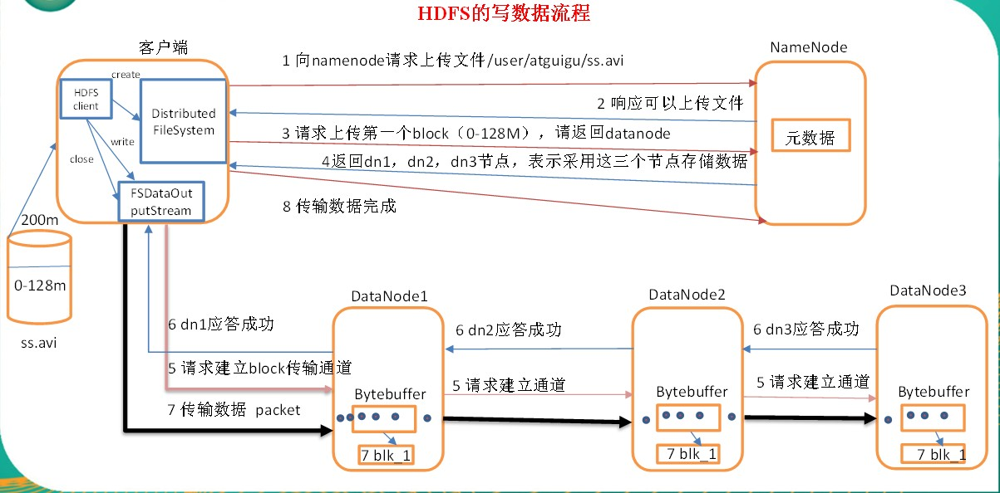
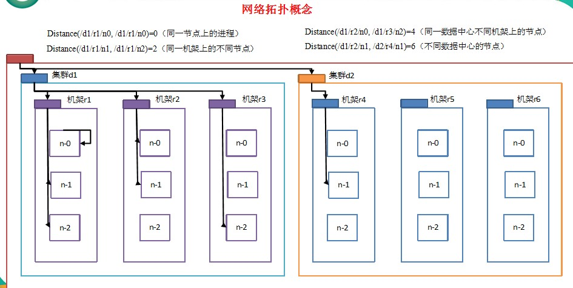
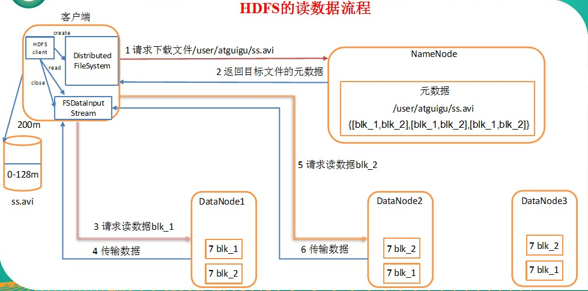
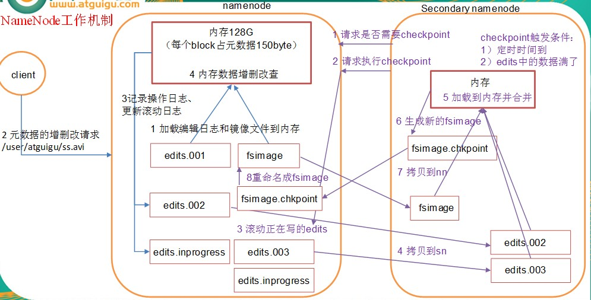

### HDFS的优缺点
* 优点
  * 高容错性
    * 数据自动保存多个副本。它通过增加副本的形式,提高容错性;
    * 某一个副本丢失以后，它可以自动恢复。
  * 适合大数据处理
    * 数据规模：能够处理数据规模达到GB、TB、甚至PB级别的数据
    * 文件规模：能够处理百万规模以上的文件数量，数量相当之大
  * 流式数据访问,保证数据的一致性
  * 可构建在廉价机器上，通过多副本机制，提高可靠性
* 缺点
  * 不适合低延时数据访问，比如毫秒级的存储数据，是做不到的
  * 无法高效的对大量小文件进行存储
    * 存储大量小文件的话，它会占用NameNode大量的内存来存储文件、目录和块信息。这样是不可取的，因为NameNode的内存总是有限的
    * 小文件存储的寻址时间会超过读取时间，它违反了HDFS的设计目标
  * 不支持并发写入、文件随机修改
    * 一个文件只能有一个写，不允许多个线程同时写
    * 仅支持数据append（追加），不支持文件的随机修改


### 常用基础命令

* **显示目录信息**
  * ` hadoop fs -ls /`

* **在hdfs上创建目录**
  * `hadoop fs -mkdir -p /yetao_yang/testMK`

* **从本地剪切粘贴到hdfs**
  * `hadoop fs -moveFromLocal ./bemove.txk /yetao_yang/testMK`
    ```shell
    [yetao_yang@hadoop01 ~]$ touch bemove.txk
    [yetao_yang@hadoop01 ~]$ ll
    总用量 0
    -rw-rw-r--. 1 yetao_yang yetao_yang  0 3月  26 16:17 bemove.txk
    drwxrwxr-x. 4 yetao_yang yetao_yang 65 3月  25 17:43 hadoop
    drwxrwxr-x. 3 yetao_yang yetao_yang 60 3月  22 01:46 jdk
    [yetao_yang@hadoop01 ~]$ hadoop fs -moveFromLocal ./bemove.txk /yetao_yang/testMK
    [yetao_yang@hadoop01 ~]$ ll
    总用量 0
    drwxrwxr-x. 4 yetao_yang yetao_yang 65 3月  25 17:43 hadoop
    drwxrwxr-x. 3 yetao_yang yetao_yang 60 3月  22 01:46 jdk
    ```

* **从本地拷贝到dhfs**
  * `hadoop fs -put testCP.txt /yetao_yang/testCP`

  * `hadoop fs -copyFromLocal testCP.txt /yetao_yang/testCP`

* **从hdfs拷贝到本地**
  * `hadoop fs -get /yetao_yang/output/part-r-00000 ./`

  * `hadoop fs -copyToLocal /yetao_yang/output/part-r-00000 ./`
    ```shell
    [yetao_yang@hadoop01 ~]$ hadoop fs -copyToLocal /yetao_yang/output/part-r-00000 ./
    [yetao_yang@hadoop01 ~]$ cat part-r-00000
    a	3
    b	2
    c	1
    d	4
    e	2
    f	8
    ```

* **从hdfs的一个路径拷贝到hdfs的另一个路径**
  * `hadoop fs -cp /yetao_yang/output/part-r-00000 /yetao_yang/testMK/kkk.txt`

* **在hdfs中移动文件**
  * `hadoop fs -mv /yetao_yang/testMK/kkk.txt /yetao_yang/input/`

* **合并下载多个文件**
  * 比如hdfs `/yetao_yang/test/`目录下有多个文件,要把这下面的所有文件下载下来
    * `hadoop fs -getmerge /yetao_yang/test/* ./merge.txt`

* **显示文件内容**
  * `hadoop fs -cat /yetao_yang/output/part-r-00000`
    ```shell
    [yetao_yang@hadoop01 ~]$ hadoop fs -cat /yetao_yang/output/part-r-00000
    a	3
    b	2
    c	1
    d	4
    e	2
    f	8
    ```

* **追加一个文件到已存在文件的末尾**
  * `hadoop fs -appendToFile testApp.txt /yetao_yang/testMK/bemove.txk`
    ```shell
    [yetao_yang@hadoop01 ~]$ touch testApp.txt
    [yetao_yang@hadoop01 ~]$ vi testApp.txt
    [yetao_yang@hadoop01 ~]$ cat testApp.txt
    aaa
    bbb
    ccc
    ddd
    [yetao_yang@hadoop01 ~]$ ^C
    [yetao_yang@hadoop01 ~]$ hadoop fs -appendToFile testApp.txt /yetao_yang/testMK/bemove.txk
    [yetao_yang@hadoop01 ~]$ hadoop fs -cat /yetao_yang/testMK/bemove.txk
    aaa
    bbb
    ccc
    ddd
    ```
* **删除文件或文件夹**
  * `hadoop fs -rm /yetao_yang/output/part-r-00000`


* **统计文件夹的大小信息**
  * `hadoop fs -du /yetao_yang/output`
    ```shell
    [yetao_yang@hadoop01 ~]$ hadoop fs -du /yetao_yang/output
    0   /yetao_yang/output/_SUCCESS
    24  /yetao_yang/output/part-r-00000
    ```

* **设置hdfs文件副本数量**
  * `hadoop fs -setrep 10 /yetao_yang/input/wc.input`
    * 设置10,但datanode只有三个所以实际副本只有三个


### HDFS的客戶端操作

* 在电脑上配置好`HADOOP_HOME`,具体[网上](http://www.baidu.com)查

* 新建java项目,并加入相关依赖

  ```xml
  <!-- https://mvnrepository.com/artifact/org.apache.hadoop/hadoop-common -->
  <dependency>
      <groupId>org.apache.hadoop</groupId>
      <artifactId>hadoop-common</artifactId>
      <version>2.9.2</version>
  </dependency>
  <!-- https://mvnrepository.com/artifact/org.apache.hadoop/hadoop-client -->
  <dependency>
      <groupId>org.apache.hadoop</groupId>
      <artifactId>hadoop-client</artifactId>
      <version>2.9.2</version>
  </dependency>
  <!-- https://mvnrepository.com/artifact/org.apache.hadoop/hadoop-hdfs -->
  <dependency>
      <groupId>org.apache.hadoop</groupId>
      <artifactId>hadoop-hdfs</artifactId>
      <version>2.9.2</version>
  </dependency>
  ```

* 代码演示

```java

@SpringBootTest
public class HdfsTestApplicationTests {
    Configuration configuration = new Configuration();
    //要在windows下配置ip地址映射
    URI uri = new URI("hdfs://hadoop01:9000");
    String user = "yetao_yang";


    // 创建文件夹
    @Test
    public void mkDir() throws IOException, InterruptedException {
        FileSystem fileSystem = FileSystem.get(uri,configuration,user);
        Path path = new Path("/hdfsDemo/mkdirs/mkdir02");
        fileSystem.mkdirs(path);
        fileSystem.close();
    }

    // 上传文件到指定目录
    @Test
    public void uploadFile() throws IOException, InterruptedException {
        Configuration configuration = new Configuration();
        // 配置文件的副本数 （1）客户端代码中设置的值 >（2）classpath下的用户自定义配置文件 >（3）然后是服务器的默认配置
        configuration.set("dfs.replication","5");
        FileSystem fileSystem = FileSystem.get(uri, configuration,user);
        // 源文件
        Path srcPath = new Path("F:\\srcFile.txt");
        // 目标文件
        Path dipPath = new Path("/upload/dip02.txt");
        fileSystem.copyFromLocalFile(srcPath,dipPath);
        fileSystem.close();
    }

    // 从hdfs下载到本地
    @Test
    public void downLoadFile() throws IOException, InterruptedException {
        FileSystem fileSystem = FileSystem.get(uri, configuration,user);
        // 源文件
        Path srcPath = new Path("/upload/dip02.txt");
        // 目标文件
        Path dipPath = new Path("F:\\downLoad.txt");
        fileSystem.copyToLocalFile(false, // 是否删除源文件
                srcPath, // 源文件
                dipPath, // 目标文件
                true // 是否采用本地的文本校验 (false会多产生一个校验的文件)
        );
        fileSystem.close();
    }

    // 文件夹的删除
    @Test
    public void deleteDir() throws IOException, InterruptedException {
        FileSystem fileSystem = FileSystem.get(uri, configuration,user);
        Path deleteDir = new Path("/hdfsDemo/mkdirs/mkdir01");
        fileSystem.delete(deleteDir, // 删除的路径
                false //是否递归删除
        );
        fileSystem.close();
    }

    // 更改文件名称
    @Test
    public void renameFile() throws IOException, InterruptedException {
        FileSystem fileSystem = FileSystem.get(uri, configuration,user);
        Path renameFile = new Path("/upload/dip.txt");
        Path afterFile = new Path("/upload/dip01.txt");
        fileSystem.rename(renameFile,afterFile);
        fileSystem.close();
    }

    // 文件详情的查看
    @Test
    public void readFileInfo() throws IOException, InterruptedException {
        FileSystem fileSystem = FileSystem.get(uri, configuration,user);
        Path file = new Path("/");
        RemoteIterator<LocatedFileStatus> listfiles = fileSystem.listFiles(
                file,
                true // 是否递归
        );
        while (listfiles.hasNext()) {
            System.out.println("------------------------------------------------------");
            LocatedFileStatus fileStatus = listfiles.next();
            System.out.println("文件名为 : " + fileStatus.getPath().getName());
            System.out.println("文件大小为 : " + fileStatus.getLen());
            System.out.println("文件权限为　："+ fileStatus.getPermission());
            BlockLocation[] locations = fileStatus.getBlockLocations();
            System.out.print("文件的存放节点为 : ");
            for (BlockLocation location : locations) {
                String[] hosts = location.getHosts();
                for (String host : hosts) {
                    System.out.print(" " + host);
                }
            }
            System.out.println();
            System.out.println("------------------------------------------------------");
        }
        fileSystem.close();
        /**
         * ------------------------------------------------------
         * 文件名为 : dip01.txt
         * 文件大小为 : 21
         * 文件权限为　：rw-r--r--
         * 文件的存放节点为 :  hadoop01 hadoop03 hadoop02
         * ------------------------------------------------------
         * ------------------------------------------------------
         * 文件名为 : dip02.txt
         * 文件大小为 : 21
         * 文件权限为　：rw-r--r--
         * 文件的存放节点为 :  hadoop03 hadoop02 hadoop01
         * ------------------------------------------------------
         * ------------------------------------------------------
         * 文件名为 : wc.input
         * 文件大小为 : 40
         * 文件权限为　：rw-r--r--
         * 文件的存放节点为 :  hadoop03 hadoop02 hadoop01
         * ------------------------------------------------------
         * ------------------------------------------------------
         * 文件名为 : _SUCCESS
         * 文件大小为 : 0
         * 文件权限为　：rw-r--r--
         * 文件的存放节点为 :
         * ------------------------------------------------------
         * ------------------------------------------------------
         * 文件名为 : part-r-00000
         * 文件大小为 : 24
         * 文件权限为　：rw-r--r--
         * 文件的存放节点为 :  hadoop02 hadoop03 hadoop01
         * ------------------------------------------------------
         * ------------------------------------------------------
         * 文件名为 : bemove.txk
         * 文件大小为 : 16
         * 文件权限为　：rw-r--r--
         * 文件的存放节点为 :  hadoop02 hadoop03 hadoop01
         * ------------------------------------------------------
         */
    }

    // 文件和文件夹的判断
    @Test
    public void isFileOrDir() throws IOException, InterruptedException {
        FileSystem fileSystem = FileSystem.get(uri, configuration,user);
        Path file = new Path("/");
        FileStatus[] fileStatuses = fileSystem.listStatus(file);
        for (FileStatus fileStatus : fileStatuses) {
            if (fileStatus.isFile())
                System.out.println("文件 : " + fileStatus.getPath().getName());
            else
                System.out.println("文件夹 : " + fileStatus.getPath().getName());
        }
        /**
         * 文件夹 : hdfsDemo
         * 文件夹 : tmp
         * 文件夹 : upload
         * 文件夹 : yetao_yang
         */
    }

    // 上传文件通过IO流
    @Test
    public void uploadFileByIO () throws IOException, InterruptedException {
        FileSystem fileSystem = FileSystem.get(uri, configuration,user);
        // 创建输入流
        FileInputStream fileInputStream = new FileInputStream(new File("F:\\阿里巴巴java开发规范.pdf"));
        Path outPath = new Path("/upload/阿里巴巴java开发规范.pdf");
        // 获取输出流
        FSDataOutputStream fsDataOutputStream = fileSystem.create(outPath);
        // 进行流的拷贝
        IOUtils.copyBytes(fileInputStream, fsDataOutputStream,configuration);// 该方法会自动的关闭 fileInputStream 和 fsDataOutputStream
        fileSystem.close();
    }

    // 通过IO流从hdfs下载文件
    @Test
    public void downLoadFileByIO () throws IOException, InterruptedException {
        FileSystem fileSystem = FileSystem.get(uri, configuration,user);
        Path inPath = new Path("/upload/阿里巴巴java开发规范.pdf");
        // 输入流
        FSDataInputStream fsDataInputStream = fileSystem.open(inPath);
        // 输出流
        FileOutputStream fileOutputStream = new FileOutputStream("F:\\阿里巴巴java开发规范02.pdf");
        IOUtils.copyBytes(fsDataInputStream,fileOutputStream,configuration);
        fileSystem.close();
    }

    // 下载第一块
    @Test
    public void readFileSeek1() throws IOException, InterruptedException{
        // 1 获取文件系统
        FileSystem fileSystem = FileSystem.get(uri, configuration,user);
        // 2 获取输入流
        FSDataInputStream fis = fileSystem.open(new Path("/hadoop-2.9.2.tar.gz"));
        // 3 创建输出流
        FileOutputStream fos = new FileOutputStream(new File("e:/hadoop-2.9.2.tar.gz.part1"));
        // 4 流的拷贝
        byte[] buf = new byte[1024];

        for(int i =0 ; i < 1024 * 128; i++){
            fis.read(buf);
            fos.write(buf);
        }
        // 5关闭资源
        IOUtils.closeStream(fis);
        IOUtils.closeStream(fos);
    }

    // 下载第二块
    @Test
    public void readFileSeek2() throws IOException, InterruptedException{
        // 1 获取文件系统
        FileSystem fileSystem = FileSystem.get(uri, configuration,user);
        // 2 打开输入流
        FSDataInputStream fis = fileSystem.open(new Path("/hadoop-2.9.2.tar.gz"));
        // 3 定位输入数据位置
        fis.seek(1024*1024*128);
        // 4 创建输出流
        FileOutputStream fos = new FileOutputStream(new File("e:/hadoop-2.9.2.tar.gz.part2"));
        // 5 流的对拷
        IOUtils.copyBytes(fis, fos, configuration);
        // 6 关闭资源
        IOUtils.closeStream(fis);
        IOUtils.closeStream(fos);
    }

    /**
     *
     * 在window命令窗口中执行
     * type hadoop-2.9.2.tar.gz.part2 >> hadoop-2.9.2.tar.gz.part1
     *
     */

    public HdfsTestApplicationTests() throws URISyntaxException {
    }
}
```

### HDFS写数据流程
  * 客户端向`namenode`请求上传某某文件.
  * namenode判断该用户是否有上传权限
  * (如果可以上传) 客户端将文件进行切分,并请求上传第一块的数据
  * namenode返回datanode给客户端(返回的datanode是最优的几个datanode)
  * 客户端跟返回的第一个datanode建立通道,并开始把数据传送到该datanode
  * 传送完成后开始上传第二块

    

### 网络拓扑概念
* 节点距离
  * 两个节点到达最近的共同祖先的距离总和。

    

### HDFS读数据流程

  

### NN与2NN的工作机制
  

### namenode故障处理

* `将SecondaryNameNode中数据拷贝到NameNode存储数据的目录`

* 重启`namenode`
