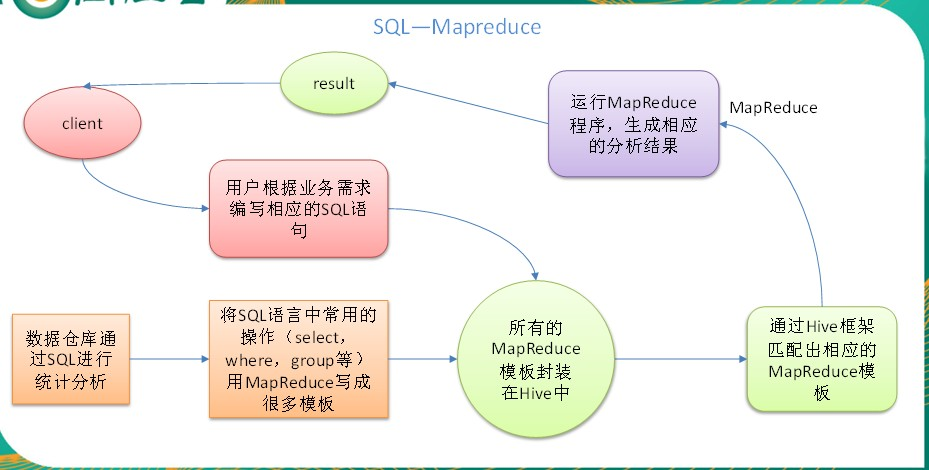
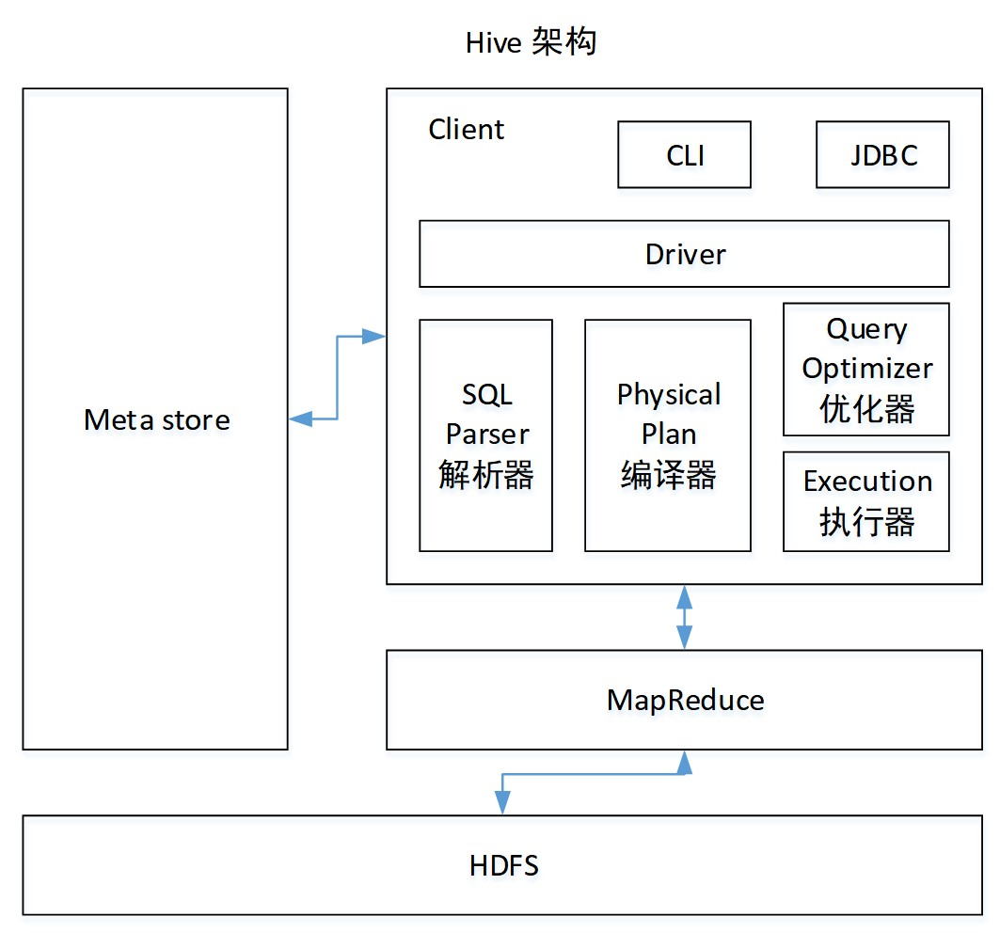
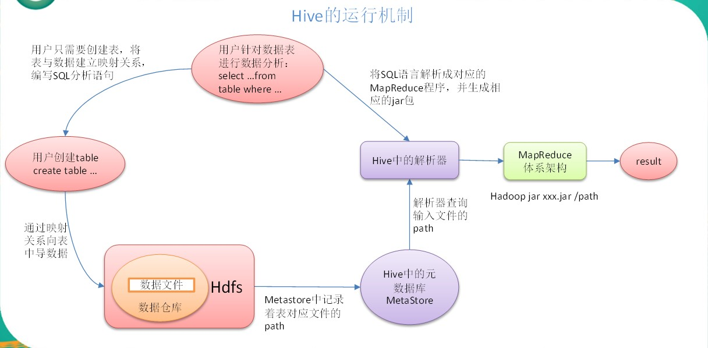

### Hive

> Hive：由Facebook开源用于解决海量结构化日志的数据统计。
Hive是基于Hadoop的一个数据仓库工具，可以将结构化的数据文件映射为一张表，并提供类SQL查询功能。<font style="color: red">本质是：将HQL转化成MapReduce程序</font>



* Hive处理的数据存储在HDFS
* Hive分析数据底层的实现是MapReduce
* 执行程序运行在Yarn上

### HIVE的优缺点

> 优点
* 操作接口采用类SQL语法，提供快速开发的能力（简单、容易上手）。
* 避免了去写MapReduce，减少开发人员的学习成本。
* Hive的执行延迟比较高，因此Hive常用于数据分析，对实时性要求不高的场合。
* Hive优势在于处理大数据，对于处理小数据没有优势，因为Hive的执行延迟比较高。
* Hive支持用户自定义函数，用户可以根据自己的需求来实现自己的函数。

> 缺点
* Hive的HQL表达能力有限
  * 迭代式算法无法表达
  * 数据挖掘方面不擅长
* Hive的效率比较低
  * Hive自动生成的MapReduce作业，通常情况下不够智能化
  * Hive调优比较困难，粒度较粗

### 架构原理



* 用户接口：Client
  * CLI（hive shell）、JDBC/ODBC(java访问hive)、WEBUI（浏览器访问hive）
* 元数据：Metastore
  * 元数据包括：表名、表所属的数据库（默认是default）、表的拥有者、列/分区字段、表的类型（是否是外部表）、表的数据所在目录等；
  * <font style="color: red">默认存储在自带的derby数据库中，推荐使用MySQL存储Metastore</font>
* Hadoop
  * 使用HDFS进行存储，使用MapReduce进行计算。
* 驱动器：Driver
  * 解析器（SQL Parser）：将SQL字符串转换成抽象语法树AST，这一步一般都用第三方工具库完成，比如antlr；对AST进行语法分析，比如表是否存在、字段是否存在、SQL语义是否有误。
  * 编译器（Physical Plan）：将AST编译生成逻辑执行计划。
  * 优化器（Query Optimizer）：对逻辑执行计划进行优化。
  * 执行器（Execution）：把逻辑执行计划转换成可以运行的物理计划。对于Hive来说，就是MR/Spark。

### HIVE的运行机制



> Hive通过给用户提供的一系列交互接口，接收到用户的指令(SQL)，使用自己的Driver，结合元数据(MetaStore)，将这些指令翻译成MapReduce，提交到Hadoop中执行，最后，将执行返回的结果输出到用户交互接口。

### **Hive和数据库比较**

> 由于 Hive 采用了类似SQL 的查询语言 HQL(Hive Query Language)，因此很容易将 Hive 理解为数据库。其实从结构上来看，Hive 和数据库除了拥有类似的查询语言，再无类似之处。本文将从多个方面来阐述 Hive 和数据库的差异。数据库可以用在 Online 的应用中，但是Hive 是为数据仓库而设计的，清楚这一点，有助于从应用角度理解 Hive 的特性。

#### <font style="color:red">查询语言</font>

> 由于SQL被广泛的应用在数据仓库中，因此，专门针对Hive的特性设计了类SQL的查询语言HQL。熟悉SQL开发的开发者可以很方便的使用Hive进行开发。

#### <font style="color:red">数据存储位置</font>

> Hive 是建立在 Hadoop 之上的，所有 Hive 的数据都是存储在 HDFS 中的。而数据库则可以将数据保存在块设备或者本地文件系统中。

#### <font style="color:red">数据更新</font>

> 由于Hive是针对数据仓库应用设计的，而<font style="color:red">数据仓库的内容是读多写少的</font>。因此，<font style="color:red">Hive中不建议对数据的改写，所有的数据都是在加载的时候确定好的。</font>而数据库中的数据通常是需要经常进行修改的，因此可以使用 INSERT INTO …  VALUES 添加数据，使用 UPDATE … SET修改数据。

#### <font style="color:red">索引</font>

> **hive不建立索引**<br>Hive在加载数据的过程中不会对数据进行任何处理，甚至不会对数据进行扫描，因此也没有对数据中的某些Key建立索引。Hive要访问数据中满足条件的特定值时，需要<font style="color:red">暴力扫描整个数据</font>，因此访问延迟较高。由于 MapReduce 的引入， Hive 可以并行访问数据，因此即使没有索引，对于大数据量的访问，Hive 仍然可以体现出优势。数据库中，通常会针对一个或者几个列建立索引，因此对于少量的特定条件的数据的访问，数据库可以有很高的效率，较低的延迟。由于数据的访问延迟较高，决定了 Hive 不适合在线数据查询。

#### <font style="color:red">执行</font>

> Hive中大多数查询的执行是通过 Hadoop 提供的 MapReduce 来实现的。而数据库通常有自己的执行引擎。

#### <font style="color:red">执行延迟</font>

> Hive 在查询数据的时候，由于没有索引，需要扫描整个表，因此延迟较高。另外一个导致 Hive 执行延迟高的因素是 MapReduce框架。由于MapReduce 本身具有较高的延迟，因此在利用MapReduce 执行Hive查询时，也会有较高的延迟。相对的，数据库的执行延迟较低。当然，这个低是有条件的，即数据规模较小，当数据规模大到超过数据库的处理能力的时候，Hive的并行计算显然能体现出优势。

#### <font style="color:red">可扩展性</font>

> 由于Hive是建立在Hadoop之上的，因此Hive的可扩展性是和Hadoop的可扩展性是一致的（世界上最大的Hadoop 集群在 Yahoo!，2009年的规模在4000 台节点左右）。而数据库由于 ACID 语义的严格限制，扩展行非常有限。目前最先进的并行数据库 Oracle 在理论上的扩展能力也只有100台左右。

#### <font style="color:red">数据规模</font>

> 由于Hive建立在集群上并可以利用MapReduce进行并行计算，因此可以支持很大规模的数据；对应的，数据库可以支持的数据规模较小。

### Hive安装
* [官方安装教程](https://cwiki.apache.org/confluence/display/Hive/GettingStarted)
* [下载地址](https://mirrors.tuna.tsinghua.edu.cn/apache/hive/)`本文档安装的是1.2.2`
* 解压文件并配置环境变量
  * `vi .bashrc`
    ```
    export HIVE_HOME=/home/yetao_yang/hive/hive-2.3.4
    export PATH=$PATH:$HIVE_HOME/bin
    ```
  * `source .bashrc`
* 进入到`conf`文件夹下 拷贝`hive-env.sh.template`文件为`hive-env.sh`
  * `cp hive-env.sh.template hive-env.sh`
  * 修改`hive-env.sh`文件
  * `HADOOP_HOME=/home/yetao_yang/hadoop/hadoop-2.9.2`
  * `export HIVE_CONF_DIR=/home/yetao_yang/hive/hive-1.2.2/conf`
* 在hdfs里面创建hive相关目录
  ```
  [yetao_yang@hadoop04 hadoop-2.9.2]$ $HADOOP_HOME/bin/hadoop fs -mkdir /tmp
  [yetao_yang@hadoop04 hadoop-2.9.2]$ $HADOOP_HOME/bin/hadoop fs -mkdir -p /user/hive/warehouse
  [yetao_yang@hadoop04 hadoop-2.9.2]$ $HADOOP_HOME/bin/hadoop fs -chmod g+w   /tmp
  [yetao_yang@hadoop04 hadoop-2.9.2]$ $HADOOP_HOME/bin/hadoop fs -chmod g+w   /user/hive/warehouse
  ```

* 启动Hive
  * `bin/hive`


  ### Hive常用命令

  [hive官网](https://cwiki.apache.org/confluence/display/Hive/LanguageManual+Cli)

  ### 建表语句示例

  ```
  CREATE EXTERNAL TABLE `table_name`(
  `timestamp` bigint,
  `insert_time` bigint,
  `name` string,
  `age` smallint,
  `sex` string,
  `message` string
  )PARTITIONED BY (
  `month` bigint,
  `day` bigint)
  ROW FORMAT SERDE
  'org.apache.hadoop.hive.serde2.lazy.LazySimpleSerDe'
  WITH SERDEPROPERTIES (
  'field.delim'='\b',
  'serialization.format'='\b')
  STORED AS INPUTFORMAT
  'org.apache.hadoop.mapred.TextInputFormat'
  OUTPUTFORMAT
  'org.apache.hadoop.hive.ql.io.HiveIgnoreKeyTextOutputFormat'
  LOCATION
  'hdfs://hadoop01:9000/hive_data/table_name'
  TBLPROPERTIES (
  'transient_lastDdlTime'='1534123505');
  ```
  * `PARTITIONED BY`
    * 建立分区
  * `field.delim`
    * 字段分割符
  * `serialization.format`
    * 序列化格式
  * `hdfs://hadoop01:9000/hive_data/table_name`
    * `hadoop01:9000`
      * namenode的地址,如果是高可用, 要填写namenode的集群名称
    * `/hive_data/table_name`
      * 该表要对`/hive_data/table_name`里面的数据建立映射关系

  <hr>
  * `msck repair table table_name;`
    * Hive会检测如果HDFS目录下存在但表的metastore中不存在的partition元信息，更新到metastore中。

  ### 安装MySQL
  * 下载mysql源安装包
    * `wget http://dev.mysql.com/get/mysql57-community-release-el7-8.noarch.rpm`
  * 安装mysql源
    * `yum localinstall mysql57-community-release-el7-8.noarch.rpm`
  * 安装MySQL
    * `yum install mysql-community-server`
  * 启动MySQL服务
    * `systemctl start mysqld`
  * 查看MySQL的启动状态
    * `systemctl status mysqld`
  * 开机启动
    * `systemctl enable mysqld`
    * `systemctl daemon-reload`
  * 修改密码策略
    * 在/etc/my.cnf文件添加validate_password_policy配置，指定密码策略
    * `#选择0（LOW），1（MEDIUM），2（STRONG）其中一种，选择2需要提供密码字典文件`
      * `validate_password_policy=0`
    * 如果不需要密码策略，添加my.cnf文件中添加如下配置禁用即可：
      * `validate_password = off`
    * 重新启动mysql服务使配置生效：
      * `systemctl restart mysqld`
  * 修改root本地登录密码
    * mysql安装完成之后，在/var/log/mysqld.log文件中给root生成了一个默认密码。通过下面的方式找到root默认密码，然后登录mysql进行修改：
    * `grep 'temporary password' /var/log/mysqld.log`
    * `mysql -uroot -p`
    * `mysql> SET PASSWORD FOR 'root'@'localhost' = PASSWORD('newpass');`
  * 允许root用户远程登录
    * 切换到mysql这个数据库
      * `mysql> use mysql;`
    * 查看root用户配置
      * `mysql> select host,user from user where user='root';`
    * 修改root配置
      * `mysql> update user set host = '%' where user = 'root' and host = '127.0.0.1';`
    * 给用户授权
      * `mysql> grant all privileges on *.* to 'root'@'%' identified by '123456' with grant option;`
    * 使配置生效
      * `mysql> flush privileges;`

  ### Hive元数据配置到MySql
  * 驱动拷贝
    * 把附件里的文件拷贝到`hive/lib/`目录下
  * 在`/opt/module/hive/conf`目录下创建一个`hive-site.xml`并进行配置
    ```xml
    <?xml version="1.0"?>
    <?xml-stylesheet type="text/xsl" href="configuration.xsl"?>
    <configuration>
    	<property>
    	  <name>javax.jdo.option.ConnectionURL</name>
    	  <value>jdbc:mysql://hadoop04:3306/metastore?createDatabaseIfNotExist=true</value>
    	  <description>JDBC connect string for a JDBC metastore</description>
    	</property>

    	<property>
    	  <name>javax.jdo.option.ConnectionDriverName</name>
    		<!-- 驱动 -->
    	  <value>com.mysql.jdbc.Driver</value>
    	  <description>Driver class name for a JDBC metastore</description>
    	</property>

    	<property>
    	  <name>javax.jdo.option.ConnectionUserName</name>
    		<!-- 用户 -->
    	  <value>root</value>
    	  <description>username to use against metastore database</description>
    	</property>

    	<property>
    	  <name>javax.jdo.option.ConnectionPassword</name>
    		<!-- 密码 -->
    	  <value>123456</value>
    	  <description>password to use against metastore database</description>
    	</property>
    </configuration>
    ```
  * 启动hive
    * `bin/hive --service metastore -p 9083`
      * 启用服务端与客户端服务
