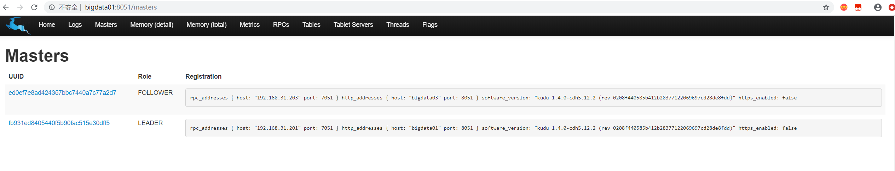
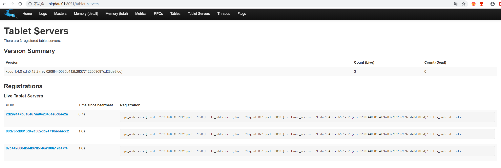

### kudu集群部署

> 选择指定版本的kudu进行下载[kudu](http://archive.cloudera.com/kudu/),我的版本是[5.12.2](http://archive.cloudera.com/kudu/redhat/7/x86_64/kudu/cloudera-kudu.repo)

#### 集群规划

节点 | 角色
-- | --
bigdata01 | Master Server、Tablet Server
bigdata02 |Tablet Server、Kudu Client
bigdata03 |Master Server、Tablet Server

* 把下载的文件放在`/etc/yum.repos.d/`路径下
* 在所有节点上安装kudu基础组件
  * `yum install kudu`
* 在`bigdata01`,`bigdata03`上安装Master Server
  * `yum install kudu-master`
* 在`bigdata01`,`bigdata02`,`bigdata03`上安装Tablet Server
  * `yum install kudu-tserver`
* 在`bigdata02`上安装Kudu Client
  * `yum install kudu-client0`
  * `yum install kudu-client-devel`
* 配置所有**Kudu Master**节点
  * 修改`/etc/default/kudu-master`
    ```sh
    export FLAGS_log_dir=/var/log/kudu
    # 填写 本机主机名:端口号
    export FLAGS_rpc_bind_addresses=bigdata01:7051
    ```
  * 修改`/etc/kudu/conf/master.gflagfile`
    ```sh
    # Do not modify these two lines. If you wish to change these variables,
    # modify them in /etc/default/kudu-master.
    --fromenv=rpc_bind_addresses
    --fromenv=log_dir

    --fs_wal_dir=/var/lib/kudu/master/D_wal
    --fs_data_dirs=/var/lib/kudu/master/D_data
    --master_addresses=bigdata01:7051,bigdata03:7051
    ```
* 配置所有的`Tablet Server`节点
  * 修改`/etc/default/kudu-tserver`
    ```sh
    export FLAGS_log_dir=/var/log/kudu
    # 填写 本机主机名:端口号
    export FLAGS_rpc_bind_addresses=bigdata01:7050
    ```
  * 修改`/etc/kudu/conf/tserver.gflagfile`
    ```sh
    # Do not modify these two lines. If you wish to change these variables,
    # modify them in /etc/default/kudu-tserver.
    --fromenv=rpc_bind_addresses
    --fromenv=log_dir

    --fs_wal_dir=/var/lib/kudu/tserver/D_wal
    --fs_data_dirs=/var/lib/kudu/tserver/D_data
    --tserver_master_addrs=bigdata01:7051,bigdata03:7051
    ```
* 解除kudu用户的线程限制
  * 修改`/etc/security/limits.d/20-nproc.conf`添加如下内容**所有节点修改**
    ```
    kudu       soft    nproc     unlimited
    impala     soft    nproc     unlimited
    ```

* 在`bigdata01`,`bigdata03`上启动Master Server
  * `service kudu-master start`
* 在`bigdata01`,`bigdata02`,`bigdata03`上启动Tablet Server
  * `service kudu-tserver start`
* 在页面上查看master节点的情况
  
* 查看Tablet节点
  
