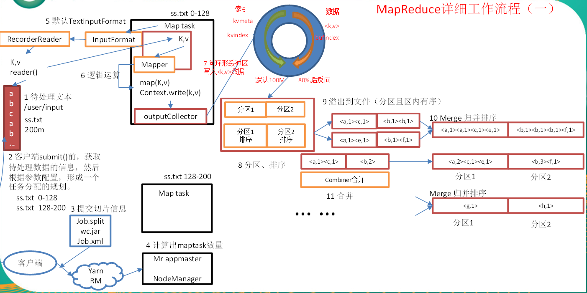
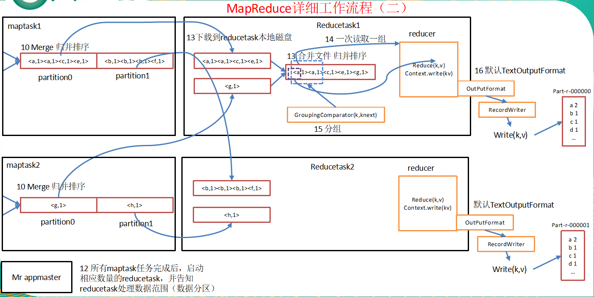
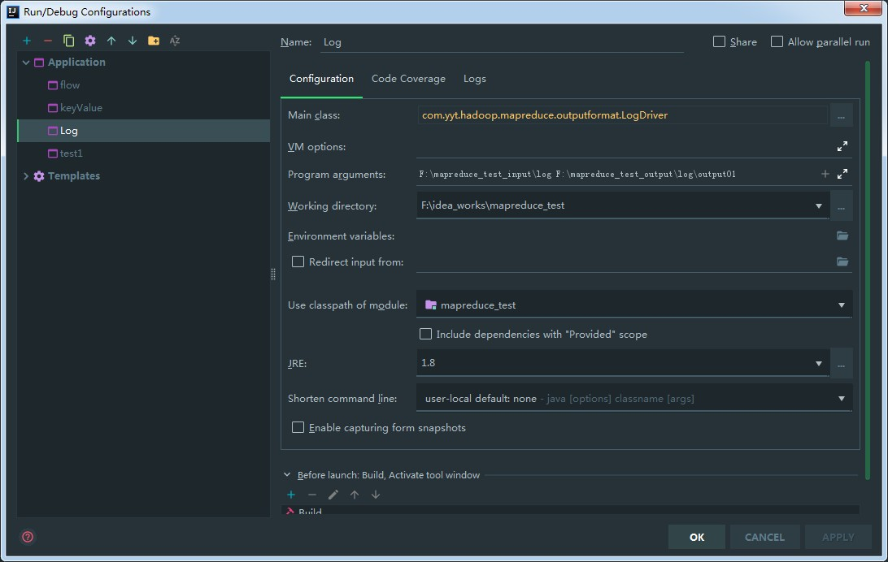
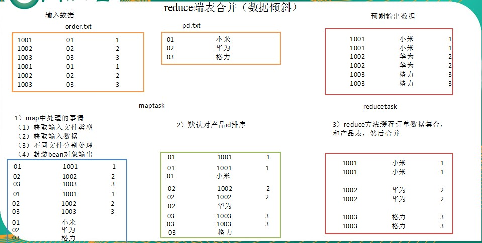

> **MapReduce定义**: <br>Mapreduce是一个分布式运算程序的编程框架，是用户开发“基于hadoop的数据分析应用”的核心框架。<br> Mapreduce核心功能是将用户编写的业务逻辑代码和自带默认组件整合成一个完整的分布式运算程序，并发运行在一个hadoop集群上。

### MapReduce的优缺点

> **优点**

* MapReduce 易于编程
  > 它简单的实现一些接口，就可以完成一个分布式程序，这个分布式程序可以分布到大量廉价的PC机器上运行。也就是说你写一个分布式程序，跟写一个简单的串行程序是一模一样的。就是因为这个特点使得MapReduce编程变得非常流行。
* 良好的扩展性
  > 当你的计算资源不能得到满足的时候，你可以通过简单的增加机器来扩展它的计算能力。
* 高容错性
  > MapReduce设计的初衷就是使程序能够部署在廉价的PC机器上，这就要求它具有很高的容错性。比如其中一台机器挂了，它可以把上面的计算任务转移到另外一个节点上运行，不至于这个任务运行失败，而且这个过程不需要人工参与，而完全是由Hadoop内部完成的。
* 适合PB级以上海量数据的**<font style="color:red">离线处理</font>**
  > 这里加红字体离线处理，说明它适合离线处理而不适合在线处理。比如像毫秒级别的返回一个结果，MapReduce很难做到。

> **缺点**

* MapReduce不擅长做实时计算、流式计算、DAG（有向图）计算。
  * 实时计算
    * MapReduce无法像Mysql一样，在毫秒或者秒级内返回结果。
  * 流式计算
    * 流式计算的输入数据是动态的，而MapReduce的输入数据集是静态的，不能动态变化。这是因为MapReduce自身的设计特点决定了数据源必须是静态的。
  * DAG（有向图）计算
    * 多个应用程序存在依赖关系，后一个应用程序的输入为前一个的输出。在这种情况下，MapReduce并不是不能做，而是使用后，每个MapReduce作业的输出结果都会写入到磁盘，会造成大量的磁盘IO，导致性能非常的低下。


### MapReduce核心思想


> * 首先要对需要处理的文件进行切片,默认的是每个切片大小是**128M**
* 将切片封装成maptask的任务交给每个服务器去处理
* 读取数据按行处理
* 按照空格切分行内单词
* 封装成KV键值对(单词,1)
* 然后把maptask的结果传给reducetask,每个reducetask会输出结果到文件

### MapReduce编程规范
> 用户编写的程序分成三个部分：Mapper、Reducer和Driver。

* Mapper阶段
  > * 用户自定义的Mapper要继承自己的父类
  * Mapper的输入数据是KV对的形式（KV的类型可自定义）
  * Mapper中的业务逻辑写在map()方法中
  * Mapper的输出数据是KV对的形式（KV的类型可自定义）
  * map()方法（maptask进程）对每一个<K,V>调用一次
* Reducer阶段
  > * 用户自定义的Reducer要继承自己的父类
  * Reducer的输入数据类型对应Mapper的输出数据类型，也是KV
  * Reducer的业务逻辑写在reduce()方法中
  * Reducetask进程对每一组相同k的<k,v>组调用一次reduce()方法
* Driver阶段
  > * 相当于yarn集群的客户端，用于提交我们整个程序到yarn集群，提交的是封装了mapreduce程序相关运行参数的job对象

### 按照mapreduce编程规范，分别编写Mapper，Reducer，Driver


### 编码

* 新建maven项目
* 导入依赖
  ```xml
  <dependencies>
      <dependency>
          <groupId>junit</groupId>
          <artifactId>junit</artifactId>
          <version>RELEASE</version>
      </dependency>
      <dependency>
          <groupId>org.apache.logging.log4j</groupId>
          <artifactId>log4j-core</artifactId>
          <version>2.11.1</version>
      </dependency>

      <dependency>
          <groupId>org.apache.hadoop</groupId>
          <artifactId>hadoop-common</artifactId>
          <version>2.9.2</version>
      </dependency>

      <dependency>
          <groupId>org.apache.hadoop</groupId>
          <artifactId>hadoop-client</artifactId>
          <version>2.9.2</version>
      </dependency>
      <dependency>
          <groupId>org.apache.hadoop</groupId>
          <artifactId>hadoop-hdfs</artifactId>
          <version>2.9.2</version>
      </dependency>
  </dependencies>
  ```

* 增加配置文件`log4j.properties`
  ```yml
  log4j.rootLogger=INFO, stdout
  log4j.appender.stdout=org.apache.log4j.ConsoleAppender
  log4j.appender.stdout.layout=org.apache.log4j.PatternLayout
  log4j.appender.stdout.layout.ConversionPattern=%d %p [%c] - %m%n
  log4j.appender.logfile=org.apache.log4j.FileAppender
  log4j.appender.logfile.File=target/spring.log
  log4j.appender.logfile.layout=org.apache.log4j.PatternLayout
  log4j.appender.logfile.layout.ConversionPattern=%d %p [%c] - %m%n
  ```

* 编写`Mapper`程序逻辑
  ```java
  /**
 *  参数1 输入key的类型
 *  参数2 输入的一个类型
 *  参数3 输出的key的类型
 *  参数4 输出的value一个类型
 */
  public class WordcountMapper extends Mapper<LongWritable, Text, Text, IntWritable> {

      IntWritable time = new IntWritable(1);
      Text texts = new Text();
      /**
       * 对每一个<k,V>调用一次
       * @param key: 数据偏移量
       * @param value: 待处理的一行数据
       * @param context: 上下文
       * @throws IOException
       * @throws InterruptedException
       */
      @Override
      protected void map(LongWritable key, Text value, Context context) throws IOException,
              InterruptedException {
          // 将1行数据转换为String类型\
          String line = value.toString();
          // 切割字符串
          String[] words = line.split(" ");
          // 循环写出
          for (String word : words) {
              texts.set(word);
              // 把数据传入reduce
              context.write(texts, time);
          }
      }
  }
  ```

* 编写`Reduce`程序
  ```java
  /**
   * 参数1 : 输入key类型
   * 参数2 : 输入value类型
   * 参数3 : 输出key的类型
   * 参数4 : 输出value的类型
   */
  public class WordcountReduce extends Reducer<Text, IntWritable, Text, IntWritable> {

      /**
       *
       * @param key: 单词
       * @param values: 单词个数的一个集合
       * @param context: 上下文
       * @throws IOException
       * @throws InterruptedException
       */
      @Override
      protected void reduce(Text key, Iterable<IntWritable> values, Context context) throws
              IOException,
              InterruptedException {
          // 累加
          int sum = 0;
          for (IntWritable value : values) {
              sum += value.get();
          }
          context.write(key,new IntWritable(sum));
      }
  }
  ```

* 编写`Driver程序`
  ```java
  public class WordcountDriver {
      public static void main(String[] args) throws
              IOException,
              ClassNotFoundException,
              InterruptedException {
          // 获取job对象
          final Configuration configuration = new Configuration();
          Job job = Job.getInstance(configuration);
          // 指定jar包的路径
          job.setJarByClass(WordcountDriver.class);
          // 关联Mapper和reduce类
          job.setMapperClass(WordcountMapper.class);
          job.setReducerClass(WordcountReduce.class);
          // 指定mapper输出的k v 类型
          job.setMapOutputKeyClass(Text.class);
          job.setMapOutputValueClass(IntWritable.class);
          // 最终输出的k v类型
          job.setOutputKeyClass(Text.class);
          job.setOutputValueClass(IntWritable.class);
          // 指定job输入数据的路径
          FileInputFormat.setInputPaths(job, new Path(args[0]));
          // 指定job输出数据的路径
          FileOutputFormat.setOutputPath(job, new Path(args[1]));
          // 提交任务 任务成功返回true,失败返回false
          boolean flage = job.waitForCompletion(true);
          // 根据任务的成功或失败 来关闭虚拟机
          System.exit(flage ? 0 : 1);
      }
  }
  ```

* 在`windows`环境中进行测试
  > * 需要你的windows正确的配置了`HADOOP_HOME`环境变量
  * 还要需要在网上找对应hadoop版本下的`winutils`依赖等文件
    * `2.9.2`版本放在了本目录下`附件`里面 照着教程来
  * 具体配置如下<br/>
    
  * 点击运行main方法 查看打印日志
    ```shell
    2019-04-04 10:09:03,917 INFO [org.apache.hadoop.mapreduce.Job] - Counters: 30
    	File System Counters
    		FILE: Number of bytes read=9102
    		FILE: Number of bytes written=974884
    		FILE: Number of read operations=0
    		FILE: Number of large read operations=0
    		FILE: Number of write operations=0
    	Map-Reduce Framework
    		Map input records=29
    		Map output records=296
    		Map output bytes=2522
    		Map output materialized bytes=3120
    		Input split bytes=113
    		Combine input records=0
    		Combine output records=0
    		Reduce input groups=68
    		Reduce shuffle bytes=3120
    		Reduce input records=296
    		Reduce output records=68
    		Spilled Records=592
    		Shuffled Maps =1
    		Failed Shuffles=0
    		Merged Map outputs=1
    		GC time elapsed (ms)=0
    		Total committed heap usage (bytes)=514850816
    	Shuffle Errors
    		BAD_ID=0
    		CONNECTION=0
    		IO_ERROR=0
    		WRONG_LENGTH=0
    		WRONG_MAP=0
    		WRONG_REDUCE=0
    	File Input Format Counters
    		Bytes Read=1246
    	File Output Format Counters
    		Bytes Written=1118
    Disconnected from the target VM, address: '127.0.0.1:60782', transport: 'socket'
    ```
  * 查看output文件夹下的文件 检验结果是否正确

* 在`centos`环境中进行测试
  > * 使用idea进行打包,并在target中把jar包拷到centos中<br/>
  
  * 运行命令
    * `hadoop jar mapreduce_test-1.0-SNAPSHOT.jar com.yyt.hadoop.mapreduce.wordcount.WordcountDriver /yetao_yang/input /yetao_yang/output`
    * `com.yyt.hadoop.mapreduce.wordcount.WordcountDriver`为类的路径
    * `yetao_yang/input`为输入的文件
    * `/yetao_yang/output`为结果输出文件
  * 查看输入文件
    ```shell
    [yetao_yang@hadoop01 ~]$ hadoop fs -cat /yetao_yang/input/wc.input
    zhangsan zhangsan zhangsan
    zhangsan lishi lishi lishi lishi
    wangwu wangwu richen jiangjie jiangjie jiangjie jiangjie jiangjie
    jiangjie lijie lijie lijie lijie lijie
    install install install install install install install install
    install install install install
    ```
  * 查看结果
    ```shell
    [yetao_yang@hadoop01 ~]$ hadoop fs -cat /yetao_yang/output/part-r-00000
    install	12
    jiangjie	6
    lijie	5
    lishi	4
    richen	1
    wangwu	2
    zhangsan	4
    ```


### 需求二
> 
* 准备输入文件
  ```
  1363157993055	13560436666	C4-17-FE-BA-DE-D9:CMCC	120.196.100.99	18	15	1116	954	200
  1363157993056	18694067935	C4-17-FE-BA-DE-D9:CMCD	120.196.100.100	18	15	935	564	210
  1363157993057	18694067936	C4-17-FE-BA-DE-D9:CMCE	120.196.100.101	18	15	1256	756	210
  1363157993058	18694067937	C4-17-FE-BA-DE-D9:CMCF	120.196.100.102	18	15	866	698	210
  1363157993059	18694067938	C4-17-FE-BA-DE-D9:CMCG	120.196.100.103	18	15	1597	999	210
  1363157993057	18694067936	C4-17-FE-BA-DE-D9:CMCE	120.196.100.101	18	15	150	123	210
  ```
* 书写`FlowBean`
  ```java
  // 实现Writable接口 让Bean实现序列化
  public class FlowBean implements Writable {
      // 上行流量
      private long upflow;
      // 下行流量
      private long downflow;
      // 总和
      private long sumflow;
      public FlowBean() {
      }
      public FlowBean(long upflow, long downflow) {
          this.upflow = upflow;
          this.downflow = downflow;
          this.sumflow = this.upflow + this.downflow;
      }
      public void set(long upflow, long downflow) {
          this.upflow = upflow;
          this.downflow = downflow;
          this.sumflow = this.upflow + this.downflow;
      }
      public long getUpflow() {
          return upflow;
      }
      public void setUpflow(long upflow) {
          this.upflow = upflow;
      }
      public long getDownflow() {
          return downflow;
      }
      public void setDownflow(long downflow) {
          this.downflow = downflow;
      }
      public long getSumflow() {
          return sumflow;
      }
      public void setSumflow(long sumflow) {
          this.sumflow = sumflow;
      }
      @Override
      public String toString() {
          return "\b"+upflow + "\b" + downflow + "\b" + sumflow ;
      }
      /**
       * 序列化方法
       * @param dataOutput
       *          输出流
       * @throws IOException
       */
      public void write(DataOutput dataOutput) throws IOException {
          dataOutput.writeLong(upflow);
          dataOutput.writeLong(downflow);
          dataOutput.writeLong(sumflow);
      }
      /**
       * 反序列化方法 要与序列化方法一致
       * @param dataInput
       *          输入流
       * @throws IOException
       */
      public void readFields(DataInput dataInput) throws IOException {
          this.upflow = dataInput.readLong();
          this.downflow = dataInput.readLong();
          this.sumflow = dataInput.readLong();
      }
  }
  ```
* 书写`mapper`类
  ```java
  public class FlowMapper extends Mapper<LongWritable, Text, Text, FlowBean> {
      FlowBean flowBean = new FlowBean();
      Text text = new Text();
      @Override
      protected void map(LongWritable key, Text value, Context context) throws IOException, InterruptedException {
          String line = value.toString();
          String[] fields = line.split("\t");
          //手机号
          String phone = fields[1];
          // 上行流量
          Long upflow = Long.parseLong(fields[fields.length - 3]);
          // 下行流量
          Long downflow = Long.parseLong(fields[fields.length - 2]);
          // 封装对象
          flowBean.set(upflow,downflow);
          text.set(phone);
          // 写出数据
          context.write(text,flowBean);
      }
  }
  ```
* 书写`reduce`类
  ```java
  public class FlowReduce extends Reducer<Text, FlowBean, Text,FlowBean> {
      FlowBean flowBean = new FlowBean();
      @Override
      protected void reduce(Text key, Iterable<FlowBean> values, Context context) throws IOException, InterruptedException {
          // 累加
          Long sumUpFlow = 0L;
          Long sumDownFlow = 0L;
          for (FlowBean value : values) {
              sumUpFlow += value.getUpflow();
              sumDownFlow += value.getDownflow();
          }
          // 封装对象
          flowBean.set(sumUpFlow, sumDownFlow);
          // 写出数据
          context.write(key, flowBean);
      }
  }
  ```
* 书写`driver`类
  ```java
  public class FlowDriver {
      public static void main(String[] args) throws IOException, ClassNotFoundException, InterruptedException {
          // 获取job对象
          Configuration configuration = new Configuration();
          Job job = Job.getInstance(configuration);
          // 设置jar包路径
          job.setJarByClass(FlowDriver.class);
          // 关联mapper和reduce
          job.setMapperClass(FlowMapper.class);
          job.setReducerClass(FlowReduce.class);
          // 关联mapper的输出kv类型
          job.setMapOutputKeyClass(Text.class);
          job.setMapOutputValueClass(FlowBean.class);
          // 关联最终的输出类型
          job.setOutputKeyClass(Text.class);
          job.setOutputValueClass(FlowBean.class);
          // 设置输入数据的路径
          FileInputFormat.setInputPaths(job, new Path(args[0]));
          // 设置输出路径
          FileOutputFormat.setOutputPath(job, new Path(args[1]));
          // 提交
          boolean flag = job.waitForCompletion(true);
          System.exit(flag ? 0 : 1);
      }
  }
  ```
* 在`windows`环境中进行测试(与需求一的过程一样)


### MapReduce详细工作流程





### 小文件优化策略

> 最好的办法，在数据处理系统的最前端（预处理/采集），将小文件先合并成大文件，再上传到HDFS做后续分析。

> 补救措施：如果已经是大量小文件在HDFS中了，可以使用另一种InputFormat来做切片（CombineTextInputFormat），它的切片逻辑跟TextFileInputFormat不同：它可以将多个小文件从逻辑上规划到一个切片中，这样，多个小文件就可以交给一个maptask。<br>优先满足最小切片，不超过最大切片大小
  * 在Driver代码里面配置InputFormat的类型并设置切片的最大值与最小值
    ```java
    // 指定inputformat的类型
    job.setInputFormatClass(CombineTextInputFormat.class);
    CombineTextInputFormat.setMaxInputSplitSize(job, 4194304); // 4M
    CombineTextInputFormat.setMinInputSplitSize(job, 2097152); // 2M
    ```

### 需求三
> 过滤输入的log日志中是否包含yangyetao<br>包含yangyetao的输入到一个文件夹,不包含的输入到另一个文件夹
* 输入数据格式为
  ```
  http://www.baidu.com
  http://www.google.com
  http://cn.bing.com
  http://www.yangyetao.com
  http://www.sohu.com
  http://www.sina.com
  http://www.sin2a.com
  http://www.sin2desa.com
  http://www.sindsafa.com
  ```
* 输出预期
  ```
  http://www.yangyetao.com
  ```
  <hr>
  ```
  http://www.baidu.com
  http://www.google.com
  http://cn.bing.com
  http://www.sohu.com
  http://www.sina.com
  http://www.sin2a.com
  http://www.sin2desa.com
  http://www.sindsafa.com
  ```
* 书写`Mapper`
  ```java
  public class LogMapper extends Mapper<LongWritable, Text, Text, NullWritable> {
      @Override
      protected void map(LongWritable key, Text value, Context context) throws IOException, InterruptedException {
          context.write(value, NullWritable.get());
      }
  }
  ```
* 书写`Reduce`
  ```java
  public class LogReduce extends Reducer<Text, NullWritable, Text, NullWritable> {
      @Override
      protected void reduce(Text key, Iterable<NullWritable> values, Context context) throws IOException, InterruptedException {
          String line = key.toString();
          String str = line +"\n";
          context.write(new Text(str), NullWritable.get());
      }
  }
  ```
* 自定义`outputformat`
  ```java
  public class LogOutputFormat extends FileOutputFormat<Text, NullWritable> {
      public RecordWriter<Text, NullWritable> getRecordWriter(TaskAttemptContext job) throws IOException, InterruptedException {
          RecordWriter<Text, NullWritable> recordWriter = new LogRecordWriter(job);
          return recordWriter;
      }
  }
  ```
* 自定义`RecordWriter`
  ```java
  public class LogRecordWriter extends RecordWriter<Text, NullWritable> {
      FSDataOutputStream path01 = null;
      FSDataOutputStream path02 = null;
      FileSystem fileSystem = null;
      public LogRecordWriter(TaskAttemptContext job) {
          Configuration configuration = job.getConfiguration();
          try {
              // 获取客户端
              fileSystem = FileSystem.get(configuration);
              // 输出流
              Path path1 = new Path("f:/yangyetao.txt");
              Path path2 = new Path("f:/other.txt");
              path01 = fileSystem.create(path1);
              path02 = fileSystem.create(path2);
          } catch (IOException e) {
              e.printStackTrace();
          }
      }
      public void write(Text key, NullWritable nullWritable) throws IOException, InterruptedException {
          String line = key.toString();
          // 判断数据中是否包含yangyetao
          if(line.contains("yangyetao")){
              path01.write(line.getBytes());
          } else {
              path02.write(line.getBytes());
          }
      }
      public void close(TaskAttemptContext taskAttemptContext) throws IOException, InterruptedException {
          IOUtils.closeStream(path01);
          IOUtils.closeStream(path02);
          fileSystem.close();
      }
  }
  ```
* 书写`Driver`
  ```java
  public class LogDriver  {
      public static void main(String[] args) throws IOException, ClassNotFoundException, InterruptedException {
          // 获取job对象
          Configuration configuration = new Configuration();
          Job job = Job.getInstance(configuration);
          job.setJarByClass(LogDriver.class);
          job.setMapperClass(LogMapper.class);
          job.setReducerClass(LogReduce.class);
          //
          job.setMapOutputKeyClass(Text.class);
          job.setMapOutputValueClass(NullWritable.class);
          //
          job.setOutputKeyClass(Text.class);
          job.setOutputValueClass(NullWritable.class);
          //
          job.setOutputFormatClass(LogOutputFormat.class);
          // 设置输入数据的路径
          FileInputFormat.setInputPaths(job, new Path(args[0]));
          // 设置输出路径
          FileOutputFormat.setOutputPath(job, new Path(args[1]));
          // 提交
          boolean flag = job.waitForCompletion(true);
          System.exit(flag ? 0 : 1);
      }
  }
  ```
* 启动`Driver`<br>
  
* 输出的文件结果分别在`f:/yangyetao.txt`和`f:/other.txt`
* mapreudce的`SUCCESS`文件在`F:\mapreduce_test_output\log\output01`路径下

### Reduce的join操作

> **原理**<br>Map端的主要工作：为来自不同表(文件)的key/value对打标签以区别不同来源的记录。然后用连接字段作为key，其余部分和新加的标志作为value，最后进行输出。<br>**缺点**<br>这种方式的缺点很明显就是会造成map和reduce端也就是shuffle阶段出现大量的数据传输，效率很低。

#### 需求
> **订单数据**

id | pid | amount
-- | -- | :--
1001 | 01 | 1
1002 | 02 | 2
1003 | 03 | 3
1004 | 01 | 4
1005 | 02 | 5
1006 | 03 | 6
> **商品信息表**

pid | pname
-- | --
01 | 小米
02 | 华为
03 | 格力

> **关联后的结果**

id | pname | amount
-- | -- | :--
1001 | 小米 | 1
1002 | 华为 | 2
1003 |格力 | 3
1004 | 小米 | 4
1005 | 华为 | 5
1006 | 格力 | 6

> **思路**<br>将关联条件（pid）作为map输出的key，将两张表满足join条件的数据封装起来，并携带数据所来源的文件信息，一起发往同一个reduce task，在reduce中进行数据的串联<br>

