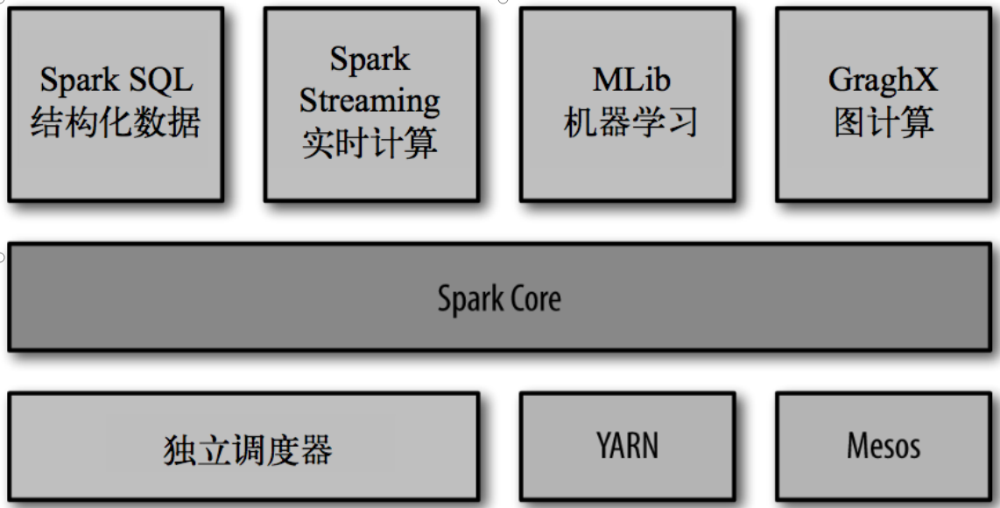
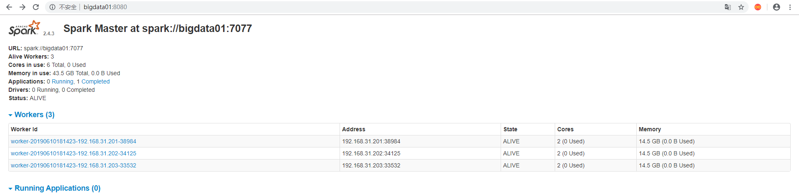
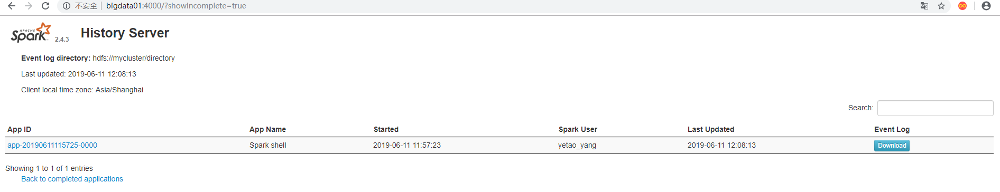

### 什么是Spark

>Spark是一种快速、通用、可扩展的大数据分析引擎，2009年诞生于加州大学伯克利分校AMPLab，2010年开源，2013年6月成为Apache孵化项目，2014年2月成为Apache顶级项目。项目是用Scala进行编写。</br>
目前，Spark生态系统已经发展成为一个包含多个子项目的集合，其中包含SparkSQL、Spark Streaming、GraphX、MLib、SparkR等子项目，Spark是基于内存计算的大数据并行计算框架。除了扩展了广泛使用的 MapReduce 计算模型，而且高效地支持更多计算模式，包括交互式查询和流处理。Spark 适用于各种各样原先需要多种不同的分布式平台的场景，包括批处理、迭代算法、交互式查询、流处理。通过在一个统一的框架下支持这些不同的计算，Spark 使我们可以简单而低耗地把各种处理流程整合在一起。而这样的组合，在实际的数据分析 过程中是很有意义的。不仅如此，Spark 的这种特性还大大减轻了原先需要对各种平台分 别管理的负担。</br>
大一统的软件栈，各个组件关系密切并且可以相互调用，这种设计有几个好处：1、软件栈中所有的程序库和高级组件 都可以从下层的改进中获益。2、运行整个软件栈的代价变小了。不需要运 行 5 到 10 套独立的软件系统了，一个机构只需要运行一套软件系统即可。系统的部署、维护、测试、支持等大大缩减。3、能够构建出无缝整合不同处理模型的应用。
<hr>
* Spark的内置项目如下
  </br>

### SPARK[下载](http://spark.apache.org/downloads.html)

### Standalone模式安装

* 拷贝`conf/slaves.template`为`conf/slaves`并添加如下内容
  ```
  bigdata01
  bigdata02
  bigdata03
  ```
* 拷贝`conf/spark-env.sh.template`为`conf/spark-env.sh`修改如下内容
  ```sh
  SPARK_MASTER_HOST=bigdata01
  SPARK_MASTER_PORT=7077
  ```
* 修改`sbin`目录下的`spark-config.sh`文件,添加如下内容
  ```sh
  export JAVA_HOME=/usr/local/java/jdk1.8.0_211
  ```
* 向其余两台服务器分发`spark`
  * `scp -r spark-2.4.3/ yetao_yang@bigdata02:/home/yetao_yang/spark`
  * `scp -r spark-2.4.3/ yetao_yang@bigdata03:/home/yetao_yang/spark`
* 在`bigdata01`启动spark
  * `./sbin/start-all.sh`
* 在浏览器上查看`bigdata01:8080`端口
  </br>
* 提交任务并执行
  ```sh
  ./bin/spark-submit \
  --class org.apache.spark.examples.SparkPi \
  --master spark://bigdata01:7077 \
  --executor-memory 1G \
  --total-executor-cores 2 \
  ./examples/jars/spark-examples_2.11-2.4.3.jar \
  100
  ```
* 参数说明
  ```
  --master spark://hadoop102:7077 指定Master的地址
  --class: 你的应用的启动类 (如 org.apache.spark.examples.SparkPi)
  --deploy-mode: 是否发布你的驱动到worker节点(cluster) 或者作为一个本地客户端 (client) (default: client)*
  --conf: 任意的Spark配置属性， 格式key=value. 如果值包含空格，可以加引号“key=value”
  application-jar: 打包好的应用jar,包含依赖. 这个URL在集群中全局可见。 比如hdfs:// 共享存储系统， 如果是 file:// path， 那么所有的节点的path都包含同样的jar
  application-arguments: 传给main()方法的参数
  --executor-memory 1G 指定每个executor可用内存为1G
  --total-executor-cores 2 指定每个executor使用的cup核数为2个
  ```
### Spark Shell

* 启动`spark shell`
  * `./bin/spark-shell --master spark://bigdata01:7077`
    ```sh
    19/06/11 10:34:21 WARN NativeCodeLoader: Unable to load native-hadoop library for your platform... using builtin-java classes where applicable
    Using Spark's default log4j profile: org/apache/spark/log4j-defaults.properties
    Setting default log level to "WARN".
    To adjust logging level use sc.setLogLevel(newLevel). For SparkR, use setLogLevel(newLevel).
    Spark context Web UI available at http://bigdata01:4040
    Spark context available as 'sc' (master = spark://bigdata01:7077, app id = app-20190611103427-0001).
    Spark session available as 'spark'.
    Welcome to
          ____              __
         / __/__  ___ _____/ /__
        _\ \/ _ \/ _ `/ __/  '_/
       /___/ .__/\_,_/_/ /_/\_\   version 2.4.3
          /_/

    Using Scala version 2.11.12 (Java HotSpot(TM) 64-Bit Server VM, Java 1.8.0_211)
    Type in expressions to have them evaluated.
    Type :help for more information.

    scala>
    ```
* 运行一个`worldcount`案例
  ```
  scala> sc.textFile("./LICENSE").flatMap(_.split(" ")).map((_,1)).reduceByKey(_+_).collect
     def collect[U](f: PartialFunction[(String, Int),U])(implicit evidence$29: scala.reflect.ClassTag[U]): org.apache.spark.rdd.RDD[U]   def collect(): Array[(String, Int)]

  scala> sc.textFile("./LICENSE").flatMap(_.split(" ")).map((_,1)).reduceByKey(_+_).collect
  res0: Array[(String, Int)] = Array((Unless,3), (NON-INFRINGEMENT,,1), (agree,1), (offer,1), (event,1), (org.scalanlp:breeze-macros_2.11,1), (antlr:antlr,1), (Grant,2), (commons-logging:commons-logging,1), (include,3), (com.github.mifmif:generex,1), (org.iq80.snappy:snappy,1), (MERCHANTABILITY,,1), (org.objenesis:objenesis,1), (org.apache.spark:spark-mllib-local_2.11,1), (However,,1), (files;,1), (been,2), (2-Clause,1), (appropriateness,1), (any,28), (contract,,1), (ANY,2), (com.fasterxml.jackson.module:jackson-module-paranamer,1), (com.esotericsoftware:minlog,1), (contract,1), (version,1), (4.,1), (file,6), (documentation,,2), (wherever,1), (file.,1), (MIT,1), (------------------------------------------------------------------------------------,2), ([name,1), (origin,1), (no-charge,,2),...
  ```
  * `sc.textFile("./LICENSE").flatMap(_.split(" ")).map((_,1)).reduceByKey(_+_).collect`
  * `.flatMap(_.split(" "))`
    * 按空格进行切割,并放入一个对象里面去
  * `.map((_,1))`
    * 每个切割的元素赋值对应的1
  * `.reduceByKey(_+_)`
    * 把key相同的值进行合并
### 配置JobHistoryServer
* 把hadoop的`core-site.xml`与`hdfs-site.xml`文件软连接到`spark`的配置文件中
  * `ln -s ~/hadoop/hadoop-2.8.5/etc/hadoop/core-site.xml ~/spark/spark-2.4.3/conf/core-site.xml`
  * `ln -s ~/hadoop/hadoop-2.8.5/etc/hadoop/hdfs-site.xml ~/spark/spark-2.4.3/conf/hdfs-site.xml`
* 拷贝`spark-defaults.conf.template`为`spark-defaults.conf`并进行修改
  ```
  spark.eventLog.enabled           true
  spark.eventLog.dir               hdfs://mycluster/directory
  spark.files                      file:///home/yetao_yang/spark/spark-2.4.3/conf/core-site.xml,file:///home/yetao_yang/spark/spark-2.4.3/conf/hdfs-site.xml
  ```
  * **要先在hdfs里面建好directory文件夹**
  * `hdfs://mycluster`为hdfs的集群地址
* 修改`spark-env.sh`添加如下配置
  ```sh
  export SPARK_HISTORY_OPTS="-Dspark.history.ui.port=4000
  -Dspark.history.retainedApplications=3
  -Dspark.history.fs.logDirectory=hdfs://mycluster/directory"
  ```
  > **参数描述**</br>
  spark.eventLog.dir：Application在运行过程中所有的信息均记录在该属性指定的路径下； </br>
spark.history.ui.port=4000  调整WEBUI访问的端口号为4000</br>
spark.history.fs.logDirectory=hdfs://hadoop102:9000/directory  配置了该属性后，在start-history-server.sh时就无需再显式的指定路径，Spark History Server页面只展示该指定路径下的信息</br>
spark.history.retainedApplications=3   指定保存Application历史记录的个数，如果超过这个值，旧的应用程序信息将被删除，这个是内存中的应用数，而不是页面上显示的应用数。</br>

* 在另外两台服务器上进行同样的配置
* 重新启动`spark`
  * `./sbin/start-all.sh`
* 启动`spark`的历史服务器
  * `./sbin/start-history-server.sh`
* 在页面查看
  
* 在`spark-shell`中运行如下命令
  * `sc.textFile("/hive_test_db/account_behavior/month=201905/day=20190504/account_behavior.log").flatMap(_.split("\b")).map((_,1)).reduceByKey(_+_).collect`
    * 查找的是hdfs中的对应文件
  * `sc.textFile("file:///home/yetao_yang/spark/spark-2.4.3/LICENSE").flatMap(_.split(" ")).map((_,1)).reduceByKey(_+_).collect`
    * 查找的是本地文件系统对应的文件
