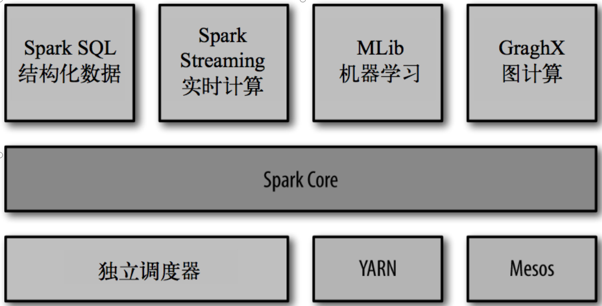
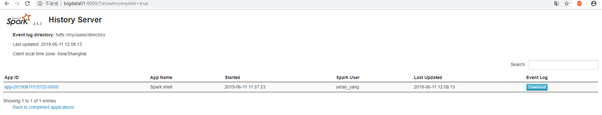

### 什么是Spark

>Spark是一种快速、通用、可扩展的大数据分析引擎，2009年诞生于加州大学伯克利分校AMPLab，2010年开源，2013年6月成为Apache孵化项目，2014年2月成为Apache顶级项目。项目是用Scala进行编写。</br>
目前，Spark生态系统已经发展成为一个包含多个子项目的集合，其中包含SparkSQL、Spark Streaming、GraphX、MLib、SparkR等子项目，Spark是基于内存计算的大数据并行计算框架。除了扩展了广泛使用的 MapReduce 计算模型，而且高效地支持更多计算模式，包括交互式查询和流处理。Spark 适用于各种各样原先需要多种不同的分布式平台的场景，包括批处理、迭代算法、交互式查询、流处理。通过在一个统一的框架下支持这些不同的计算，Spark 使我们可以简单而低耗地把各种处理流程整合在一起。而这样的组合，在实际的数据分析 过程中是很有意义的。不仅如此，Spark 的这种特性还大大减轻了原先需要对各种平台分 别管理的负担。</br>
大一统的软件栈，各个组件关系密切并且可以相互调用，这种设计有几个好处：1、软件栈中所有的程序库和高级组件 都可以从下层的改进中获益。2、运行整个软件栈的代价变小了。不需要运 行 5 到 10 套独立的软件系统了，一个机构只需要运行一套软件系统即可。系统的部署、维护、测试、支持等大大缩减。3、能够构建出无缝整合不同处理模型的应用。
<hr>

* Spark的内置项目如下</br>
  </br>

### SPARK[下载](http://spark.apache.org/downloads.html)

### Standalone模式安装

* 拷贝`conf/slaves.template`为`conf/slaves`并添加如下内容
  ```
  bigdata01
  bigdata02
  bigdata03
  ```
* 拷贝`conf/spark-env.sh.template`为`conf/spark-env.sh`修改如下内容
  ```sh
  SPARK_MASTER_HOST=bigdata01
  SPARK_MASTER_PORT=7077
  ```
* 修改`sbin`目录下的`spark-config.sh`文件,添加如下内容
  ```sh
  export JAVA_HOME=/usr/local/java/jdk1.8.0_211
  ```
* 向其余两台服务器分发`spark`
  * `scp -r spark-2.4.3/ yetao_yang@bigdata02:/home/yetao_yang/spark`
  * `scp -r spark-2.4.3/ yetao_yang@bigdata03:/home/yetao_yang/spark`
* 在`bigdata01`启动spark
  * `./sbin/start-all.sh`
* 在浏览器上查看`bigdata01:8080`端口
  </br>
* 提交任务并执行
  ```sh
  ./bin/spark-submit \
  --class org.apache.spark.examples.SparkPi \
  --master spark://bigdata01:7077 \
  --executor-memory 1G \
  --total-executor-cores 2 \
  ./examples/jars/spark-examples_2.11-2.4.3.jar \
  100
  ```
* 参数说明
  ```
  --master spark://hadoop102:7077 指定Master的地址
  --class: 你的应用的启动类 (如 org.apache.spark.examples.SparkPi)
  --deploy-mode: 是否发布你的驱动到worker节点(cluster) 或者作为一个本地客户端 (client) (default: client)*
  --conf: 任意的Spark配置属性， 格式key=value. 如果值包含空格，可以加引号“key=value”
  application-jar: 打包好的应用jar,包含依赖. 这个URL在集群中全局可见。 比如hdfs:// 共享存储系统， 如果是 file:// path， 那么所有的节点的path都包含同样的jar
  application-arguments: 传给main()方法的参数
  --executor-memory 1G 指定每个executor可用内存为1G
  --total-executor-cores 2 指定每个executor使用的cup核数为2个
  ```
### Spark Shell

* 启动`spark shell`
  * `./bin/spark-shell --master spark://bigdata01:7077`
    ```sh
    19/06/11 10:34:21 WARN NativeCodeLoader: Unable to load native-hadoop library for your platform... using builtin-java classes where applicable
    Using Spark's default log4j profile: org/apache/spark/log4j-defaults.properties
    Setting default log level to "WARN".
    To adjust logging level use sc.setLogLevel(newLevel). For SparkR, use setLogLevel(newLevel).
    Spark context Web UI available at http://bigdata01:4040
    Spark context available as 'sc' (master = spark://bigdata01:7077, app id = app-20190611103427-0001).
    Spark session available as 'spark'.
    Welcome to
          ____              __
         / __/__  ___ _____/ /__
        _\ \/ _ \/ _ `/ __/  '_/
       /___/ .__/\_,_/_/ /_/\_\   version 2.4.3
          /_/

    Using Scala version 2.11.12 (Java HotSpot(TM) 64-Bit Server VM, Java 1.8.0_211)
    Type in expressions to have them evaluated.
    Type :help for more information.

    scala>
    ```
* 运行一个`worldcount`案例
  ```
  scala> sc.textFile("./LICENSE").flatMap(_.split(" ")).map((_,1)).reduceByKey(_+_).collect
     def collect[U](f: PartialFunction[(String, Int),U])(implicit evidence$29: scala.reflect.ClassTag[U]): org.apache.spark.rdd.RDD[U]   def collect(): Array[(String, Int)]

  scala> sc.textFile("./LICENSE").flatMap(_.split(" ")).map((_,1)).reduceByKey(_+_).collect
  res0: Array[(String, Int)] = Array((Unless,3), (NON-INFRINGEMENT,,1), (agree,1), (offer,1), (event,1), (org.scalanlp:breeze-macros_2.11,1), (antlr:antlr,1), (Grant,2), (commons-logging:commons-logging,1), (include,3), (com.github.mifmif:generex,1), (org.iq80.snappy:snappy,1), (MERCHANTABILITY,,1), (org.objenesis:objenesis,1), (org.apache.spark:spark-mllib-local_2.11,1), (However,,1), (files;,1), (been,2), (2-Clause,1), (appropriateness,1), (any,28), (contract,,1), (ANY,2), (com.fasterxml.jackson.module:jackson-module-paranamer,1), (com.esotericsoftware:minlog,1), (contract,1), (version,1), (4.,1), (file,6), (documentation,,2), (wherever,1), (file.,1), (MIT,1), (------------------------------------------------------------------------------------,2), ([name,1), (origin,1), (no-charge,,2),...
  ```
  * `sc.textFile("./LICENSE").flatMap(_.split(" ")).map((_,1)).reduceByKey(_+_).collect`
  * `.flatMap(_.split(" "))`
    * 按空格进行切割,并放入一个对象里面去
  * `.map((_,1))`
    * 每个切割的元素赋值对应的1
  * `.reduceByKey(_+_)`
    * 把key相同的值进行合并
### 配置JobHistoryServer
* 把hadoop的`core-site.xml`与`hdfs-site.xml`文件软连接到`spark`的配置文件中
  * `ln -s ~/hadoop/hadoop-2.8.5/etc/hadoop/core-site.xml ~/spark/spark-2.4.3/conf/core-site.xml`
  * `ln -s ~/hadoop/hadoop-2.8.5/etc/hadoop/hdfs-site.xml ~/spark/spark-2.4.3/conf/hdfs-site.xml`
* 拷贝`spark-defaults.conf.template`为`spark-defaults.conf`并进行修改
  ```
  spark.eventLog.enabled           true
  spark.eventLog.dir               hdfs://mycluster/directory
  spark.files                      file:///home/yetao_yang/spark/spark-2.4.3/conf/core-site.xml,file:///home/yetao_yang/spark/spark-2.4.3/conf/hdfs-site.xml
  ```
  * **要先在hdfs里面建好directory文件夹**
  * `hdfs://mycluster`为hdfs的集群地址
* 修改`spark-env.sh`添加如下配置
  ```sh
  export SPARK_HISTORY_OPTS="-Dspark.history.ui.port=4000
  -Dspark.history.retainedApplications=3
  -Dspark.history.fs.logDirectory=hdfs://mycluster/directory"
  ```
  > **参数描述**</br>
  spark.eventLog.dir：Application在运行过程中所有的信息均记录在该属性指定的路径下； </br>
spark.history.ui.port=4000  调整WEBUI访问的端口号为4000</br>
spark.history.fs.logDirectory=hdfs://hadoop102:9000/directory  配置了该属性后，在start-history-server.sh时就无需再显式的指定路径，Spark History Server页面只展示该指定路径下的信息</br>
spark.history.retainedApplications=3   指定保存Application历史记录的个数，如果超过这个值，旧的应用程序信息将被删除，这个是内存中的应用数，而不是页面上显示的应用数。</br>

* 在另外两台服务器上进行同样的配置
* 重新启动`spark`
  * `./sbin/start-all.sh`
* 启动`spark`的历史服务器
  * `./sbin/start-history-server.sh`
* 在页面查看
  
* 在`spark-shell`中运行如下命令
  * `sc.textFile("/hive_test_db/account_behavior/month=201905/day=20190504/account_behavior.log").flatMap(_.split("\b")).map((_,1)).reduceByKey(_+_).collect`
    * 查找的是hdfs中的对应文件
  * `sc.textFile("file:///home/yetao_yang/spark/spark-2.4.3/LICENSE").flatMap(_.split(" ")).map((_,1)).reduceByKey(_+_).collect`
    * 查找的是本地文件系统对应的文件


### spark高可用搭建

</br>
* 修改`spark-env.sh`文件
  * 注释掉`SPARK_MASTER_HOST`与`SPARK_MASTER_PORT`配置
  * 添加如下内容
    ```
export SPARK_DAEMON_JAVA_OPTS="-Dspark.deploy.recoveryMode=ZOOKEEPER -Dspark.deploy.zookeeper.url=bigdata01:2181,bigdata02:2181,bigdata03:2181 -Dspark.deploy.zookeeper.dir=/spark"
    ```
* 向另外两台服务器分发配置
* 启动spark
  * `./sbin/start-all.sh`
* 在`bigdata03`上单独启动Master
  * `./sbin/start-master.sh`
* 在`bigdata01`上运行`spark shell`
  * `./bin/spark-shell --master spark://bigdata01:7077,bigdata03:7077`
* 杀掉`bigdata01`上的Master进程,并在`spark shell`中运行wordcount程序,没问题表示正常

### IDEA环境应用

* 新建maven父工程,并修改pom文件
  ```xml
  <?xml version="1.0" encoding="UTF-8"?>
  <project xmlns="http://maven.apache.org/POM/4.0.0"
           xmlns:xsi="http://www.w3.org/2001/XMLSchema-instance"
           xsi:schemaLocation="http://maven.apache.org/POM/4.0.0 http://maven.apache.org/xsd/maven-4.0.0.xsd">
      <modelVersion>4.0.0</modelVersion>

      <groupId>com.yyt</groupId>
      <artifactId>spark</artifactId>
      <version>1.0-SNAPSHOT</version>
      <modules>
          <module>spark01</module>
          <module>spark02</module>
      </modules>
      <packaging>pom</packaging>

      <properties>
          <spark.version>2.4.3</spark.version>
          <scala.version>2.11.12</scala.version><!-- 该scala版本必须与spark/jars下的scala包版本对应 -->
          <spark.scala.version>spark-core_2.11</spark.scala.version>
          <log.version>2.11.1</log.version>
          <scala.maven.plugin>3.2.2</scala.maven.plugin>
          <hadoop.version>2.8.5</hadoop.version>
      </properties>

      <dependencies>

          <!-- https://mvnrepository.com/artifact/org.apache.logging.log4j/log4j-core -->
          <dependency>
              <groupId>org.apache.logging.log4j</groupId>
              <artifactId>log4j-core</artifactId>
              <version>${log.version}</version>
          </dependency>
          <!-- https://mvnrepository.com/artifact/org.scala-lang/scala-library -->
          <dependency>
              <groupId>org.scala-lang</groupId>
              <artifactId>scala-library</artifactId>
              <version>${scala.version}</version>
              <scope>provided</scope><!-- IDE中运行把该配置注释掉 -->
          </dependency>
          <!-- https://mvnrepository.com/artifact/net.alchim31.maven/scala-maven-plugin -->
          <!--<dependency>
              <groupId>net.alchim31.maven</groupId>
              <artifactId>scala-maven-plugin</artifactId>
              <version>${scala.maven.plugin}</version>
          </dependency>-->
          <!-- https://mvnrepository.com/artifact/org.apache.maven.plugins/maven-assembly-plugin -->
          <!--<dependency>
              <groupId>org.apache.maven.plugins</groupId>
              <artifactId>maven-assembly-plugin</artifactId>
              <version>3.0.0</version>
          </dependency>-->

      </dependencies>

      <!--仅声明共有依赖-->
      <dependencyManagement>
          <dependencies>
              <!-- https://mvnrepository.com/artifact/org.apache.spark/spark-core -->
              <dependency>
                  <groupId>org.apache.spark</groupId>
                  <artifactId>${spark.scala.version}</artifactId>
                  <version>${spark.version}</version>
                  <scope>provided</scope><!-- IDE中运行把该配置注释掉 -->
              </dependency>

              <!-- https://mvnrepository.com/artifact/org.apache.hadoop/hadoop-client -->
              <dependency>
                  <groupId>org.apache.hadoop</groupId>
                  <artifactId>hadoop-client</artifactId>
                  <version>${hadoop.version}</version>
                  <scope>provided</scope><!-- IDE中运行把该配置注释掉 -->
              </dependency>
          </dependencies>
      </dependencyManagement>

      <build>
          <!--声明并引入构建插件-->
          <plugins>
              <!--设置编译版本-->
              <plugin>
                  <groupId>org.apache.maven.plugins</groupId>
                  <artifactId>maven-compiler-plugin</artifactId>
                  <version>3.8.1</version>
                  <configuration>
                      <source>1.8</source>
                      <target>1.8</target>
                  </configuration>
              </plugin>

              <plugin>
                  <groupId>net.alchim31.maven</groupId>
                  <artifactId>scala-maven-plugin</artifactId>
                  <version>3.2.2</version>
                  <executions>
                      <execution>
                          <goals>
                              <goal>compile</goal>
                              <goal>testCompile</goal>
                          </goals>
                      </execution>
                  </executions>
              </plugin>
          </plugins>
          <!--仅声明构建的插件-->
          <pluginManagement>
              <plugins>
                  <plugin>
                      <groupId>org.apache.maven.plugins</groupId>
                      <artifactId>maven-assembly-plugin</artifactId>
                      <version>3.0.0</version>
                      <executions>
                          <execution>
                              <id>make-assembly</id>
                              <phase>package</phase>
                              <goals>
                                  <goal>single</goal>
                              </goals>
                          </execution>
                      </executions>
                  </plugin>
              </plugins>
          </pluginManagement>
      </build>
  </project>
  ```
* 在父工程下面建立`spark01`与`spark02`子工程
  * 在`spark01`下面加入依赖
    ```xml
    <?xml version="1.0" encoding="UTF-8"?>
    <project xmlns="http://maven.apache.org/POM/4.0.0"
             xmlns:xsi="http://www.w3.org/2001/XMLSchema-instance"
             xsi:schemaLocation="http://maven.apache.org/POM/4.0.0 http://maven.apache.org/xsd/maven-4.0.0.xsd">
        <parent>
            <artifactId>spark</artifactId>
            <groupId>com.yyt</groupId>
            <version>1.0-SNAPSHOT</version>
        </parent>
        <modelVersion>4.0.0</modelVersion>

        <artifactId>spark01</artifactId>

        <dependencies>
            <dependency>
                <groupId>org.apache.spark</groupId>
                <artifactId>${spark.scala.version}</artifactId>
            </dependency>
            <dependency>
                <groupId>org.apache.hadoop</groupId>
                <artifactId>hadoop-client</artifactId>
            </dependency>
        </dependencies>

        <build>
            <plugins>
                <plugin>
                    <groupId>org.apache.maven.plugins</groupId>
                    <artifactId>maven-assembly-plugin</artifactId>
                    <configuration>
                        <archive>
                            <manifest>
                                <mainClass>com.yyt.spark.wordcount.WordCount</mainClass><!-- 具体程序的包路径 -->
                            </manifest>
                        </archive>
                        <descriptorRefs>
                            <descriptorRef>jar-with-dependencies</descriptorRef>
                        </descriptorRefs>
                    </configuration>
                </plugin>
            </plugins>
        </build>
    </project>
    ```
* 项目结构如下</br>
  </br>

* 在`wordCount`编写代码
  ```scala
  object WordCount{
    def main(args: Array[String]): Unit = {
      // 声明操作hadoop的用户
      System.setProperty("HADOOP_USER_NAME", "yetao_yang")
      // 声明配置,如果要在IDE上面运行Master要修改为local[*]
      val sparkConf = new SparkConf().setAppName("wordCount").setMaster("spark://bigdata01:7077,bigdata03:7077")
      // 创建SparkContext
      val sc = new SparkContext(sparkConf)
      // 业务逻辑
      // 读取hdfs里面的文件 指定的是hdfs集群的地址,如果要在IDE上面运行则要指定唯一的hdfs地址如: hdfs://bigdata01:8020/XXX/XXX
      val file = sc.textFile("hdfs://mycluster/hive_test_db/account_behavior/month=201903/day=20190306/account_behavior.log")
      // 以 /b 进行分割 并舍弃最后一个元素
      val words = file.flatMap(_.split("\b").dropRight(1))
      val word2count = words.map((_,1))
      val result = word2count.reduceByKey(_+_)
      //将结果保存到hdfs 指定的是hdfs集群的地址,如果要在IDE上面运行则要指定唯一的hdfs地址如: hdfs://bigdata01:8020/XXX/XXX
      result.saveAsTextFile("hdfs://mycluster/abc.out")
      // 关闭spark链接
      sc.stop
    }
  }
  ```
* 配置程序变量</br>
  </br>
* 运行程序后查看`hdfs://bigdata01:8020/abc.out`路径下的文件,格式如下
  ```
  (1558574310633,21)
  (1551821750000,1)
  (1551823860000,1)
  (1551846740000,1)
  (1551842070000,1)
  (1551867345000,1)
  (1551884205000,1)
  (男,8620)
  (1551871580000,1)
  (1551885400000,1)
  (1551821725000,1)
  (1558574309947,19)
  ```
* 打包程序到spark上运行**非本地运行**
  * 打包项目</br>
    </br>
  * 提交jar包
    * `./bin/spark-submit --class com.yyt.spark.wordcount.WordCount ~/spark/jar/spark01-1.0-SNAPSHOT-jar-with-dependencies.jar`
      * `./bin/spark-submit --class 运行类路径 jar包路径`
    * 在web页面进行查看</br>
      </br>


### spark与YARN进行整合
* 如果内存过小可以向`yarn-site.xml`添加以下内容
  ```xml
  <!--是否启动一个线程检查每个任务正使用的物理内存量，如果任务超出分配值，则直接将其杀掉，默认是true -->
  <property>
    <name>yarn.nodemanager.pmem-check-enabled</name>
    <value>false</value>
  </property>
  <!--是否启动一个线程检查每个任务正使用的虚拟内存量，如果任务超出分配值，则直接将其杀掉，默认是true -->
  <property>
    <name>yarn.nodemanager.vmem-check-enabled</name>
    <value>false</value>
  </property>
  ```

* 修改`./conf/spark-env.sh`文件,添加如下内容
  ```sh
  HADOOP_CONF_DIR=/home/yetao_yang/hadoop/hadoop-2.8.5/etc/hadoop
  YARN_CONF_DIR=/home/yetao_yang/hadoop/hadoop-2.8.5/etc/hadoop
  ```
* 进行配置文件的分发
* 重新启动spark集群
* 提交`jar`包
  * `./bin/spark-submit --class com.yyt.spark.wordcount.WordCount --master yarn --deploy-mode client  ~/spark/jar/spark01-1.0-SNAPSHOT-jar-with-dependencies.jar`
    * 采用`client`的方式提交jar包,一般调试的时候用这种方式
  * `./bin/spark-submit --class com.yyt.spark.wordcount.WordCount --master yarn --deploy-mode cluster  ~/spark/jar/spark01-1.0-SNAPSHOT-jar-with-dependencies.jar`
    * 采用`cluster`的方式提交jar包,常用于正式环境
    * **此方式请将代码中的`setMaster`方法注释掉**

### Spark Core讲解

#### RDD(弹性分布式数据集)

>RDD是Spark的基石，是实现Spark数据处理的核心抽象。那么RDD为什么会产生呢？</br>
Hadoop的MapReduce是一种基于数据集的工作模式，面向数据，这种工作模式一般是从存储上加载数据集，然后操作数据集，最后写入物理存储设备。数据更多面临的是一次性处理。</br>
MR的这种方式对数据领域两种常见的操作不是很高效。第一种是迭代式的算法。比如机器学习中ALS、凸优化梯度下降等。这些都需要基于数据集或者数据集的衍生数据反复查询反复操作。MR这种模式不太合适，即使多MR串行处理，性能和时间也是一个问题。数据的共享依赖于磁盘。另外一种是交互式数据挖掘，MR显然不擅长。

* 什么是RDD
  > RDD是spark为简化用户的使用,对所有的底层数据进行抽象,以面向对象的方式提供了RDD很多的方法,通过这些方法来对RDD进行计算和输出.RDD是spark的基石,所有的上层模块全部都是由RDD来实现
* RDD的特性
  * 不可变 对于所有RDD操作豆浆产生一个新的RDD
  * 可分区 RDD是通过江苏局进行分区保存
  * 弹性
    * 存储的弹性:内存与磁盘自动切换
    * 容错的弹性:数据丢失可以自动恢复
    * 计算的弹性:计算出错重试机制
    * 分片的弹性:根据需要重新分片
* RDD 是懒执行的,分为转换和行动操作,行动操作负责触发RDD执行
* spark到底做了什么</br>
  </br>

#### RDD的方法

* RDD的创建
  * 从集合中创建RDD
    ```scala
    def makeRDD[T: ClassTag](seq: Seq[T],numSlices: Int = defaultParallelism): RDD[T]
    ```
    * `scala-shell`
      ```sh
      scala> sc.makeRDD(Array(1,2,3,4,5,6))
      res0: org.apache.spark.rdd.RDD[Int] = ParallelCollectionRDD[0] at makeRDD at <console>:25

      scala> res0.collect
      res1: Array[Int] = Array(1, 2, 3, 4, 5, 6)
      ```
  * 从外部存储创建RDD
  * 从其他RDD转换


* RDD的类型
  * 数值型RDD:
    * `RDD[Int]`,`RDD[(Int,Int)]`,`RDD[(Int,(Int,Int))]` > `RDD.scala`
  * 键值对RDD:
    * `RDD[(Int,Int)]`,`RDD[Int,(Int,Int)]` > `PairRDDFunctions.scala`
    * 所有键值对RDD都可以使用数值型RDD的操作


#### **RDD的操作**
##### 转换(transformation)
* map
  * 返回一个新的RDD，该RDD由每一个输入元素经过func函数转换后组成
    ```scala
    def map[U: ClassTag](f: T => U): RDD[U]
    ```
    ```sh
    scala> sc.makeRDD(1 to 100)
    res2: org.apache.spark.rdd.RDD[Int] = ParallelCollectionRDD[1] at makeRDD at <console>:25
    scala> res2.map(_ * 2).collect
    res3: Array[Int] = Array(2, 4, 6, 8, 10, 12, 14, 16, 18, 20, 22, 24, 26, 28, 30, 32, 34, 36, 38, 40, 42, 44, 46, 48, 50, 52, 54, 56, 58, 60, 62, 64, 66, 68, 70, 72, 74, 76, 78, 80, 82, 84, 86, 88, 90, 92, 94, 96, 98, 100, 102, 104, 106, 108, 110, 112, 114, 116, 118, 120, 122, 124, 126, 128, 130, 132, 134, 136, 138, 140, 142, 144, 146, 148, 150, 152, 154, 156, 158, 160, 162, 164, 166, 168, 170, 172, 174, 176, 178, 180, 182, 184, 186, 188, 190, 192, 194, 196, 198, 200)
    ```
* filter
  * 返回一个新的RDD，该RDD由经过func函数计算后返回值为true的输入元素组成
    ```scala
    def filter(f: T => Boolean): RDD[T]
    ```
    ```sh
    scala> sc.makeRDD(1 to 50)
    res4: org.apache.spark.rdd.RDD[Int] = ParallelCollectionRDD[3] at makeRDD at <console>:25
    scala> res4.filter(_ % 3 == 0).collect
    res5: Array[Int] = Array(3, 6, 9, 12, 15, 18, 21, 24, 27, 30, 33, 36, 39, 42, 45, 48)
    ```
* flatMap
  * 一对多,将处理后的数据进行压平
  * 类似于map，但是每一个输入元素可以被映射为0或多个输出元素（所以func应该返回一个序列，而不是单一元素）
    ```scala
    def flatMap[U: ClassTag](f: T => TraversableOnce[U]): RDD[U]
    ```
  * 元素 1 - 100,形成1;1,2;1,2,3;1,2,3,4这种格式
    ```sh
    scala> var rdd = sc.makeRDD(1 to 100)
    rdd: org.apache.spark.rdd.RDD[Int] = ParallelCollectionRDD[7] at makeRDD at <console>:24
    scala> rdd.flatMap(1 to _).collect
    res9: Array[Int] = Array(1, 1, 2, 1, 2, 3, 1, 2, 3, 4, 1, 2, 3, 4, 5, 1, 2, 3, 4, 5, 6, 1, 2, 3, 4, 5, 6, 7, 1, 2, 3, 4, 5, 6, 7, 8, 1, 2, 3, 4, 5, 6, 7, 8, 9, 1, 2, 3, 4, 5, 6, 7, 8, 9, 10, 1, 2, 3, 4, 5, 6, 7, 8, 9, 10, 11, 1, 2, 3...
    ```

* mapPartitions
  * 类似于map，但独立地在RDD的每一个分片上运行，因此在类型为T的RDD上运行时，func的函数类型必须是Iterator[T] => Iterator[U]。假设有N个元素，有M个分区，那么map的函数的将被调用N次,而mapPartitions被调用M次,一个函数一次处理所有分区
  * 对一个分区的所有数据执行一个函数,性能比map高
    ```scala
    def mapPartitions[U: ClassTag](f: Iterator[T] => Iterator[U],preservesPartitioning: Boolean = false): RDD[U]
    ```
    ```sh
    scala> var rdd = sc.makeRDD(1 to 100)
    rdd: org.apache.spark.rdd.RDD[Int] = ParallelCollectionRDD[9] at makeRDD at <console>:24
    scala> rdd.mapPartitions(items => items.filter(_ %3 == 0).map(_ + "hello")).collect
    res10: Array[String] = Array(3hello, 6hello, 9hello, 12hello, 15hello, 18hello, 21hello, 24hello, 27hello, 30hello, 33hello, 36hello, 39hello, 42hello, 45hello, 48hello, 51hello, 54hello, 57hello, 60hello, 63hello, 66hello, 69hello, 72hello, 75hello, 78hello, 81hello, 84hello, 87hello, 90hello, 93hello, 96hello, 99hello)
    ```
* mapPartitionsWithIndex
    * 类似于mapPartitions，但func带有一个整数参数表示分片的索引值，因此在类型为T的RDD上运行时，func的函数类型必须是`(Int, Interator[T]) => Iterator[U]`
      ```scala
      def mapPartitionsWithIndex[U: ClassTag](f: (Int, Iterator[T]) => Iterator[U],preservesPartitioning: Boolean = false): RDD[U]
      ```
      ```sh
      scala> var rdd = sc.makeRDD(1 to 100,3)
      rdd: org.apache.spark.rdd.RDD[Int] = ParallelCollectionRDD[15] at makeRDD at <console>:24

      scala> rdd.mapPartitionsWithIndex((i,items) => Iterator(i + ":["+items.mkString(",") +"]")).collect
      res14: Array[String] = Array(0:[1,2,3,4,5,6,7,8,9,10,11,12,13,14,15,16,17,18,19,20,21,22,23,24,25,26,27,28,29,30,31,32,33], 1:[34,35,36,37,38,39,40,41,42,43,44,45,46,47,48,49,50,51,52,53,54,55,56,57,58,59,60,61,62,63,64,65,66], 2:[67,68,69,70,71,72,73,74,75,76,77,78,79,80,81,82,83,84,85,86,87,88,89,90,91,92,93,94,95,96,97,98,99,100])
      ```
* sample
  * 主要用于抽样
  * 以指定的随机种子随机抽样出数量为fraction的数据，withReplacement表示是抽出的数据是否放回，true为有放回的抽样，false为无放回的抽样，seed用于指定随机数生成器种子。例子从RDD中随机且有放回的抽出50%的数据，随机种子值为3（即可能以1 2 3的其中一个起始值）
    ```scala
    def sample(
        withReplacement: Boolean,
        fraction: Double,
        seed: Long = Utils.random.nextLong): RDD[T]
    ```
    ```sh
    scala> rdd.sample(true,0.3,0).collect
    res22: Array[Int] = Array(4, 9, 10, 14, 14, 17, 22, 22, 23, 23, 25, 26, 26, 26, 33, 37, 41, 42, 42, 49, 55, 59, 60, 67, 74, 80, 80, 80, 84, 87, 87, 89, 91, 91, 93, 93, 94)
    ```
* union
  * 对源RDD和参数RDD求并集后返回一个新的RDD
    ```scala
    def union(other: RDD[T]): RDD[T]
    ```
    ```sh
    scala> var rdd1 = sc.makeRDD(150 to 200)
    rdd1: org.apache.spark.rdd.RDD[Int] = ParallelCollectionRDD[26] at makeRDD at <console>:24

    scala> rdd.union(rdd1).collect
    res23: Array[Int] = Array(1, 2, 3, 4, 5, 6, 7, 8, 9, 10, 11, 12, 13, 14, 15, 16, 17, 18, 19, 20, 21, 22, 23, 24, 25, 26, 27, 28, 29, 30, 31, 32, 33, 34, 35, 36, 37, 38, 39, 40, 41, 42, 43, 44, 45, 46, 47, 48, 49, 50, 51, 52, 53, 54, 55, 56, 57, 58, 59, 60, 61, 62, 63, 64, 65, 66, 67, 68, 69, 70, 71, 72, 73, 74, 75, 76, 77, 78, 79, 80, 81, 82, 83, 84, 85, 86, 87, 88, 89, 90, 91, 92, 93, 94, 95, 96, 97, 98, 99, 100, 150, 151, 152, 153, 154, 155, 156, 157, 158, 159, 160, 161, 162, 163, 164, 165, 166, 167, 168, 169, 170, 171, 172, 173, 174, 175, 176, 177, 178, 179, 180, 181, 182, 183, 184, 185, 186, 187, 188, 189, 190, 191, 192, 193, 194, 195, 196, 197, 198, 199, 200)
    ```
* intersection
  * 对源RDD和参数RDD求交集后返回一个新的RDD
    ```scala
    def intersection(other: RDD[T]): RDD[T]
    ```
    ```sh
    scala> var rdd1 = sc.makeRDD(50 to 150)
    rdd1: org.apache.spark.rdd.RDD[Int] = ParallelCollectionRDD[28] at makeRDD at <console>:24

    scala> rdd.intersection(rdd1).collect
    res24: Array[Int] = Array(52, 96, 82, 66, 54, 80, 98, 50, 64, 92, 74, 90, 72, 70, 78, 94, 84, 100, 56, 76, 62, 86, 58, 88, 60, 68, 81, 71, 55, 79, 65, 57, 51, 75, 89, 63, 83, 99, 61, 77, 53, 97, 95, 59, 73, 93, 67, 69, 85, 91, 87)
    ```
* distinct
  * 对源RDD进行去重后返回一个新的RDD. 默认情况下，只有8个并行任务来操作，但是可以传入一个可选的numTasks参数改变它。
    ```scala
    def distinct(numPartitions: Int)(implicit ord: Ordering[T] = null): RDD[T]
    ```
    ```sh
    scala> var rdd2 = sc.makeRDD(1 to 10).union(sc.makeRDD(10 to 20))
    rdd2: org.apache.spark.rdd.RDD[Int] = UnionRDD[37] at union at <console>:24
    scala> rdd2.collect
    res25: Array[Int] = Array(1, 2, 3, 4, 5, 6, 7, 8, 9, 10, 10, 11, 12, 13, 14, 15, 16, 17, 18, 19, 20)
    scala> rdd2.distinct.collect
    res27: Array[Int] = Array(4, 16, 8, 12, 20, 13, 1, 17, 9, 5, 14, 6, 18, 10, 2, 19, 15, 11, 3, 7)
    ```
* partitionBy
  * 对RDD进行分区操作，如果原有的partionRDD和现有的partionRDD是一致的话就不进行分区， 否则会生成ShuffleRDD。
    ```scala
    def partitionBy(partitioner: Partitioner): RDD[(K, V)]
    ```
    ```sh
    scala> rdd.map(x => (x,x)).partitionBy(new org.apache.spark.HashPartitioner(5))
    res31: org.apache.spark.rdd.RDD[(Int, Int)] = ShuffledRDD[48] at partitionBy at <console>:26
    scala> res31.partitions.size
    res33: Int = 5
    scala> res31.mapPartitionsWithIndex((i,items) => Iterator(i + ":["+items.mkString(",") +"]")).collect
    res36: Array[String] = Array(0:[(5,5),(10,10),(15,15),(20,20),(25,25),(30,30),(35,35),(40,40),(45,45),(50,50),(55,55),(60,60),(65,65),(70,70),(75,75),(80,80),(85,85),(90,90),(95,95),(100,100)], 1:[(1,1),(6,6),(11,11),(16,16),(21,21),(26,26),(31,31),(36,36),(41,41),(46,46),(51,51),(56,56),(61,61),(66,66),(71,71),(76,76),(81,81),(86,86),(91,91),(96,96)], 2:[(2,2),(7,7),(12,12),(17,17),(22,22),(27,27),(32,32),(37,37),(42,42),(47,47),(52,52),(57,57),(62,62),(67,67),(72,72),(77,77),(82,82),(87,87),(92,92),(97,97)], 3:[(3,3),(8,8),(13,13),(18,18),(23,23),(28,28),(33,33),(38,38),(43,43),(48,48),(53,53),(58,58),(63,63),(68,68),(73,73),(78,78),(83,83),(88,88),(93,93),(98,98)], 4:[(4,4),(9,9),(14,14),(19,19),(24,24),(29,29),(34,34),(39,39),(44,44),(49,49),(54,54),(59,59),(64,64),(69,69),(74,74),(...
    scala>
    ```
* reduceByKey
  * 合并相同的key
  * 在一个(K,V)的RDD上调用，返回一个(K,V)的RDD，使用指定的reduce函数，将相同key的值聚合到一起，reduce任务的个数可以通过第二个可选的参数来设置。
    ```scala
    def reduceByKey(func: (V, V) => V): RDD[(K, V)]
    ```
    ```sh
    scala> var rdd = sc.makeRDD(1 to 20).union(sc.makeRDD(10 to 30)).map(X => (X,X))
    rdd: org.apache.spark.rdd.RDD[(Int, Int)] = MapPartitionsRDD[57] at map at <console>:24

    scala> rdd.reduceByKey(_+_).collect
    res55: Array[(Int, Int)] = Array((4,4), (16,32), (28,28), (24,24), (8,8), (12,24), (20,40), (13,26), (21,21), (25,25), (29,29), (1,1), (17,34), (9,9), (5,5), (22,22), (30,30), (14,28), (6,6), (18,36), (26,26), (10,20), (2,2), (19,38), (15,30), (11,22), (27,27), (23,23), (3,3), (7,7))
    ```
* groupByKey
  * groupByKey也是对每个key进行操作，但只生成一个sequence。
    ```scala
    def groupByKey(partitioner: Partitioner): RDD[(K, Iterable[V])]
    ```
    ```sh
    scala> var rdd2 = sc.makeRDD(Array((1,5),(1,6),(1,7),(2,2),(2,3),(3,2),(3,3)))
    rdd2: org.apache.spark.rdd.RDD[(Int, Int)] = ParallelCollectionRDD[61] at makeRDD at <console>:24

    scala> rdd2.groupByKey.collect
    res59: Array[(Int, Iterable[Int])] = Array((2,CompactBuffer(2, 3)), (1,CompactBuffer(5, 6, 7)), (3,CompactBuffer(2, 3)))
    ```
* combineByKey
  * 对相同K，把V合并成一个集合。
createCombiner: combineByKey() 会遍历分区中的所有元素，因此每个元素的键要么还没有遇到过，要么就 和之前的某个元素的键相同。如果这是一个新的元素,combineByKey() 会使用一个叫作 createCombiner() 的函数来创建 
那个键对应的累加器的初始值
    ```scala
    def combineByKey[C](
        createCombiner: V => C,
        mergeValue: (C, V) => C,
        mergeCombiners: (C, C) => C): RDD[(K, C)]
    ```
  * 求出每个学成所有课程的平均值</br>
    
    ```sh
    scala> val rdd = sc.makeRDD(Array(("a",90),("a",80),("a",60),("b",78),("b",84),("b",96),("c",90),("c",86)))
    rdd: org.apache.spark.rdd.RDD[(String, Int)] = ParallelCollectionRDD[63] at makeRDD at <console>:24
    scala> rdd.combineByKey(v => (v,1),(c:(Int,Int),v) => (c._1 + v , c._2 + 1),(c1:(Int,Int),c2:(Int,Int)) => (c1._1 + c2._1 , c1._2 + c2._2))
    res62: org.apache.spark.rdd.RDD[(String, (Int, Int))] = ShuffledRDD[64] at combineByKey at <console>:26
    scala> res62.collect
    res67: Array[(String, (Int, Int))] = Array((b,(258,3)), (a,(230,3)), (c,(176,2)))
    scala> res62.map{case(k,v:(Int,Int)) => (k , v._1 / v._2)}
    res64: org.apache.spark.rdd.RDD[(String, Int)] = MapPartitionsRDD[65] at map at <console>:26
    scala> res64.collect
    res65: Array[(String, Int)] = Array((b,86), (a,76), (c,88))
    ```
* aggregateByKey
  > 在kv对的RDD中，，按key将value进行分组合并，合并时，将每个value和初始值作为seq函数的参数，进行计算，返回的结果作为一个新的kv对，然后再将结果按照key进行合并，最后将每个分组的value传递给combine函数进行计算（先将前两个value进行计算，将返回结果和下一个value传给combine函数，以此类推），将key与计算结果作为一个新的kv对输出。</br>seqOp函数用于在每一个分区中用初始值逐步迭代value，combOp函数用于合并每个分区中的结果。

    ```scala
    def aggregateByKey[U: ClassTag](zeroValue: U)(seqOp: (U, V) => U,combOp: (U, U) => U): RDD[(K, U)]
    ```
  * 求出在kv格式的RDD中算出这个key在每个分区的最大值,并把每个分区对应k的最大值相加求和
  * 求出每个key的最大值</br>
    </br>
    ```sh
    scala> val rdd = sc.makeRDD(Array(("a",90),("a",80),("a",60),("b",78),("b",84),("b",96),("c",90),("c",86)))
    rdd: org.apache.spark.rdd.RDD[(String, Int)] = ParallelCollectionRDD[66] at makeRDD at <console>:24
    scala> rdd.aggregateByKey(0)(math.max(_,_),_ + _).collect
    res68: Array[(String, Int)] = Array((b,174), (a,90), (c,90))

    scala> rdd.aggregateByKey(0)(math.max(_,_) , math.max(_,_)).collect
    res69: Array[(String, Int)] = Array((b,96), (a,90), (c,90))
    ```
* foldByKey
  * aggregateByKey的简化操作，当aggregateByKey的seqop和combop相同时可以使用该方法
    ```scala
    def foldByKey(zeroValue: V)(func: (V, V) => V): RDD[(K, V)]
    ```
    ```sh
    scala> rdd.foldByKey(0)(math.max(_,_)).collect
    res70: Array[(String, Int)] = Array((b,96), (a,90), (c,90))
    ```
* sortByKey
  * 在一个(K,V)的RDD上调用，K必须with Ordered接口,实现compare方法,告诉spark key的大小判定，返回一个按照key进行排序的(K,V)的RDD
    ```scala
    def sortByKey(ascending: Boolean = true, numPartitions: Int = self.partitions.length): RDD[(K, V)]
    ```
    ```sh
    scala> var rdd = sc.makeRDD(1 to 50)
    rdd: org.apache.spark.rdd.RDD[Int] = ParallelCollectionRDD[70] at makeRDD at <console>:24
    scala> var rdd3 = rdd.map(v => (v,v))
    rdd3: org.apache.spark.rdd.RDD[(Int, Int)] = MapPartitionsRDD[76] at map at <console>:25
    scala> rdd3.sortByKey(true).collect
    res75: Array[(Int, Int)] = Array((1,1), (2,2), (3,3), (4,4), (5,5), (6,6), (7,7), (8,8), (9,9), (10,10), (11,11), (12,12), (13,13), (14,14), (15,15), (16,16), (17,17), (18,18), (19,19), (20,20), (21,21), (22,22), (23,23), (24,24), (25,25), (26,26), (27,27), (28,28), (29,29), (30,30), (31,31), (32,32), (33,33), (34,34), (35,35), (36,36), (37,37), (38,38), (39,39), (40,40), (41,41), (42,42), (43,43), (44,44), (45,45), (46,46), (47,47), (48,48), (49,49), (50,50))
    ```
* sortBy
  * 用func先对数据进行处理，按照处理后的数据比较结果排序。
    ```scala
    def sortBy[B](f: A => B)(implicit ord: Ordering[B]): Repr
    ```
    ```sh
    scala> var rdd = sc.makeRDD(1 to 50)
    rdd: org.apache.spark.rdd.RDD[Int] = ParallelCollectionRDD[70] at makeRDD at <console>:24

    scala> rdd.sortBy(_ % 5).collect
    res71: Array[Int] = Array(5, 10, 15, 20, 25, 30, 35, 40, 45, 50, 1, 6, 11, 16, 21, 26, 31, 36, 41, 46, 2, 7, 12, 17, 22, 27, 32, 37, 42, 47, 3, 8, 13, 18, 23, 28, 33, 38, 43, 48, 4, 9, 14, 19, 24, 29, 34, 39, 44, 49)
    ```
* join相关操作
  * 在类型为(K,V)和(K,W)的RDD上调用，返回一个相同key对应的所有元素对在一起的(K,(V,W))的RDD
  * JOIN: 只留下双方都有的KEY
  * left JOIN: 留下左边RDD所有的数据
  * right JOIN: 留下右边RDD所有的数据
    ```scala
    def join[W](other: RDD[(K, W)]): RDD[(K, (V, W))]
    ```
    ```sh
    scala> val rdd = sc.parallelize(Array((1,"a"),(2,"b"),(3,"c")))
    rdd: org.apache.spark.rdd.RDD[(Int, String)] = ParallelCollectionRDD[32] at parallelize at <console>:24

    scala> val rdd1 = sc.parallelize(Array((1,4),(2,5),(3,6)))
    rdd1: org.apache.spark.rdd.RDD[(Int, Int)] = ParallelCollectionRDD[33] at parallelize at <console>:24

    scala> rdd.join(rdd1).collect()
    res13: Array[(Int, (String, Int))] = Array((1,(a,4)), (2,(b,5)), (3,(c,6)))
    ```
* cogroup
  * 在类型为(K,V)和(K,W)的RDD上调用，返回一个(K,(Iterable<V>,Iterable<W>))类型的RDD
  * 分别将相同key的数据聚集在一起

    ```scala
    def cogroup[W](other: RDD[(K, W)], partitioner: Partitioner): RDD[(K, (Iterable[V], Iterable[W]))]
    ```
    ```sh
    scala> val rdd = sc.parallelize(Array((1,"a"),(2,"b"),(3,"c")))
    rdd: org.apache.spark.rdd.RDD[(Int, String)] = ParallelCollectionRDD[37] at parallelize at <console>:24

    scala> val rdd1 = sc.parallelize(Array((1,4),(2,5),(3,6)))
    rdd1: org.apache.spark.rdd.RDD[(Int, Int)] = ParallelCollectionRDD[38] at parallelize at <console>:24

    scala> rdd.cogroup(rdd1).collect()
    res14: Array[(Int, (Iterable[String], Iterable[Int]))] = Array((1,(CompactBuffer(a),CompactBuffer(4))), (2,(CompactBuffer(b),CompactBuffer(5))), (3,(CompactBuffer(c),CompactBuffer(6))))

    scala> val rdd2 = sc.parallelize(Array((4,4),(2,5),(3,6)))
    rdd2: org.apache.spark.rdd.RDD[(Int, Int)] = ParallelCollectionRDD[41] at parallelize at <console>:24

    scala> rdd.cogroup(rdd2).collect()
    res15: Array[(Int, (Iterable[String], Iterable[Int]))] = Array((4,(CompactBuffer(),CompactBuffer(4))), (1,(CompactBuffer(a),CompactBuffer())), (2,(CompactBuffer(b),CompactBuffer(5))), (3,(CompactBuffer(c),CompactBuffer(6))))

    scala> val rdd3 = sc.parallelize(Array((1,"a"),(1,"d"),(2,"b"),(3,"c")))
    rdd3: org.apache.spark.rdd.RDD[(Int, String)] = ParallelCollectionRDD[44] at parallelize at <console>:24

    scala> rdd3.cogroup(rdd2).collect()
    [Stage 36:> (0 +0)                                                                             res16: Array[(Int, (Iterable[String], Iterable[Int]))] = Array((4,(CompactBuffer(),CompactBuffer(4))), (1,(CompactBuffer(d, a),CompactBuffer())), (2,(CompactBuffer(b),CompactBuffer(5))), (3,(CompactBuffer(c),CompactBuffer(6))))
    ```

* cartesian
  * 笛卡尔积
    ```scala
    def cartesian[U: ClassTag](other: RDD[U]): RDD[(T, U)]
    ```
    ```sh
    scala> val rdd1 = sc.parallelize(1 to 3)
    rdd1: org.apache.spark.rdd.RDD[Int] = ParallelCollectionRDD[47] at parallelize at <console>:24

    scala> val rdd2 = sc.parallelize(2 to 5)
    rdd2: org.apache.spark.rdd.RDD[Int] = ParallelCollectionRDD[48] at parallelize at <console>:24

    scala> rdd1.cartesian(rdd2).collect()
    res17: Array[(Int, Int)] = Array((1,2), (1,3), (1,4), (1,5), (2,2), (2,3), (2,4), (2,5), (3,2), (3,3), (3,4), (3,5))
    ```

* pipe
  * 管道，对于每个分区，都执行一个perl或者shell脚本，返回输出的RDD
    ```scala
    def pipe(command: String): RDD[String]
    ```
    ```sh
    #!/bin/sh
    # Shell脚本
    echo "AA"
    while read LINE; do
       echo ">>>"${LINE}
    done
    ```
    ```sh
    scala> val rdd = sc.parallelize(List("hi","Hello","how","are","you"),1)
    rdd: org.apache.spark.rdd.RDD[String] = ParallelCollectionRDD[50] at parallelize at <console>:24

    scala> rdd.pipe("/home/bigdata/pipe.sh").collect()
    res18: Array[String] = Array(AA, >>>hi, >>>Hello, >>>how, >>>are, >>>you)
    ```

* coalesce
  * 缩减分区数，用于大数据集过滤后，提高小数据集的执行效率。
  * 如果有100万个分区,过滤完成后每个分区只有100条数据,处理任务就不高效了,就要进行分区合并
    ```scala
    def coalesce(numPartitions: Int, shuffle: Boolean = false,
                   partitionCoalescer: Option[PartitionCoalescer] = Option.empty)
                  (implicit ord: Ordering[T] = null)
          : RDD[T]
    ```
    ```sh
    scala> val rdd = sc.parallelize(1 to 16,4)
    rdd: org.apache.spark.rdd.RDD[Int] = ParallelCollectionRDD[54] at parallelize at <console>:24

    scala> rdd.partitions.size
    res20: Int = 4

    scala> val coalesceRDD = rdd.coalesce(3)
    coalesceRDD: org.apache.spark.rdd.RDD[Int] = CoalescedRDD[55] at coalesce at <console>:26

    scala> coalesceRDD.partitions.size
    res21: Int = 3
    ```

* repartition
  * 根据分区数，从新通过网络随机洗牌所有数据。
    ```scala
    def repartition(numPartitions: Int)(implicit ord: Ordering[T] = null): RDD[T]
    ```
    ```sh
    scala> val rdd = sc.parallelize(1 to 16,4)
    rdd: org.apache.spark.rdd.RDD[Int] = ParallelCollectionRDD[56] at parallelize at <console>:24

    scala> rdd.partitions.size
    res22: Int = 4

    scala> val rerdd = rdd.repartition(2)
    rerdd: org.apache.spark.rdd.RDD[Int] = MapPartitionsRDD[60] at repartition at <console>:26

    scala> rerdd.partitions.size
    res23: Int = 2

    scala> val rerdd = rdd.repartition(4)
    rerdd: org.apache.spark.rdd.RDD[Int] = MapPartitionsRDD[64] at repartition at <console>:26

    scala> rerdd.partitions.size
    res24: Int = 4
    ```
* repartitionAndSortWithinPartitions
  > repartitionAndSortWithinPartitions函数是repartition函数的变种，与repartition函数不同的是，repartitionAndSortWithinPartitions在给定的partitioner内部进行排序，性能比repartition要高。 
  * 如果分区完成之后又要进行排序就用此函数,效率要高很多
    ```scala
    def repartitionAndSortWithinPartitions(partitioner: Partitioner): RDD[(K, V)]
    ```

* glom
  * 将每一个分区形成一个数组，形成新的RDD类型时RDD[Array[T]]
    ```scala
    def glom(): RDD[Array[T]]
    ```
    ```sh
    scala> val rdd = sc.parallelize(1 to 16,4)
    rdd: org.apache.spark.rdd.RDD[Int] = ParallelCollectionRDD[65] at parallelize at <console>:24

    scala> rdd.glom().collect()
    res25: Array[Array[Int]] = Array(Array(1, 2, 3, 4), Array(5, 6, 7, 8), Array(9, 10, 11, 12), Array(13, 14, 15, 16))
    ```

* mapValues
  * 针对于(K,V)形式的类型只对V进行操作
    ```scala
    def mapValues[U](f: V => U): RDD[(K, U)]
    ```
    ```sh
    scala> val rdd3 = sc.parallelize(Array((1,"a"),(1,"d"),(2,"b"),(3,"c")))
    rdd3: org.apache.spark.rdd.RDD[(Int, String)] = ParallelCollectionRDD[67] at parallelize at <console>:24

    scala> rdd3.mapValues(_+"|||").collect()
    res26: Array[(Int, String)] = Array((1,a|||), (1,d|||), (2,b|||), (3,c|||))
    ```

* subtract
  * 计算差的一种函数，去除两个RDD中相同的元素，不同的RDD将保留下来
  * 去掉和`other`重复的元素
    ```scala
    def subtractByKey[W: ClassTag](other: RDD[(K, W)]): RDD[(K, V)]
    ```
    ```sh
    scala> val rdd = sc.parallelize(3 to 8)
    rdd: org.apache.spark.rdd.RDD[Int] = ParallelCollectionRDD[70] at parallelize at <console>:24

    scala> val rdd1 = sc.parallelize(1 to 5)
    rdd1: org.apache.spark.rdd.RDD[Int] = ParallelCollectionRDD[71] at parallelize at <console>:24

    scala> rdd.subtract(rdd1).collect()
    res27: Array[Int] = Array(8, 6, 7)
    ```

##### 行动(action)

* reduce
  * 通过func函数聚集RDD中的所有元素，这个功能必须是可交换且可并联的
    ```scala
    def reduce(f: (T, T) => T): T
    ```
    ```sh
    scala> var rdd = sc.makeRDD(1 to 10)
    rdd: org.apache.spark.rdd.RDD[Int] = ParallelCollectionRDD[81] at makeRDD at <console>:24

    scala> rdd.reduce(_ + _)
    res77: Int = 55
    ```
* collect
  * 在驱动程序中，以数组的形式返回数据集的所有元素
  * 把数据抓回到`driver`
    ```scala
    private[spark] def collectPartitions(): Array[Array[T]]
    ```
* count
  * 返回RDD的元素个数
    ```scala
    def count(): Long
    ```
* first
  * 返回RDD的第一个元素（类似于take(1)）
* take
  * 返回一个由数据集的前n个元素组成的数组
* takeSample
  * 返回一个数组，该数组由从数据集中随机采样的num个元素组成，可以选择是否用随机数替换不足的部分，seed用于指定随机数生成器种子
    ```scala
    def takeSample(
          withReplacement: Boolean,
          num: Int,
          seed: Long = Utils.random.nextLong): Array[T]
    ```
* takeOrdered
  * 返回排序后的前几个数据
    ```scala
    def takeOrdered(num: Int)(implicit ord: Ordering[T]): Array[T]
    ```
* aggregate
  * (zeroValue: U)(seqOp: (U, T) ⇒ U, combOp: (U, U) ⇒ U)
aggregate函数将每个分区里面的元素通过seqOp和初始值进行聚合，然后用combine函数将每个分区的结果和初始值(zeroValue)进行combine操作。这个函数最终返回的类型不需要和RDD中元素类型一致
    ```scala
    def aggregate[U: ClassTag](zeroValue: U)(seqOp: (U, T) => U, combOp: (U, U) => U): U
    ```
    ```sh
    scala> var rdd1 = sc.makeRDD(1 to 10,2)
    rdd1: org.apache.spark.rdd.RDD[Int] = ParallelCollectionRDD[88] at makeRDD at <console>:24

    scala> rdd1.aggregate(1)(
         | {(x : Int,y : Int) => x + y},
         | {(a : Int,b : Int) => a + b}
         | )
    res56: Int = 58

    scala> rdd1.aggregate(1)(
         | {(x : Int,y : Int) => x * y},
         | {(a : Int,b : Int) => a + b}
         | )
    res57: Int = 30361
    ```
* fold
  * 折叠操作，aggregate的简化操作，seqop和combop一样。
    ```scala
    def fold(zeroValue: T)(op: (T, T) => T): T
    ```
    ```sh
    scala> var rdd1 = sc.makeRDD(1 to 4,2)
    rdd1: org.apache.spark.rdd.RDD[Int] = ParallelCollectionRDD[90] at makeRDD at <console>:24

    scala> rdd1.aggregate(1)(
         | {(x : Int,y : Int) => x + y},
         | {(a : Int,b : Int) => a + b}
         | )
    res59: Int = 13

    scala> rdd1.fold(1)(_+_)
    res60: Int = 13
    ```
* saveAsTextFile
  * 将数据集的元素以textfile的形式保存到HDFS文件系统或者其他支持的文件系统，对于每个元素，Spark将会调用toString方法，将它装换为文件中的文本
    ```scala
    def saveAsTextFile(path: String): Unit
    ```
    ```sh
    result.saveAsTextFile("hdfs://mycluster/abc.out")
    ```
* saveAsSequenceFile
  * 将数据集中的元素以Hadoop sequencefile的格式保存到指定的目录下，可以使HDFS或者其他Hadoop支持的文件系统。
* saveAsObjectFile
  * 用于将RDD中的元素序列化成对象，存储到文件中。
* countByKey
  * 针对(K,V)类型的RDD，返回一个(K,Int)的map，表示每一个key对应的元素个数。
* 在数据集的每一个元素上，运行函数func进行更新。
  * 在数据集的每一个元素上，运行函数func进行更新。


### 需求示例代码

```scala
/**
  *
  * @param timeStamp
  *                  时间戳
  * @param province
  *                 省份
  * @param city
  *             城市
  * @param uid
  *            用户id
  * @param adid
  *             广告id
  */
case class AdClick(timeStamp:Long,
                   province:Int,
                   city:Int,
                   uid:Int,
                   adid:Int)

/**
  * 格式 : timestamp province city userid adid
  *     某个时间点  某个省份  某个城市  某个用户  某个广告
  *   1516609240717   2         8         4         18
  *   需求:统计每一个省份点击TOP3的广告ID
  *   需求:统计每一个省份每一个小时的TOP3广告的ID
  */
object LogAccumulator extends Serializable {
  def main(args: Array[String]): Unit = {
    // 声明操作hadoop的用户
    System.setProperty("HADOOP_USER_NAME", "yetao_yang")
    // 声明配置
    val sparkConf = new SparkConf().setAppName("adClick").setMaster("local[*]")
    // 创建SparkContext
    val sc = new SparkContext(sparkConf)
    //val logRDD:RDD[String] = sc.textFile("./log")
    var list:List[String] = List(
      "1516609240717 5 8 4 18",
      "1516609240517 5 7 3 18",
      "1516609240717 5 13 2 17",
      "1516609240917 5 7 3 17",
      "1516609240417 5 7 4 16",
      "1516609240417 5 7 4 16",
      "1516609240417 5 5 9 16",
      "1516609240417 5 5 9 16",
      "1516609240317 5 6 2 16",
      "1516609240217 5 5 2 15",
      "1516609240217 5 5 2 15",
      "1516609240217 5 5 2 15"
    )
    val logRDD = sc.makeRDD(list.toArray)
    // 把每条信息封装成 AdClick对象存入RDD
    val adClickRDD:RDD[AdClick] = logRDD.map { x =>
      val paras = x.split(" ")
      AdClick(paras(0).toLong, paras(1).toInt, paras(2).toInt, paras(3).toInt, paras(4).toInt)
    }
    // 把RDD的格式转换为(省份_广告ID,1)的形式
    val proAndAd2Count:RDD[(String,Int)] = adClickRDD.map(adClick => (adClick.province+ "_" +adClick.adid,1))
    // 进行统计 把key相同的进行合并,值进行相加
    val proAndAd2Sum:RDD[(String,Int)] = proAndAd2Count.reduceByKey(_+_)
    // 把key进行拆分形成新的RDD格式为 (省份,(广告ID,广告总数))
    val pro2Ad:RDD[(Int,(Int,Int))] = proAndAd2Sum.map{case(proAndAd,sum) =>
        val para = proAndAd.split("_")
        // 省份   (广告ID,广告总数)
        (para(0).toInt,(para(1).toInt,sum))
    }

    // 根据key进行分组,value为一个迭代器,把分区合并为一个方便计算,key就是省份
    val pro2Ads:RDD[(Int,Iterable[(Int,Int)])] = pro2Ad.groupByKey().coalesce(1)
    // 求出每个省份TOP3广告点击量
    val results:RDD[String] = pro2Ads.flatMap{case (pro,items) =>
        // 迭代器转List 并求出前3个广告点击量
        val filterItems:Array[(Int,Int)] = items.toList.sortWith(_._2 < _._2 ).take(3).toArray
        val result = new ArrayBuffer[String]()
        for (item <- filterItems) {
          result += (pro+ "," +item._1+ "," +item._2)
        }
        // 返回该省的结果
        result
    }
    // 把统计后的RDD写入到HDFS
    results.saveAsTextFile("hdfs://bigdata03:8020/def.out")
    // sparkContext停止
    sc.stop
    /**
    5,17,2
    5,18,2
    5,15,3
    **/
  }
}
```


### RDD的执行切分

</br>
* 一个jar包就是一个Application
* 一个行动操作就是一个job,对应于Hadoop中的一个Mapreduce任务
* 一个Job有很多stage组成,划分stage是从后往前划分,遇到宽依赖则将前面的所有转换为一个stage
* 一个stage有很多task组成,一个分区被一个task所处理,所有分区数也叫并行度

### RDD持久化

* RDD的缓存
  * cache就是MEMORY_ONLY的persist
  * persist可以提供存储级别
  * 缓存后可能会由于内存不足通过类似LRU算法删除内存的备份,所以 缓存操作不会清楚血统关系
> Spark速度非常快的原因之一，就是在不同操作中可以在内存中持久化或缓存个数据集。当持久化某个RDD后，每一个节点都将把计算的分片结果保存在内存中，并在对此RDD或衍生出的RDD进行的其他动作中重用。这使得后续的动作变得更加迅速。RDD相关的持久化和缓存，是Spark最重要的特征之一。可以说，缓存是Spark构建迭代式算法和快速交互式查询的关键。如果一个有持久化数据的节点发生故障，Spark 会在需要用到缓存的数据时重算丢失的数据分区。如果 希望节点故障的情况不会拖累我们的执行速度，也可以把数据备份到多个节点上。

* RDD缓存方式
> RDD通过persist方法或cache方法可以将前面的计算结果缓存，默认情况下 persist() 会把数据以序列化的形式缓存在 JVM 的堆空 间中。 </br>但是并不是这两个方法被调用时立即缓存，而是触发后面的action时，该RDD将会被缓存在计算节点的内存中，并供后面重用。

</br>
</br>

### 检查点机制
> Spark中对于数据的保存除了持久化操作之外，还提供了一种检查点的机制，检查点（本质是通过将RDD写入Disk做检查点）是为了通过lineage做容错的辅助，lineage过长会造成容错成本过高，这样就不如在中间阶段做检查点容错，如果之后有节点出现问题而丢失分区，从做检查点的RDD开始重做Lineage，就会减少开销。检查点通过将数据写入到HDFS文件系统实现了RDD的检查点功能。</br>cache 和 checkpoint 是有显著区别的，  缓存把 RDD 计算出来然后放在内存中，但是RDD 的依赖链（相当于数据库中的redo 日志）， 也不能丢掉， 当某个点某个 executor 宕了，上面cache 的RDD就会丢掉， 需要通过 依赖链重放计算出来， 不同的是， checkpoint 是把 RDD 保存在 HDFS中， 是多副本可靠存储，所以依赖链就可以丢掉了，就斩断了依赖链， 是通过复制实现的高容错。

* 通过将RDD保存到一个非易失存储来完成RDD的保存,一般选择HDFS
* 通过sc.setCheckPointDir来指定检查点的保存路径,一个应用指定一次
* 通过调用RDD的checkpoint方法来主动将RDD数据保存,读取时自动
* 通过检查点机制,RDD的血统关系被切断

### RDD分区

* Hash分区方式
  > HashPartitioner分区的原理：对于给定的key，计算其hashCode，并除于分区的个数取余，如果余数小于0，则用余数+分区的个数，最后返回的值就是这个key所属的分区ID。
* Ranger分区方式
  > RangePartitioner分区优势：尽量保证每个分区中数据量的均匀，而且分区与分区之间是有序的，一个分区中的元素肯定都是比另一个分区内的元素小或者大；</br>但是分区内的元素是不能保证顺序的。简单的说就是将一定范围内的数映射到某一个分区内。
* 自定义分区方式
  > 要实现自定义的分区器，你需要继承 org.apache.spark.Partitioner 类并实现下面三个方法。
  * numPartitions: Int:返回创建出来的分区数。
  * getPartition(key: Any): Int:返回给定键的分区编号(0到numPartitions-1)。
  * equals():Java 判断相等性的标准方法。这个方法的实现非常重要，Spark 需要用这个方法来检查你的分区器对象是否和其他分区器实例相同，这样 Spark 才可以判断两个 RDD 的分区方式是否相同。

### RDD累加器
* spark提供了一个默认的累加器,只能用于求和
  ```sh
  val blanklines = sc.accumulator(0)
  warning: there were two deprecation warnings; re-run with -deprecation for details
  blanklines: org.apache.spark.Accumulator[Int] = 0

  scala> val tmp = notice.flatMap(line => {
       |    if (line == "") {
       |       blanklines += 1
       |    }
       |    line.split(" ")
       | })
  scala> blanklines.value
  res32: Int = 171
  ```
* 自定义累加器
  * 需要继承AccumulatorV2抽象类,In就是输入的数据类型,out是累加器输出的数据类型

    ```scala
    class CustomerAcc extends AccumulatorV2[String,mutable.HashMap[String,Int]]{
      private  val _hashAcc = new mutable.HashMap[String,Int]()
      // 检测是否为空
      override def isZero: Boolean = {
        _hashAcc.isEmpty
      }

      // 拷贝一个新的累加器
      override def copy(): AccumulatorV2[String, mutable.HashMap[String, Int]] = {
        val newAcc = new CustomerAcc()
        _hashAcc.synchronized{
          newAcc._hashAcc ++= _hashAcc
        }
        newAcc
      }

      // 重置一个累加器
      override def reset(): Unit = {
        _hashAcc.clear()
      }

      // 每一个分区中用于添加数据的方法 小sum
      override def add(v: String): Unit = {
        _hashAcc.get(v) match {
          case None => _hashAcc += ((v,1))
          case Some(a) => _hashAcc += ((v,a+1))
        }
      }

      // 合并每一个分区的输出 总sum
      override def merge(other: AccumulatorV2[String, mutable.HashMap[String, Int]]): Unit = {
        other match {
          case o:AccumulatorV2[String,mutable.HashMap[String,Int]] => {
            for ((k,v) <- o.value) {
              _hashAcc.get(k) match {
                case None => _hashAcc += ((k,v))
                case Some(a) => _hashAcc += ((k,a+v))
              }
            }
          }
        }
      }

      // 输出值
      override def value: mutable.HashMap[String, Int] = {
        _hashAcc
      }
    }
    object CustomerAcc {
      def main(args: Array[String]): Unit = {
        System.setProperty("HADOOP_USER_NAME", "yetao_yang")
        val sparkconf = new SparkConf().setAppName("ACCApp").setMaster("local[*]")
        val customerAcc = new CustomerAcc()
        val sc = new SparkContext(sparkconf)
        sc.register(customerAcc,"customerAcc")
        val rdd = sc.makeRDD(Array("a","b","c","a","a","c","c"))
        rdd.foreach(customerAcc.add(_))
        for ((k,v) <- customerAcc.value) {
          println("key: " + k + " ,value: " + v)
        }
        sc.stop()
      }
    }
    /*
    key: b ,value: 1
    key: a ,value: 3
    key: c ,value: 3
    */
    ```
