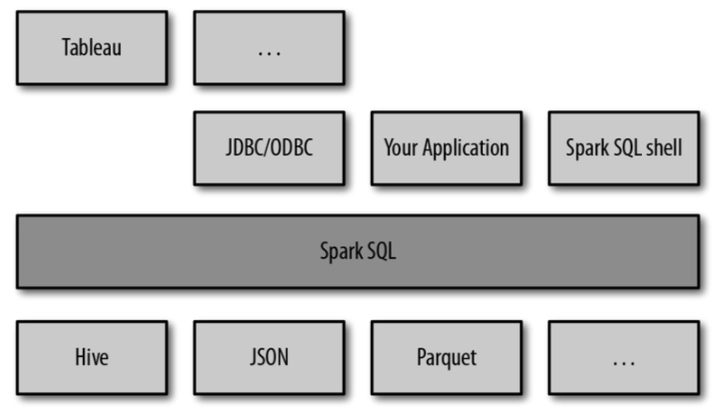
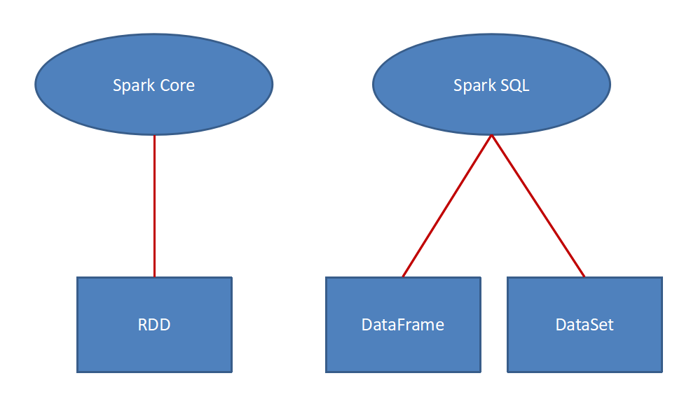

### 什么是SparkSQL
> Spark SQL是Spark用来处理结构化数据的一个模块，它提供了一个编程抽象叫做DataFrame并且作为分布式SQL查询引擎的作用。</br>我们已经学习了Hive，它是将Hive SQL转换成MapReduce然后提交到集群上执行，大大简化了编写MapReduce的程序的复杂性，由于MapReduce这种计算模型执行效率比较慢。所有Spark SQL的应运而生，它是将Spark SQL转换成RDD，然后提交到集群执行，执行效率非常快！

* SparkSQL优点
  * 易整合
  * 统一的数据访问方式
  * 兼容Hive
  * 标准的数据连接


</br>
  * SparkSQL可以看做是一个转换层，向下对接各种不同的结构化数据源，向上提供不同的数据访问方式。

### SparkSQL的数据抽象


### 命令行使用SqarkSQL

* 原始数据预览
  ```json
  {"name":"Michael", "salary":3000}
  {"name":"Andy", "salary":4500}
  {"name":"Justin", "salary":3500}
  {"name":"Berta", "salary":4000}
  ```
* 具体操作
  ```sh
  scala> val employees = spark.read.json("file:///home/yetao_yang/spark/spark-2.4.3/examples/src/main/resources/employees.json")
  employees: org.apache.spark.sql.DataFrame = [name: string, salary: bigint]

  scala> employees.show
  +-------+------+
  |   name|salary|
  +-------+------+
  |Michael|  3000|
  |   Andy|  4500|
  | Justin|  3500|
  |  Berta|  4000|
  +-------+------+
  scala> employees.map(_.getAs[String]("name")).show
  +-------+
  |  value|
  +-------+
  |Michael|
  |   Andy|
  | Justin|
  |  Berta|
  +-------+
  scala> employees.select("name").show
  +-------+
  |   name|
  +-------+
  |Michael|
  |   Andy|
  | Justin|
  |  Berta|
  +-------+
  ```
* 命令行sql操作
  ```sh
  scala> employees.createOrReplaceTempView("abc")

  scala> spark.sql("select * from abc").show
  +-------+------+
  |   name|salary|
  +-------+------+
  |Michael|  3000|
  |   Andy|  4500|
  | Justin|  3500|
  |  Berta|  4000|
  +-------+------+
  scala> spark.sql("select * from abc where salary >= 4000 ").show
  +-----+------+
  | name|salary|
  +-----+------+
  | Andy|  4500|
  |Berta|  4000|
  +-----+------+
  ```

### IDEA里面使用SparkSQL

* 在pom文件里面添加sparkSql的依赖
  ```xml
  <dependency>
      <groupId>org.apache.spark</groupId>
      <artifactId>spark-sql_2.11</artifactId>
      <version>2.4.3</version>
      <!--<scope>provided</scope>-->
  </dependency>
  ```

* 具体代码为
  ```scala
  object SparkSqlHello extends App{
      System.setProperty("HADOOP_USER_NAME", "yetao_yang")
      val sparkConf = new SparkConf().setAppName("sparkSql").setMaster("local[*]")
      val spark = SparkSession
        .builder()
        .config(sparkConf)
        .getOrCreate()
      val sc = spark.sparkContext

      val employee = spark.read.json("file:///D:/work_space/idea/spark/spark_sql/helloWord/src/main/resources/employee.json")
      for (elem <- employee.collect) {
        println(elem.getAs[String]("name") + " == " + elem.getAs[Int]("salary"))
      }
      println("=========================================")
      employee.createOrReplaceTempView("employee")
      val result = spark.sql("select * from employee where salary >= 4000 ").collect
      for (elem <- result) {
        println(elem.getAs[String]("name") + " == " + elem.getAs[Int]("salary"))
      }
      spark.stop()
      sc.stop()
      /**
      Michael == 3000
      Andy == 4500
      Justin == 3500
      Berta == 4000
      =========================================
      Andy == 4500
      Berta == 4000
      **/
  }
  ```

### RDD与DataFrame 互转

* `RDD  ->  DataFrame` （确定Schema）
  * 直接手动确定
    ```scala
    peopleRDD.map{x =>
      val para = x.split(",")
      (para(0), para(1).trim.toInt)
      }.toDF("name","age")
    ```
  * 通过反射确定  （利用case class 的功能）
    ```scala
    case class People(name:String, age:Int)
    peopleRdd.map{ x =>
      val para = x.split(",")
      People(para(0),para(1).trim.toInt)
        }.toDF
    ```
  * 通过编程方式来确定
    * 准备Scheam
      * `val schema = StructType( StructField("name",StringType):: StructField("age",IntegerType)::Nil )`
    * 准备Data   【需要Row类型】
      ```scala
      val data = peopleRdd.map{ x =>
        val para = x.split(",")
        Row(para(0),para(1).trim.toInt)
          }
      ```
    * 生成DataFrame
      * `val dataFrame = spark.createDataFrame(data, schema)`
* `DataFrame -> RDD`
  * `dataFrame.rdd` 即可， 返回的是 RDD[Row]

### RDD与DataSet 互转

* `RDD -> DataSet`
  ```scala
  case class People(name:String, age:Int)
  peopleRDD.map{x =>
	 val para = x.split(",")
	 People(para(0), para(1).trim.toInt)
	}.toDS
  ```
* `DataSet -> RDD`
  ```scala
  dataSet.rdd //返回的是 RDD[People]
  ```

### DataFrame与DataSet 互转

* `DataSet ->  DataFrame`
  * `dataSet.toDF`  即可,直接复用case class的名称
* `DataFrame -> DataSet`  （Scheam需要借助case class） 【DF的列名要和 case class的列名一致。】
  ```scala
  case class People(name:String, age:Int)
  dataFrame.as[People]
  ```

### SparkSQL执行模式

* DSL模式 【通过调用方法】
  * `dataFame.select("name").show`
  * `dataFame.filter($"age" > 25).show`
* SQL模式
  * `spark.sql("select * from people")`

### 自定义函数

#### UDF函数

* 注册函数
  * `spark.udf.register("add",(x:String) => "A:" + x)`
* 使用函数
  * `spark.sql("select add(name) from people")`
* 效果
  ```
  +-------------+
  |UDF:add(name)|
  +-------------+
  |A:Michael    |
  |A:Andy       |
  |A:Justin     |
  |A:Berta      |
  +-------------+
  ```


#### UDAF函数(聚合函数)

* 弱类型
  * 代码书写
    ```scala
    /*{"name":"Michael", "salary":3000}
    {"name":"Andy", "salary":4501}
    {"name":"Justin", "salary":3500}
    {"name":"Berta", "salary":4000}
    目标: 求平均工资 [工资的总额,工资的个数]
    */

    // 自定义UDAF函数需要继承UserDefinedAggregateFunction抽象类
    class AverageSal extends UserDefinedAggregateFunction{

      // 输入数据
      override def inputSchema: StructType = StructType(StructField("salary",LongType) :: Nil)

      // 每一个分区中的 共享变量
      override def bufferSchema: StructType = StructType(StructField("sum",LongType) :: StructField("count",IntegerType) :: Nil)

      // 表示UDFA函数的最终输出类型
      override def dataType: DataType = DoubleType

      // 如果有相同的输入是否存在相同的输出,如果有则true
      override def deterministic: Boolean = true

      // 初始化每一个分区中的共享变量
      override def initialize(buffer: MutableAggregationBuffer): Unit = {
        // buffer(0) 为bufferSchema函数第一个StructField,为StructField("sum",LongType)
        buffer(0) = 0L
        // buffer(1) 为bufferSchema函数第二个StructField,为StructField("count",IntegerType)
        buffer(1) = 0
      }

      // 每一个分区中的每一条数据聚合的时候需要调用该方法
      override def update(buffer: MutableAggregationBuffer, input: Row): Unit = {
        // 获取一行的工资,将工资加入到sum中
        buffer(0) = buffer.getLong(0) + input.getLong(0)
        // 将工资个数加1
        buffer(1) = buffer.getInt(1) + 1
      }

      // 将每一个分区的输出合并,形成最后的数据
      override def merge(buffer1: MutableAggregationBuffer, buffer2: Row): Unit = {
        // 合并总的工资
        buffer1(0) = buffer1.getLong(0) + buffer2.getLong(0)
        // 合并总的工资个数
        buffer1(1) = buffer1.getInt(1) + buffer2.getInt(1)
      }

      // 给出计算结果
      override def evaluate(buffer: Row): Any = {
        // 取出总的工资 / 总的工资数
        buffer.getLong(0).toDouble / buffer.getInt(1)
      }
    }
    ```
  * 具体调用
    ```scala
    object SparkSqlHello extends App{
        //System.setProperty("HADOOP_USER_NAME", "yetao_yang")
        val sparkConf = new SparkConf().setAppName("sparkSql").setMaster("local[*]")
        val spark = SparkSession
          .builder()
          .config(sparkConf)
          .getOrCreate()
        val employee = spark.read.json("file:///D:/work_space/idea/spark/spark_sql/helloWord/src/main/resources/employee.json")
        employee.createOrReplaceTempView("employee")
        // 注册UDAF函数
        spark.udf.register("averageSal",new AverageSal)
        val result = spark.sql("select averageSal(salary) from employee").collect
        for (elem <- result) {
          println(elem.toString())
        }
        spark.stop()
        /**
        [3750.25]
        */
    }
    ```

* 强类型[DSL]
  * 继承Aggregator抽象类， 依次配置输入、共享变量、输出的类型，需要用到case class
  * 代码
    ```scala
    case class EmpLoyee(var name:String,var salary:Long)
    case class Aver(var sum:Long,var count:Int)

    /**
      * EmpLoyee: INPUT
      * Aver: Buffer
      * Double: OUTPUT
      */
    class Average extends Aggregator[EmpLoyee,Aver,Double] {
      // 初始化方法
      override def zero: Aver = Aver(0L,0)

      // 每一个分区中的每一条数据聚合的时候需要调用该方法
      override def reduce(b: Aver, a: EmpLoyee): Aver = {
        b.sum = b.sum + a.salary
        b.count = b.count + 1
        b
      }

      // 将每一个分区的输出合并,形成最后的数据
      override def merge(b1: Aver, b2: Aver): Aver = {
        b1.count = b1.count + b2.count
        b1.sum = b1.sum + b2.sum
        b1
      }

      // 给出计算结果
      override def finish(reduction: Aver): Double = {
        reduction.sum.toDouble / reduction.count
      }

      // 对共享的变量进行编码
      override def bufferEncoder: Encoder[Aver] = Encoders.product

      // 将输出进行编码
      override def outputEncoder: Encoder[Double] = Encoders.scalaDouble
    }
    ```
  * 使用
    ```scala
    object Average extends App {
      val sparkConf = new SparkConf().setAppName("sparkSql").setMaster("local[*]")
      val spark = SparkSession
        .builder()
        .config(sparkConf)
        .getOrCreate()
      import spark.implicits._
      val employee = spark.read.json("file:///D:/work_space/idea/spark/spark_sql/helloWord/src/main/resources/employee.json")
        .as[EmpLoyee]
      val aver = new Average().toColumn.name("average")
      employee.select(aver).show()
      spark.stop()
    }
    ```


#### 开窗函数

* 具体代码
  ```scala
  case class Score(name: String, clazz: Int, score: Int)

  object OverFunction extends App {

    val sparkConf = new SparkConf().setAppName("over").setMaster("local[*]")

    val spark = SparkSession.builder().config(sparkConf).getOrCreate()

    import spark.implicits._
    println("//***************  原始的班级表  ****************//")
    val scoreDF = spark.sparkContext.makeRDD(Array( Score("a", 1, 80),
                                                    Score("b", 1, 78),
                                                    Score("c", 1, 95),
                                                    Score("d", 2, 74),
                                                    Score("e", 2, 92),
                                                    Score("f", 3, 99),
                                                    Score("g", 3, 99),
                                                    Score("h", 3, 45),
                                                    Score("i", 3, 55),
                                                    Score("j", 3, 78))).toDF("name","class","score")
    scoreDF.createOrReplaceTempView("score")
    scoreDF.show()

    println("//***************  求每个班最高成绩学生的信息  ***************/")
    println("    /*******  开窗函数的表  ********/")
    spark.sql("select name,class,score, rank() over(partition by class order by score desc) rank from score").show()
    /**
      * +----+-----+-----+----+
      * |name|class|score|rank|
      * +----+-----+-----+----+
      * |   c|    1|   95|   1|
      * |   a|    1|   80|   2|
      * |   b|    1|   78|   3|
      * |   f|    3|   99|   1|
      * |   g|    3|   99|   1|
      * |   j|    3|   78|   3|
      * |   i|    3|   55|   4|
      * |   h|    3|   45|   5|
      * |   e|    2|   92|   1|
      * |   d|    2|   74|   2|
      * +----+-----+-----+----+
      */

    println("    /*******  计算结果的表  *******")
    spark.sql("select * from " +
      "( select name,class,score,rank() over(partition by class order by score desc) rank from score) " +
      "as t " +
      "where t.rank=1").show()
    /**
      * +----+-----+-----+----+
      * |name|class|score|rank|
      * +----+-----+-----+----+
      * |   c|    1|   95|   1|
      * |   f|    3|   99|   1|
      * |   g|    3|   99|   1|
      * |   e|    2|   92|   1|
      * +----+-----+-----+----+
      */
    spark.stop()
  }
  ```
* 说明
  ```
  rank（）跳跃排序，有两个第二名时后边跟着的是第四名
dense_rank() 连续排序，有两个第二名时仍然跟着第三名
over（）开窗函数：
      在使用聚合函数后，会将多行变成一行，而开窗函数是将一行变成多行；
      并且在使用聚合函数后，如果要显示其他的列必须将列加入到group by中，
      而使用开窗函数后，可以不使用group by，直接将所有信息显示出来。
       开窗函数适用于在每一行的最后一列添加聚合函数的结果。
常用开窗函数：
  1.为每条数据显示聚合信息.(聚合函数() over())
  2.为每条数据提供分组的聚合函数结果(聚合函数() over(partition by 字段) as 别名)
        --按照字段分组，分组后进行计算
  3.与排名函数一起使用(row number() over(order by 字段) as 别名)
常用分析函数：（最常用的应该是1.2.3 的排序）
  1、row_number() over(partition by ... order by ...)
  2、rank() over(partition by ... order by ...)
  3、dense_rank() over(partition by ... order by ...)
  4、count() over(partition by ... order by ...)
  5、max() over(partition by ... order by ...)
  6、min() over(partition by ... order by ...)
  7、sum() over(partition by ... order by ...)
  8、avg() over(partition by ... order by ...)
  9、first_value() over(partition by ... order by ...)
  10、last_value() over(partition by ... order by ...)
  11、lag() over(partition by ... order by ...)
  12、lead() over(partition by ... order by ...)
lag 和lead 可以 获取结果集中，按一定排序所排列的当前行的上下相邻若干offset 的某个行的某个列(不用结果集的自关联）；
lag ，lead 分别是向前，向后；
lag 和lead 有三个参数，第一个参数是列名，第二个参数是偏移的offset，第三个参数是 超出记录窗口时的默认值
  ```

### 集成外部hive
> spark整合hive,是通过获取hive的`hive-site.xml`文件里面的hdfs地址(对应hive配置的路径),以及元数据的地址和mysql的地址密码信息,所以spark与hive整合不需要启动hive,只需要告诉spark,hive的元数据地址和数据地址即可


* 把hive中的`hive-site.xml`配置文件分别拷贝到`spark/conf`目录下
* 把mysql链接的jar包`mysql-connector-java-5.1.27-bin.jar`拷贝到jars目录下
* 通过命令行调用
  * `./bin/spark-shell --master spark://bigdata01:7077`
    ```sh
    scala> spark.sql("select * from emp").show
    +-----+-----+----+---+--------+----+----+------+
    |empno|ename| job|mgr|hiredate| sal|comm|deptno|
    +-----+-----+----+---+--------+----+----+------+
    |   10|  yyt|上班| 20|20180903|20.5|10.0|     8|
    |   39| cxsm|运维| 21|20190403|19.5| 3.8|     4|
    +-----+-----+----+---+--------+----+----+------+
    ```
* 使用IDEA进行调用
  * 代码
    ```scala
    object SparkSql2Hive extends App{
      System.setProperty("HADOOP_USER_NAME", "yetao_yang")
      val sparkConf = new SparkConf().setAppName("spark2hive")//.setMaster("spark://bigdata01:7077")
      val spark = SparkSession
        .builder()
        .config(sparkConf).enableHiveSupport()
        .getOrCreate()
      spark.sql("select * from emp").show
      spark.stop
    }
    ```
  * 将该类进行打包,运行spark 提交命令
    * `./bin/spark-submit --class com.yyt.sparkSQL.SparkSql2Hive --master yarn --deploy-mode cluster ../jar/helloWord-1.0-SNAPSHOT-jar-with-dependencies.jar`
  * 控制台打印如下
    ```sh
    19/06/20 14:05:38 INFO yarn.Client:
    	 client token: N/A
    	 diagnostics: N/A
    	 ApplicationMaster host: bigdata03
    	 ApplicationMaster RPC port: 39386
    	 queue: default
    	 start time: 1561010715354
    	 final status: SUCCEEDED
    	 tracking URL: http://bigdata01:8088/proxy/application_1560391631266_0016/
    	 user: yetao_yang
    ```
  * 去Yarn服务器上查看日志如下
    ```sh
    19/06/20 14:05:37 INFO spark.MapOutputTrackerMasterEndpoint: MapOutputTrackerMasterEndpoint stopped!
    19/06/20 14:05:37 INFO memory.MemoryStore: MemoryStore cleared
    19/06/20 14:05:37 INFO storage.BlockManager: BlockManager stopped
    19/06/20 14:05:37 INFO storage.BlockManagerMaster: BlockManagerMaster stopped
    19/06/20 14:05:37 INFO scheduler.OutputCommitCoordinator$OutputCommitCoordinatorEndpoint: OutputCommitCoordinator stopped!
    19/06/20 14:05:37 INFO spark.SparkContext: Successfully stopped SparkContext
    19/06/20 14:05:37 INFO yarn.ApplicationMaster: Final app status: SUCCEEDED, exitCode: 0
    19/06/20 14:05:37 INFO yarn.ApplicationMaster: Unregistering ApplicationMaster with SUCCEEDED
    19/06/20 14:05:37 INFO impl.AMRMClientImpl: Waiting for application to be successfully unregistered.
    19/06/20 14:05:37 INFO impl.AMRMClientImpl: Waiting for application to be successfully unregistered.
    19/06/20 14:05:37 INFO yarn.ApplicationMaster: Deleting staging directory hdfs://mycluster/user/yetao_yang/.sparkStaging/application_1560391631266_0016
    19/06/20 14:05:37 INFO util.ShutdownHookManager: Shutdown hook called
    19/06/20 14:05:37 INFO util.ShutdownHookManager: Deleting directory /home/yetao_yang/hadoop/data/hadoop/tmp/nm-local-dir/usercache/yetao_yang/appcache/application_1560391631266_0016/spark-cf73e992-fcc3-4614-84a5-8bfff1218121
    Log Type: stdout
    Log Upload Time: 星期四 六月 20 14:05:39 +0800 2019
    Log Length: 299
    +-----+-----+----+---+--------+----+----+------+
    |empno|ename| job|mgr|hiredate| sal|comm|deptno|
    +-----+-----+----+---+--------+----+----+------+
    |   10|  yyt|上班| 20|20180903|20.5|10.0|     8|
    |   39| cxsm|运维| 21|20190403|19.5| 3.8|     4|
    +-----+-----+----+---+--------+----+----+------+
    ```

### SparkSQl的输入输出

#### 输入
* 高级模式
  ```
  spark.read.json(path)
              jdbc
      		    csv
      		    parquet  //默认格式
      		    orc
      		    table
      		    text
      		    textFile
  ```
* 低级模式
  ```
  spark.read.format("json").load(path)  //如果不指定format 默认是 parquet 格式。
  ```
#### 输出
* 高级模式
  ```
  dataFrame.write.json(path)
                 jdbc
                  csv
                  parquet  //默认格式
                  orc
                  table
                  text
  ```
* 低级模式
  ```
  dataFrame.write.format("jdbc"). 参数  .mode(SaveMode).save()
  ```
* SaveMode模型
  ```
  `   - `SaveMode.Overwrite`: overwrite the existing data.
  *   - `SaveMode.Append`: append the data.
  *   - `SaveMode.Ignore`: ignore the operation (i.e. no-op).
  *   - `SaveMode.ErrorIfExists`: default option, throw an exception at runtime.
  ```
* 关系型数据库的读写
  * 保存
    ```scala
    employee.write.format("jdbc")
    .option("url", "jdbc:mysql://master01:3306/rdd")
    .option("dbtable", " rddtable10")
    .option("user", "root")
    .option("password", "hive")
    .mode("overwrite")
    .save()
    ```
  * 读取
    ```scala
    val abc = spark.read.format("jdbc")
    .option("url", "jdbc:mysql://master01:3306/rdd")
    .option("dbtable", " rddtable10")
    .option("user", "root")
    .option("password", "hive")
    .load()
    ```
