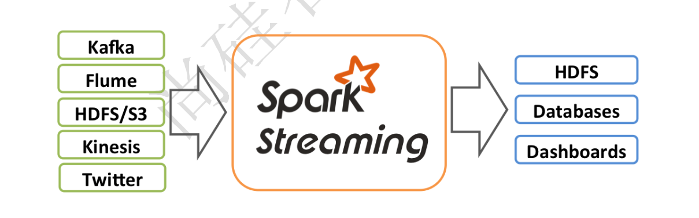
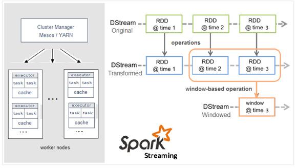
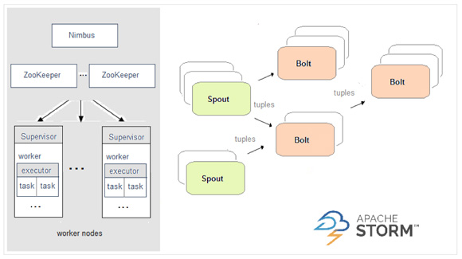
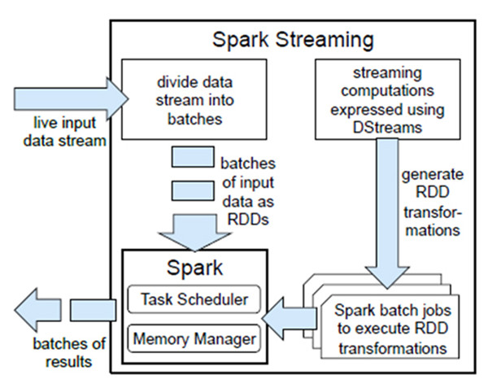
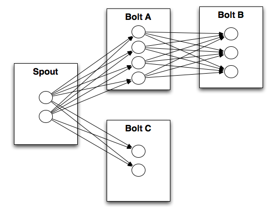
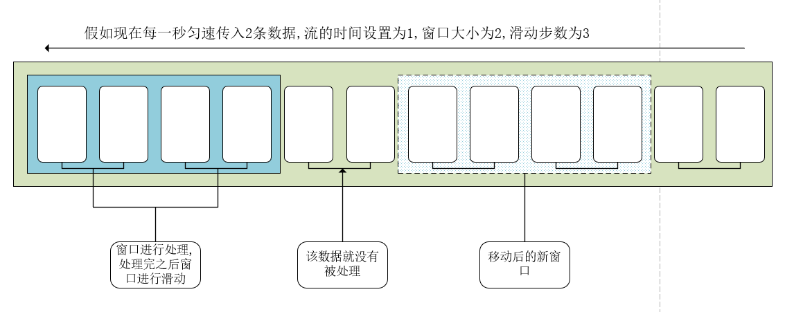

### 什么是`SparkStreaming`
</br>
> Spark Streaming类似于Apache Storm，用于流式数据的处理。根据其官方文档介绍，Spark Streaming有高吞吐量和容错能力强等特点。Spark Streaming支持的数据输入源很多，例如：Kafka、Flume、Twitter、ZeroMQ和简单的TCP套接字等等。数据输入后可以用Spark的高度抽象原语如：map、reduce、join、window等进行运算。而结果也能保存在很多地方，如HDFS，数据库等。另外Spark Streaming也能和MLlib（机器学习）以及Graphx完美融合

> 和Spark基于RDD的概念很相似，Spark Streaming使用离散化流(discretized stream)作为抽象表示，叫作DStream。DStream 是随时间推移而收到的数据的序列。在内部，每个时间区间收到的数据都作为 RDD 存在，而 DStream 是由这些 RDD 所组成的序列(因此 得名“离散化”)。

> DStream 可以从各种输入源创建，比如 Flume、Kafka 或者 HDFS。创建出来的DStream 支持两种操作，一种是转化操作(transformation)，会生成一个新的DStream，另一种是输出操作(output operation)，可以把数据写入外部系统中。DStream 提供了许多与 RDD 所支持的操作相类似的操作支持，还增加了与时间相关的新操作，比如滑动窗口。

### `SparkStreaming`优点
* 易用
  * Spark Streaming将Apache Spark的 语言集成API 引入流处理，使您可以像编写批处理作业一样编写流式作业。它支持Java，Scala和Python。

* 容错
  * Spark Streaming可以开箱即用，恢复丢失的工作和操作员状态（例如滑动窗口），而无需任何额外的代码。

* 易整合到spark
  * 通过在Spark上运行，Spark Streaming允许您重复使用相同的代码进行批处理，将流加入历史数据，或者在流状态下运行即席查询。构建强大的交互式应用程序，而不只是分析。

### Spark与Storm的对比
Spark|Storm
:--:|:--:
|
开发语言：Scala|开发语言：Clojure
编程模型：DStream|编程模型：Spout/Bolt
|

### `WordCount`代码书写
* 导入依赖
  ```xml
  <dependency>
      <groupId>org.apache.spark</groupId>
      <artifactId>spark-streaming_2.11</artifactId>
      <version>2.4.3</version>
  </dependency>
  ```
* 代码书写
  ```scala
  object WordCount extends App {
    val conf = new SparkConf().setMaster("local[*]").setAppName("NetworkWordCount")
    val ssc = new StreamingContext(conf, Seconds(1))
    // 监控bigdata01主机的9999端口
    val lines = ssc.socketTextStream("bigdata01", 9999)
    // 数据操作
    val words = lines.flatMap(_.split(" "))
    val pairs = words.map((_, 1))
    val wordCounts = pairs.reduceByKey(_ + _)
    wordCounts.print()
    ssc.start()             // Start the computation
    ssc.awaitTermination()  // Wait for the computation to terminate
  }
  ```
* 在对应机器开启端口
  ```sh
  [root@bigdata01 ~]# nc -lk 9999
  长相思面 罗志祥 罗志祥 张三 张三 张三
  ```
* 查看控制台输出
  ```
  -------------------------------------------
  Time: 1561446426000 ms
  -------------------------------------------
  (罗志祥,2)
  (张三,3)
  (长相思面,1)
  ```
### 自定义数据源
* 数据源书写
  ```scala
  /**
    *
    * @param host
    *             监控的主机
    * @param port
    *             监控的端口
    *  StorageLevel.MEMORY_ONLY :
    *             表示只存在内存中
    */
  class CustomerReceiver(host:String,port:Int) extends Receiver[String](StorageLevel.MEMORY_ONLY){
    // 接收器启动的时候调用
    override def onStart(): Unit = {
      new Thread("receiver"){
        override def run(): Unit ={
          //接收数据
          receive()
        }
      }.start()
    }

    /**
      * 接收数据并提交给streaming
      */
    def receive(): Unit ={
      var socket:Socket = null
      var input:String = null
      try{
        socket = new Socket(host,port)
        // 生成输入流
        val reader = new BufferedReader(new InputStreamReader(socket.getInputStream))
        // 接收数据
        while (!isStopped() && (input = reader.readLine()) != null){
          // 把数据写给框架
          store(input)
        }
        // 重启
        restart("resatrt")
      }catch {
        // 遇见错误也需要重启
        case e:ConnectException => restart("resatrtBY ConnectException")
        case t:Throwable => restart("resatrtBY ThrowableException")
      }
    }
    // 接收器关闭时调用
    override def onStop(): Unit = {}
  }
  ```
* 调用
  ```scala
  object WordCount extends App {
    val conf = new SparkConf().setMaster("local[*]").setAppName("NetworkWordCount")
    val ssc = new StreamingContext(conf, Seconds(1))
    // 监控bigdata01主机的9999端口
    val lines = ssc.receiverStream(new CustomerReceiver("bigdata01",9999))
    // 数据操作
    val words = lines.flatMap(_.split(" "))
    val pairs = words.map((_, 1))
    val wordCounts = pairs.reduceByKey(_ + _)
    wordCounts.print()
    ssc.start()             // Start the computation
    ssc.awaitTermination()  // Wait for the computation to terminate
  }
  ```

### 有状态转换

#### 追踪状态变化`UpdateStateByKey`

> UpdateStateByKey原语用于记录历史记录，有时，我们需要在 DStream 中跨批次维护状态(例如流计算中累加wordcount)。针对这种情况，updateStateByKey() 为我们提供了对一个状态变量的访问，用于键值对形式的 DStream。给定一个由(键，事件)对构成的 DStream，并传递一个指定如何根据新的事件 更新每个键对应状态的函数，它可以构建出一个新的 DStream，其内部数据为(键，状态) 对。 </br>updateStateByKey() 的结果会是一个新的 DStream，其内部的 RDD 序列是由每个时间区间对应的(键，状态)对组成的。</br>updateStateByKey操作使得我们可以在用新信息进行更新时保持任意的状态。为使用这个功能，你需要做下面两步：<br>1. 定义状态，状态可以是一个任意的数据类型。 </br>2. 定义状态更新函数，用此函数阐明如何使用之前的状态和来自输入流的新值对状态进行更新。</br>使用updateStateByKey需要对检查点目录进行配置，会使用检查点来保存状态。

* 用`UpdateStateByKey`操作wordcount
  ```scala
  object WordCount{
    def main(args: Array[String]): Unit = {
      val conf = new SparkConf().setMaster("local[*]").setAppName("NetworkWordCount")
      val ssc = new StreamingContext(conf, Seconds(1))
      // 设置checkPoint的地址
      ssc.checkpoint("./check")
      // 监控bigdata01主机的9999端口
      val lines = ssc.receiverStream(new CustomerReceiver("bigdata01",9999))
      // 数据操作
      val words = lines.flatMap(_.split(" "))
      val pairs = words.map((_, 1))

      // 定义算子
      val updataFuc = (v:Seq[Int],state:Option[Int]) => {
        val preStatus = state.getOrElse(0)
        Some(preStatus + v.sum)
      }
      val wordCounts = pairs.updateStateByKey(updataFuc)
      wordCounts.print()
      ssc.start()             // Start the computation
      ssc.awaitTermination()  // Wait for the computation to terminate
    }
  }
  ```
* 用`Window Operations`操作wordcount
  ```scala
  object WordCount{
    def main(args: Array[String]): Unit = {
      val conf = new SparkConf().setMaster("local[*]").setAppName("NetworkWordCount")
      val ssc = new StreamingContext(conf, Seconds(5))
      // 设置checkPoint的地址
      ssc.checkpoint("./check")
      // 监控bigdata01主机的9999端口
      val lines = ssc.receiverStream(new CustomerReceiver("bigdata01",9999))
      // 数据操作
      val words = lines.flatMap(_.split(" "))
      val pairs = words.map((_, 1))

      val wordCounts = pairs.reduceByKeyAndWindow(
        (x:Int,y:Int) => x+y, // 具体操作
        Seconds(15),  // 窗口大小
        Seconds(10) // 滑动步长
      )
      wordCounts.print()
      ssc.start()             // Start the computation
      ssc.awaitTermination()  // Wait for the computation to terminate
    }
  }
  ```
  * 代码详解
    * 窗口大小
      * 表示要整合多少时间范围内的数据进行预处理
    * 滑动步长
      * 表示整个计算范围滑动多少个单位
    * 如果滑动步长大于窗口大小,就会有数据重复计算
    * 如果滑动步长小于窗口大小,就会有数据遗漏</br>
    </br>
