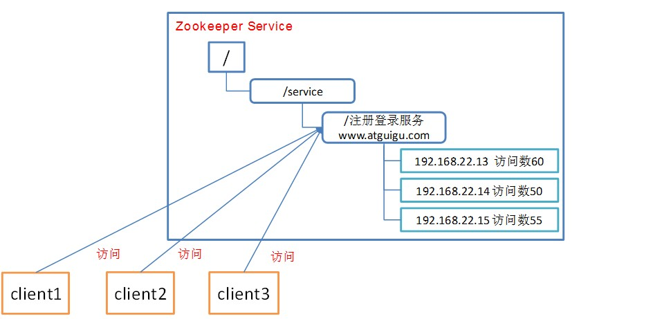

### **zookeeper概述**

> <h4>**概述**</h4>
Zookeeper是一个开源的分布式的，为分布式应用提供协调服务的Apache项目。<br>
Zookeeper从设计模式角度来理解：是一个基于观察者模式设计的分布式服务管理框架，它负责存储和管理大家都关心的数据，然后接受观察者的注册，一旦这些数据的状态发生变化，Zookeeper就将负责通知已经在Zookeeper上注册的那些观察者做出相应的反应，从而实现集群中类似Master/Slave管理模式<br><font style="color: red">Zookeeper=文件系统+通知机制</font>

> <h4>**特点**</h4>
* Zookeeper：一个领导者（leader），多个跟随者（follower）组成的集群
* Leader负责进行投票的发起和决议，更新系统状态
* Follower用于接收客户请求并向客户端返回结果，在选举Leader过程中参与投票
* 集群中只要有半数以上节点存活，Zookeeper集群就能正常服务。
* 全局数据一致：每个server保存一份相同的数据副本，client无论连接到哪个server，数据都是一致的。
* 更新请求顺序进行，来自同一个client的更新请求按其发送顺序依次执行。
* 数据更新原子性，一次数据更新要么成功，要么失败。
* 实时性，在一定时间范围内，client能读到最新数据。

> <h4>**数据结构**</h4>
ZooKeeper数据模型的结构与Unix文件系统很类似，整体上可以看作是一棵树，每个节点称做一个<font style="color: red">ZNode</font>。<br>
很显然zookeeper集群自身维护了一套数据结构。这个存储结构是一个树形结构，其上的每一个节点，我们称之为"znode"，每一个znode默认能够存储1MB的数据，每个ZNode都可以通过其路径唯一标识<br>


### **应用场景**

* 统一配置管理<br>
  
* 软负载均衡<br>
  
* 统一集群管理<br>
  

> [下载地址](https://mirrors.tuna.tsinghua.edu.cn/apache/zookeeper/)

### 配置参数详解`解读zoo.cfg 文件中参数含义`

* `tickTime`
  * `通信心跳数，Zookeeper服务器心跳时间，单位毫秒`
  * Zookeeper使用的基本时间，服务器之间或客户端与服务器之间维持心跳的时间间隔，也就是每个tickTime时间就会发送一个心跳，时间单位为毫秒
* `initLimit`
  * 集群中的follower跟随者服务器(F)与leader领导者服务器(L)之间初始连接时能容忍的最多心跳数（tickTime的数量），用它来限定集群中的Zookeeper服务器连接到Leader的时限。
* `syncLimit`
  * 集群中Leader与Follower之间的最大响应时间单位，假如响应超过syncLimit * tickTime，Leader认为Follwer死掉，从服务器列表中删除Follwer
* `dataDir`
  * 数据文件目录+数据持久化路径
  * 保存内存数据库快照信息的位置，如果没有其他说明，更新的事务日志也保存到数据库
* `clientPort`
  * 客户端连接端口
  * 监听客户端连接的端口

### 分布式搭建`zookepper`

* 重命名`conf`文件夹下的`zoo_sample.cfg`文件为`zoo.cfg`
  * 修改`dataDir`的路径
  * 添加以下配置
    ```
    server.1=hadoop01:2888:3888
    server.2=hadoop02:2888:3888
    server.3=hadoop03:2888:3888
    ```
* 在`dataDir`路径下新建`myid`文件,并添加id值
  * 与`server.x`里的`x`对应起来
* 启动四个服务端
  * `sh zkServer.sh start`
* 启动客户端
  * `sh zkCli.sh`

### 常用命令

命令基本语法 | 功能描述
-- | --
help | 显示所有操作命令
ls path [watch] | 使用 ls 命令来查看当前znode中所包含的内容
ls2 path [watch] | 查看当前节点数据并能看到更新次数等数据
create | 普通创建<br>-s  含有序列<br>-e  临时（重启或者超时消失）
get path [watch] | 获得节点的值
set | 设置节点的具体值
stat | 查看节点状态
delete | 删除节点
rmr | 递归删除节点
